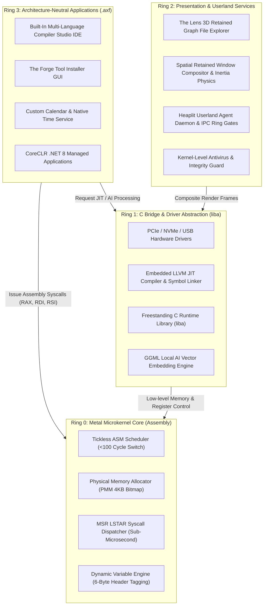
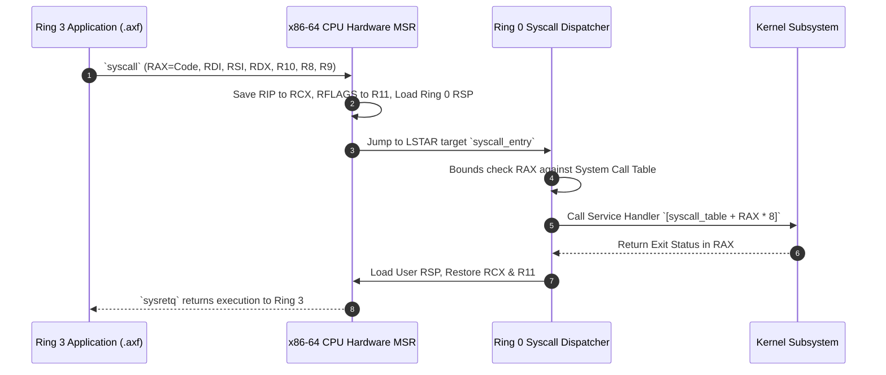
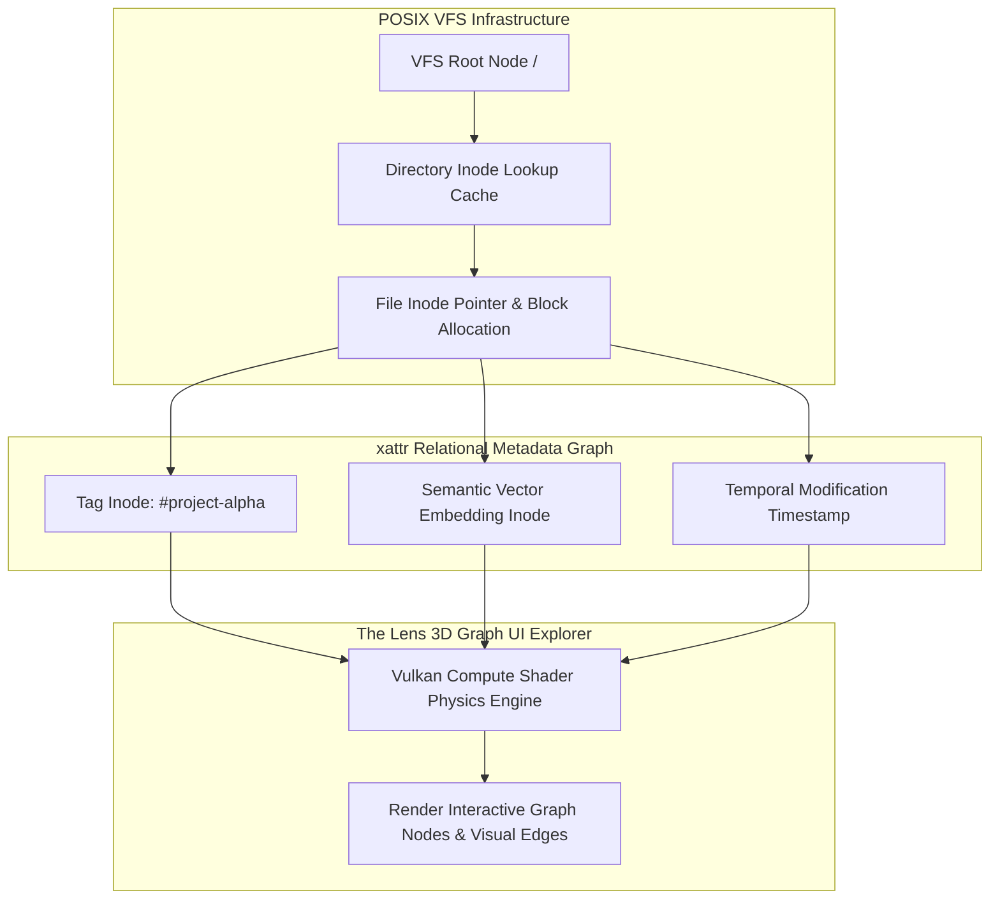
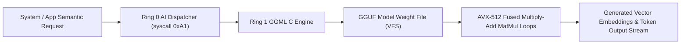
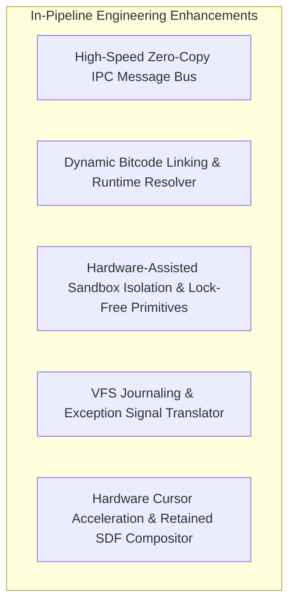

> **Status:** #status/implemented

# 🏛️ Heaplit OS – Master Project Handover & Architectural Specification

> **Official Repository:** [https://github.com/Heaplyn/Heaplit](https://github.com/Heaplyn/Heaplit)  
> **System License:** Open Source Core Specification  
> **Target Architecture:** x86-64 (AMD64 / Intel 64) with AVX-512 & XSAVE extensions  
> **Document Version:** 2.0-HANDOVER  
> **Primary Authors:** Heaplit Core Engineering Team & Antigravity Autonomous Agent

---

## 1. Executive Summary & Core Philosophy

**Heaplit OS** is an independent, metal-native, consent-first operating system designed to eliminate legacy OS bloat, telemetry, and non-deterministic execution overhead. Engineered from scratch, Heaplit OS combines a hand-crafted **x86-64 Assembly Microkernel (Ring 0)** with a freestanding **C Runtime & Driver Abstraction Bridge (Ring 1)**, an in-kernel **LLVM JIT Compiler Service**, and a high-performance **3D Spatial User Interface (Ring 2)**.



### Core System Directives
1. **Consent-First Architecture**: User data, file access, and execution privileges are explicitly granted through cryptographic hardware sandboxes. No background telemetry or undisclosed cloud communication is permitted.
2. **Compiler-Native Execution Model**: Applications are packaged as `.axf` LLVM Bitcode containers. Upon initial launch, the kernel's embedded Ring 1 LLVM service JIT-compiles the bitcode into native x86-64 machine instructions optimized specifically for the host CPU features (AVX-512, FMA, BMI2).
3. **Strict Ring Hierarchy Law**: Every module enforces the strict mathematical dependency rule:
   $$	ext{A module in Ring } N 	ext{ can depend on / require modules from Ring } M \iff M \le N$$

---

## 2. Low-Level Microkernel Architecture (Ring 0 & Ring 1)

### 2.1 Sub-Microsecond Assembly Syscall Dispatcher
Ring 0 bypasses legacy software interrupts (`int 0x80`) by configuring Model-Specific Registers (`IA32_LSTAR`, `IA32_STAR`, `IA32_FMASK`). Executing the x86-64 `syscall` instruction immediately transitions execution into `syscall_entry` in under 100 CPU cycles.



### 2.2 Tickless Assembly Scheduler
The Ring 0 scheduler operates ticklessly using the Local APIC Timer. When no tasks are active, the scheduler sets CPU low-power sleep states (`hlt`). Task switches preserve the entire integer register state (`RAX` through `R15`), stack pointer (`RSP`), and 512-byte vector registers (`xsave64` / `xrstor64`).

### 2.3 Physical Memory Allocator (PMM)
The PMM manages up to 512 GB of physical RAM using a 4KB page bitmap. Bit allocation is accelerated via x86-64 Bit Scan Forward (`bsf`) and atomic Bit Test and Set (`lock bts`) instructions.

### 2.4 Freestanding C Runtime (`liba`)
Located in Ring 1 (`rings/ring_1/ring_1/liba/`), `liba` provides a freestanding implementation of standard C services without requiring host OS headers:
- Memory Management: `malloc()`, `free()`, `realloc()`, `calloc()`.
- Formatting & I/O: `kprintf()`, `snprintf()`, `vsnprintf()`.
- String & Memory Primitives: `memcpy()`, `memset()`, `memmove()`, `strcmp()`, `strlen()`.

---

## 3. Hybrid Storage & The Lens Spatial File Explorer

### 3.1 POSIX Virtual File System (VFS) with `xattr` Metadata Graph
Heaplit OS implements a high-performance Virtual File System capable of mounting traditional FAT32, EXT4, and custom Heaplit Graph Volumes. Files are represented internally as inode structures enhanced with extended attribute (`xattr`) key-value pairs that form a relational metadata graph.



### 3.2 The Lens App & Stackable Filter Engine
The Lens is Heaplit OS's native 3D spatial file explorer. Files are rendered as physical graph nodes interconnected by semantic, temporal, and tag-based force edges. Users can isolate files dynamically by layering 5 stackable filter dimensions:

| Filter Dimension | Mechanism | Description |
| :--- | :--- | :--- |
| **Lexical** | Pattern Matching | Wildcard globs, exact string matches, and regex search across file names and raw content. |
| **Temporal** | Heatmap Timeline | Filter files by creation, modification, access ranges, or calendar event correlations. |
| **Tag** | `xattr` Key-Value | Arbitrary user-defined or system-assigned tags (`#draft`, `#release`, `priority=1`). |
| **Semantic** | AI Embedding Distance | Cosine similarity clustering using the local GGML vector embedding space. |
| **Graph-Relational** | Hard & Soft Edges | Topological traversal across file dependencies, parent-child links, and import references. |

---

## 4. AI & Local Offline Embedding Engine

### 4.1 Embedded GGML / Llama.cpp Kernel Port
Heaplit OS features a native port of GGML residing in Ring 1 (`rings/ring_1/ring_1/drivers/ai_engine.c`). The engine accesses hardware SIMD features (AVX-512 FMA) directly from C/Assembly to perform tensor matrix multiplications without overhead.



### 4.2 Local Vector Caching & Privacy Guarantee
- **Zero Cloud Dependencies**: Model weights (`.gguf`) are loaded locally from VFS storage (`/sys/ai/models/`).
- **Real-Time Vector Caching**: File contents and system notes are automatically embedded into a local vector database for instant offline semantic search.

---

## 5. Userland Applications & Developer Ecosystem

### 5.1 The Forge Tool Installer GUI
Targeted as `forge.axf`, **The Forge** is a graphical package installer that fetches, builds, and provisions developer toolchains (Visual Studio Build Tools, MinGW-w64, Node.js, Python, Rustup, and web browsers) into isolated VFS environments.

### 5.2 Built-In Multi-Language Compiler Studio
The **Compiler Studio** (`studio.axf`) is a unified development environment interfacing directly with the in-kernel LLVM service. Developers can edit, compile, link, and debug C, C++, Assembly, C#, and Rust projects locally with instant hot-patching.

### 5.3 Custom Calendar & Native Time Service
The **Heaplit Time Service** integrates CMOS RTC hardware interrupts (IRQ 8) with the VFS temporal index layer. The Calendar app (`calendar.axf`) allows users to visually cluster files and system activity by calendar event timelines.

### 5.4 Kernel-Level Antivirus & Integrity Guard
Operating at the Ring 1/Ring 0 boundary, the **Integrity Guard** inspects incoming `.axf` LLVM bitcode payloads before compilation. It verifies digital signatures, checks for prohibited instruction patterns (e.g., unauthorized ring escalation), and enforces Write XOR Execute (`W^X`) page table protections.

### 5.5 CoreCLR & .NET Package Support
Heaplit OS provides native support for .NET 8 managed assemblies. The `hpkg` package manager resolves NuGet dependencies and maps CoreCLR execution directly to Ring 0 microkernel system calls.

---

## 6. In-Pipeline Technical Specifications & Enhancements



### 6.1 High-Speed Zero-Copy IPC & Shared Memory Message Bus
- **Zero-Copy Transfers**: Shared PMM physical frames mapped into both process address spaces eliminate CPU memory copying during inter-process communication.
- **Lock-Free Ring Gates**: Atomic compare-and-swap (`lock cmpxchg`) ring buffers enable sub-microsecond signaling between the Compiler Studio, Lens UI, and background daemons.

### 6.2 Dynamic Bitcode Linking & Runtime Resolution
- **Runtime Linker**: Resolves imported symbols, relocations, and function trampolines dynamically when an `.axf` application is launched or hot-patched.
- **Cross-Language Bindings**: Seamlessly binds native Assembly subroutines, freestanding C functions, and C# CoreCLR methods.

### 6.3 Hardware-Assisted Sandbox Isolation & Concurrency Primitives
- **Page Table Ring Guards**: Enforces process isolation by clearing User/Supervisor bits (`U/S = 0`) on kernel pages and setting No-Execute (`NX`) bits on stacks.
- **Lock-Free Assembly Synchronization**:
  - Spinlocks: `lock bts` combined with `pause` instructions.
  - Atomic Operations: `lock xadd` for reference counting and `lock cmpxchg16b` for double-word atomic pointer updates.

### 6.4 VFS Journaling & Exception Translation Pipeline
- **Metadata Intent Journal**: Circular RAM journal buffer flushing write transactions to disk to preserve VFS metadata and vector embedding consistency during unexpected power loss.
- **CPU Exception Translator**: Converts raw hardware traps (Vector 14 Page Faults, Vector 13 General Protection Faults) into structured signal frames passed to the Compiler Studio debugger.

### 6.5 Hardware Cursor & Visual Retained Compositor
- **Hardware Cursor Acceleration**: Direct VBE/GPU register updates for latency-free cursor motion.
- **SDF Glyph Rendering Engine**: Retained-mode widget UI rendered using Signed Distance Field (SDF) vector font shaders for sharp scale-invariant typography.
- **Live TOML Theming Engine**: Real-time reloading of UI themes from `/sys/theme.toml` via VFS file watchers.

---

## 7. Master Repository Directory Topology

```
Heaplit OS/
├── include/                               # Global C/Assembly include headers
│   └── README.md                          # Include guidelines & syscall macros
├── loader/                                # Host bootstrap & QEMU launcher
│   ├── load_os.ps1                        # PowerShell build & test pipeline
│   └── README.md                          # Loader specifications
├── obsidian_vault/                        # Full mirror of active Obsidian vault
├── rings/                                 # 4-Ring OS Architecture Source Code
│   ├── README.md                          # Ring dependency documentation
│   ├── ring_0/                            # Ring 0: Microkernel Metal Core
│   │   └── ring_0/
│   │       ├── cpu/                       # GDT, IDT, Paging, Long Mode
│   │       ├── memory/                    # PMM Bitmap & Block Utilities
│   │       ├── sched/                     # Tickless ASM Scheduler
│   │       ├── syscalls/                  # MSR LSTAR Syscall Entry
│   │       └── types/                     # 6-Byte Dynamic Variable Engine
│   ├── ring_1/                            # Ring 1: Freestanding C & Drivers
│   │   └── ring_1/
│   │       ├── drivers/                   # PCIe, VFS, GGML AI Engine
│   │       ├── hardware/                  # A20 Enabler & Hardware Hooks
│   │       └── liba/                      # Freestanding C Runtime (malloc, kprintf)
│   ├── ring_2/                            # Ring 2: Presentation & UI Services
│   │   └── ring_2/
│   │       ├── console/                   # VGA & ANSI Text Display
│   │       └── input/                     # PS/2 Keyboard Line Editor
│   └── ring_3/                            # Ring 3: Bootloader & Userland Apps
│       └── ring_3/
│           ├── boot/                      # Multi-Sector Bootloader (base.asm, MBR)
│           └── userland/                  # Sandboxed Applications & Shell
└── README.md                              # Root repository documentation
```

---

## 8. Build, Test, and Deployment Instructions

### Automated Assembly & Execution Loop
1. **Requirements**: NASM (Netwide Assembler), Clang/LLVM toolchain, QEMU (i386/x86_64 emulator), PowerShell 7+.
2. **Build Command**:
   ```powershell
   .\loader\load_os.ps1
   ```
3. **Execution Pipeline**:
   - Assembles `rings/ring_3/ring_3/boot/base.asm` into `base.bin` (4,096 bytes / 8 sectors).
   - Validates multi-sector alignment and binary size.
   - Launches headless or graphical QEMU instance booting directly from `base.bin`.
