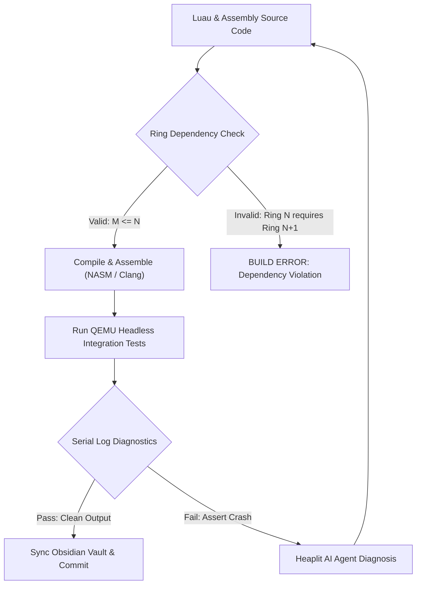

> **Status:** #status/implemented

# 📐 Code Quality & Engineering Guidelines

> **Quality Standards for Bare-Metal & Freestanding Systems Programming in Heaplit OS**

---

## 1. The Ring Dependency Law & Scaffolding Rules

Every file in Heaplit OS must strictly adhere to the layered privilege hierarchy:

$$\\text{A module in Ring } N \\text{ can depend on / require modules from Ring } M \\iff M \\le N$$

### Ring Placement Matrix
- **Ring 0 (`rings/ring_0/ring_0/`)**: ONLY independent metal utilities (math, string, variable, memory, GDT/Paging/PMM structures). **MUST NOT** include or require any modules from Ring 1, Ring 2, or Ring 3 ($M \le 0$).
- **Ring 1 (`rings/ring_1/ring_1/`)**: Hardware lines, A20, disk, device drivers, freestanding C (`liba`), GGML inference bridge. Can require Ring 0 and Ring 1 ($M \le 1$). **MUST NOT** require Ring 2 or 3.
- **Ring 2 (`rings/ring_2/ring_2/`)**: Console presentation, keyboard input services. Can require Ring 0, Ring 1, Ring 2 ($M \le 2$). **MUST NOT** require Ring 3.
- **Ring 3 (`rings/ring_3/ring_3/`)**: Staged boot orchestrator (`base.asm`, `mbr.asm`, `stage2.asm`, `stage4_console.asm`), userland shell (`entry.asm`), applications. Can require Ring 0, 1, 2, 3 ($M \le 3$).

### Anti-Monolithic Scaffolding Mandate
- No single file may exceed 300 lines of active logic unless it is a machine-generated lookup table.
- Monolithic files must be decomposed into dedicated single-responsibility submodules inside the ring namespace (e.g., `types/`, `memory/`, `cpu/`, `sched/`, `syscalls/`, `hardware/`, `liba/`, `drivers/`, `console/`, `input/`, `boot/`, `userland/`).

---

## 2. Golden Naming Rules

| Element Type | Convention | Correct Example | Incorrect Example |
| :--- | :--- | :--- | :--- |
| **Functions / Procedures** | `snake_case` | `clear_screen`, `read_line`, `switch_threads` | `ClearScreen`, `readLine`, `SwitchThreads` |
| **Local Labels / Branches** | `.snake_case` | `.loop`, `.done`, `.handle_odd`, `.error` | `.Loop`, `.DONE`, `.handleOdd` |
| **Variables / Buffers** | `snake_case` | `boot_drive`, `input_buffer`, `pmm_bitmap` | `BootDrive`, `InputBuffer`, `PMM_BITMAP` |
| **Constants / Equates** | `snake_case` (or `UPPER_CASE` for sys) | `type_string`, `sizeof_variable`, `SYS_AI_INFER` | `TypeString`, `SizeOfVariable` |
| **Structures / Types** | `struc name` / `typedef struct` | `struc variable`, `vfs_node_t` | `struc Variable`, `VFSNode` |
| **NASM Macros** | `UPPER_CASE` | `ALIGN_16`, `PUSH_ALL_64`, `DEBUG_HALT` | `align_16`, `pushAll64` |

---

## 3. Assembly Precision Directives

1. **Explicit Memory Operand Sizing:**  
   Never write ambiguous dereferences like `mov [di], 0`. Always specify the operand width:
   - `mov byte [di], 0` (1 byte)
   - `mov word [di], 0` (2 bytes)
   - `mov dword [rdi], 0` (4 bytes)
   - `mov qword [rdi], 0` (8 bytes)

2. **Explicit Memory Dereferencing:**  
   In NASM, `my_var` is the address/pointer, while `[my_var]` is the contents at that address. Always use brackets when reading from or writing to memory.

3. **Bit Width Annotations:**  
   Always include `[bits 16]`, `[bits 32]`, or `[bits 64]` when defining functions or transitioning processor modes.

---

## 4. Register Preservation Contracts

```nasm
; Standard template for a clean assembly utility function
; -----------------------------------------------------------------------------
; function_name: Brief one-line description of purpose.
; Inputs:
;   - Register 1: Description
;   - Register 2: Description
; Outputs:
;   - Return Register: Description
; Preserved:
;   - All other general purpose registers
; -----------------------------------------------------------------------------
function_name:
    push bx
    push cx
    push dx
    push si
    push di

    ; ... core logic ...

    pop di
    pop si
    pop dx
    pop cx
    pop bx
    ret
```

---

## 5. Related Documents
- [[00 - Architecture/Exhaustive Code Architecture & Implementation Walkthrough|Architecture Walkthrough]]
- [[00 - Architecture/System Overview|System Overview & Ring Hierarchy]]
- [[01 - Ring 0 - Metal Core (Assembly)/09 - Assembly Coding Standards & Macros|Macros Library]]

## 🔄 Architecture & Quality Pipeline Flowchart


