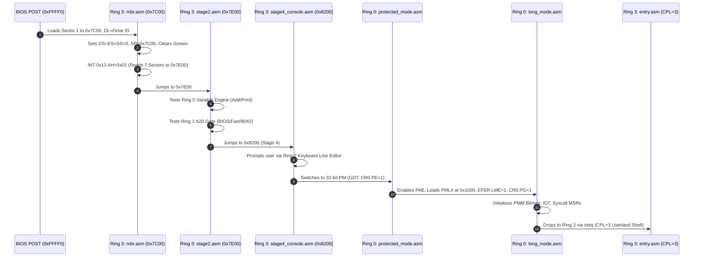

> **Status:** #status/implemented

# 🏗️ Exhaustive Code Architecture & Implementation Walkthrough

> **The Definitive Engineering Guide for Heaplit OS:** Directory taxonomy, calling conventions, data structures, staged boot progression, and subsystem implementation walkthrough with line-by-line assembly and C code snippets.

---

## 1. Repository Directory Taxonomy & Scaffolding

To prevent architectural drift and maintain clean separation of concerns across the 4-layer ring hierarchy, all modules are scaffolded into dedicated single-responsibility subfolders matching the ring namespace:

$$\\text{The Ring Dependency Law: Module in Ring } N \\text{ can depend on Ring } M \\iff M \\le N$$

```
Heaplit OS/
├── loader/                               # Host build scripts & QEMU launchers
│   └── load_os.ps1                       # PowerShell compiler & QEMU boot trigger
│
├── rings/                                # Privilege-Organized Kernel & Staged Bootstrap
│   ├── README.md                          # Master Ring Architecture Specification
│   ├── ring_0/                            # Ring 0: Pure Metal Core & Utilities (M <= 0)
│   │   ├── README.md                      # Ring 0 Subsystem Documentation
│   │   └── ring_0/
│   │       ├── types/                     # Dynamic variable system, math, strings
│   │       │   ├── variable.asm          # 6-byte typed variable system (type, flags, payload)
│   │       │   ├── math.asm              # int_to_string, abs16, min16, max16
│   │       │   └── string.asm            # strlen16, strcmp16, strcpy16, strcat16
│   │       ├── memory/                    # Block memory & physical memory allocator
│   │       │   ├── memory.asm            # Fast 16-bit word block copy/set/zero
│   │       │   └── pmm.asm               # 64-bit PMM 4KB page bitmap allocator
│   │       ├── cpu/                       # Processor control & mode transitions
│   │       │   ├── gdt.asm               # 16/32/64-bit GDT segment descriptors & TSS
│   │       │   ├── idt.asm               # 64-bit IDT descriptor table & 256 ISR gates
│   │       │   ├── paging.asm            # 4-level PML4, PDPT, PD 2MB huge page tables
│   │       │   ├── protected_mode.asm    # 32-bit PM entry (CR0.PE=1) & CPUID check
│   │       │   └── long_mode.asm         # 64-bit LM entry (CR4.PAE, EFER.LME, CR0.PG) & iretq
│   │       ├── sched/                     # Tickless thread scheduler (<100 cycles)
│   │       │   └── scheduler.asm         # thread_t struct & switch_threads context switch
│   │       └── syscalls/                  # Syscall dispatchers & vector engine
│   │           ├── syscall.asm            # Fast MSR LSTAR dispatcher (0x000-0x6FF)
│   │           └── syscall_ai.asm         # AI Syscalls (0x600-0x602) & 512-bit XSAVE area
│   │
│   ├── ring_1/                            # Ring 1: Hardware Abstraction & C Bridge (M <= 1)
│   │   ├── README.md                      # Ring 1 Subsystem Documentation
│   │   └── ring_1/
│   │       ├── hardware/                  # Hardware line gate enablers
│   │       │   └── a20.asm               # Multi-tier A20 line enable (BIOS/92h/8042)
│   │       ├── liba/                      # Freestanding C runtime (-mno-red-zone)
│   │       │   ├── string.c              # Freestanding memset, memcpy, strlen, strcmp
│   │       │   └── kprintf.c             # Formatted logger (COM1 0x3F8 + VGA 0xB8000)
│   │       └── drivers/                   # Drivers & Local AI Inference Bridge
│   │           ├── pci.c                  # PCIe configuration scanner (0xCF8/0xCFC)
│   │           ├── vfs.c                  # Virtual File System with xattr graph hooks
│   │           └── ai_engine.c            # GGML transformer forward pass & weight cache
│   │
│   ├── ring_2/                            # Ring 2: Presentation & Input Services (M <= 2)
│   │   ├── README.md                      # Ring 2 Subsystem Documentation
│   │   └── ring_2/
│   │       ├── console/                   # Video mode & screen presentation
│   │       │   └── console.asm           # VGA mode, cursor position, hex/string printers
│   │       └── input/                     # Interactive keyboard services
│   │           └── keyboard.asm          # BIOS INT 0x16 reader & line buffer editor
│   │
│   └── ring_3/                            # Ring 3: Boot Orchestrator & Userland (M <= 3)
│       ├── README.md                      # Ring 3 Subsystem Documentation
│       └── ring_3/
│           ├── boot/                      # Staged bootloader system
│           │   ├── base.asm              # Master staged orchestrator (4KB base.bin)
│           │   ├── mbr.asm               # Sector 1: MBR entry @ 0x7C00 (stack, disk read)
│           │   ├── stage2.asm            # Sectors 2-3: Extended loader @ 0x7E00 (vars, A20)
│           │   └── stage4_console.asm    # Sector 4: Interactive prompt @ 0x8200
│           └── userland/                  # Unprivileged userland applications (CPL=3)
│               └── entry.asm              # Ring 3 userland entrypoint & syscall caller
│
└── include/                              # Shared Assembly & C Headers
│   ├── macros.inc                        # NASM macro library (ALIGN_16, PUSH_ALL_64)
│   └── heaplit/
│       ├── types.h                       # Fixed-width integer types (uint8_t, size_t)
│       ├── syscalls.h                    # Master SYS_* number enum definitions
│       └── vfs.h                         # VFS node structures & xattr relations
```

---

## 2. Memory Map & Layout

```
+-----------------------------------+ 0xFFFFFFFF80000000 (Higher-Half Kernel Base)
| Long Mode 64-bit Kernel Text/Data |
+-----------------------------------+ 0x00100000 (1MB - Extended Memory)
| Free Memory / PMM Page Allocator  |
+-----------------------------------+ 0x00008400 - 0x0009FFFF (Conventional RAM)
| Staged Protected Mode & Long Mode |
+-----------------------------------+ 0x00008200 (Sector 4: Interactive Prompt)
| Sector 4 Prompt & Stage 4 Code    |
+-----------------------------------+ 0x00007E00 (Sectors 2-3: Diagnostics)
| Stage 2 Loader (Vars, A20, Utils) |
+-----------------------------------+ 0x00007C00 (Sector 1: MBR)
| Master Boot Record (512 Bytes)    |
+-----------------------------------+ 0x00007000 (Real-Mode Stack grows down)
| Real Mode Stack Frame             |
+-----------------------------------+ 0x00003000 (Page Directory Table)
| 2MB Huge Page Directory           |
+-----------------------------------+ 0x00002000 (Page Directory Pointer Table)
| PDPT Table                        |
+-----------------------------------+ 0x00001000 (Page Map Level 4)
| PML4 Table (4-Level Paging Root)  |
+-----------------------------------+ 0x00000000 - 0x00000FFF
| Real Mode IVT & BDA Tables        |
+-----------------------------------+
```

---

## 3. Calling Conventions & ABI Contracts

### 16-bit Real Mode Convention
- **Arguments:** Passed in registers (`DI` = dest buffer, `SI` = src buffer, `AL` = type/char, `DX`/`AX` = values, `CX` = length).
- **Return Values:** Returned in `AX` (or `AL` for bytes, `DX:AX` for 32-bit integers, Flags for booleans/comparisons).
- **Preservation Mandate:** Routines **MUST** preserve all registers not designated as explicit return values via `pusha`/`popa` or explicit `push`/`pop` pairs.

### 64-bit Long Mode (System V AMD64 ABI)
- **Argument Order:** `RDI`, `RSI`, `RDX`, `RCX`, `R8`, `R9`. (Additional arguments pushed to stack right-to-left).
- **Return Value:** `RAX` (and `RDX` for 128-bit values).
- **Callee-Saved Registers (MUST PRESERVE across calls):** `RBX`, `RSP`, `RBP`, `R12`, `R13`, `R14`, `R15`.
- **Caller-Saved Registers (Scratch):** `RAX`, `RCX`, `RDX`, `RSI`, `RDI`, `R8`, `R9`, `R10`, `R11`.
- **Stack Alignment:** Stack pointer `RSP` must be **16-byte aligned** immediately prior to executing any `call` instruction.

---

## 4. Staged Execution Flow & Code Walkthrough



---

## 5. Subsystem Code Snippets

### 5.1. Master Staged Bootloader (`rings/ring_3/ring_3/boot/base.asm`)

```nasm
[org 0x7c00]
bits 16

jmp mbr_entry

; Sector 1: Master Boot Record
%include "mbr.asm"
%include "ring_0/memory/memory.asm"
%include "ring_2/console/console.asm"

times 510 - ($ - $$) db 0
dw 0xaa55

; Sectors 2 & 3: Extended Loader & Diagnostics
%include "ring_0/types/variable.asm"
%include "ring_0/types/math.asm"
%include "ring_0/types/string.asm"
%include "ring_1/hardware/a20.asm"
%include "stage2.asm"

times (512 * 3) - ($ - $$) db 0

; Sector 4: Interactive Console & Input Trigger
%include "ring_2/input/keyboard.asm"
%include "stage4_console.asm"

times (512 * 4) - ($ - $$) db 0

; Sectors 5+: 32-bit PM & 64-bit Long Mode Staging
%include "ring_0/cpu/gdt.asm"
%include "ring_0/cpu/protected_mode.asm"
%include "ring_0/cpu/paging.asm"
%include "ring_0/cpu/long_mode.asm"

times 4096 - ($ - $$) db 0
```

### 5.2. Ring 0 Dynamic Variable Engine (`rings/ring_0/ring_0/types/variable.asm`)

```nasm
struc variable
    .type:       resb 1
    .flags:      resb 1
    .payload:    resd 1
endstruc

type_int:    equ 1
type_string: equ 2

; create_variable: DI = dest struct, AL = type, DX = int / SI = string
create_variable:
    push ax
    push di
    mov byte [di + variable.type], al
    mov byte [di + variable.flags], 0
    cmp al, type_int
    je .set_int
    ; string pointer assignment
    mov word [di + variable.payload], si
    jmp .done
.set_int:
    mov word [di + variable.payload], dx
.done:
    pop di
    pop ax
    ret
```

### 5.3. Ring 1 A20 Gate Multi-Method Enabler (`rings/ring_1/ring_1/hardware/a20.asm`)

```nasm
enable_a20:
    call check_a20
    test ax, ax
    jnz .a20_done

    ; Method 1: BIOS INT 0x15 AX=0x2401
    mov ax, 0x2401
    int 0x15
    call check_a20
    test ax, ax
    jnz .a20_done

    ; Method 2: Fast A20 Port 0x92
    in al, 0x92
    or al, 2
    out 0x92, al
    call check_a20
    test ax, ax
    jnz .a20_done

.a20_done:
    ret
```

---

## 6. Related Architecture Documents
- [[00 - Architecture/System Overview|System Overview & Ring Hierarchy]]
- [[00 - Architecture/Code Quality & Engineering Guidelines|Code Quality & Engineering Guidelines]]
- [[01 - Ring 0 - Metal Core (Assembly)/01 - Boot Sequence & Staged Loading|Ring 0 Boot & Staged Loading]]
- [[02 - Ring 1 - The C Overhead (Bridge)/01 - Freestanding C Runtime (liba)|Ring 1 Freestanding C Runtime]]
- [[03 - Ring 2 - Userland & Spatial UI/01 - Antigravity Daemon Architecture|Ring 2 / Ring 3 Userland Architecture]]
