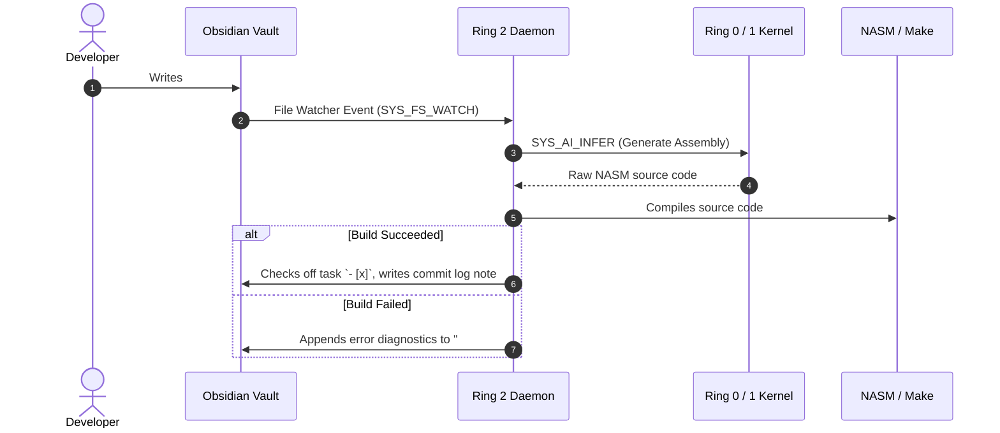

> **Status:** #status/implemented

# 🔄 Obsidian Integration & Two-Way Sync

> In Heaplit OS, **Obsidian is not just documentation—it is the single source of truth and the control plane for the OS build pipeline.**

---

## 1. How Two-Way Sync Operates



---

## 2. Special Heaplit Markdown Tags

| Tag | Purpose & Effect |
| :--- | :--- |
| `#HeaplitPlan` | Marks an actionable plan note that Heaplit should actively monitor and execute. |
| `#ASM` | Instructs the code generator to generate pure NASM x86 assembly routines. |
| `#Ring0` | Pins the generated routines to the bootloader/kernel supervisor ring. |
| `#MVP` | Marks a milestone as high-priority for the initial 3-month release target. |
| `// @Heaplit` | Inline source code annotation where Heaplit is authorized to inject modifications. |

---

## 3. Example Obsidian Directive Note

```markdown
# HeaplitPlan: Bootloader Cleanup
Tags: #HeaplitPlan #ASM #Ring0 #MVP

- [ ] Implement the A20 gate enable routine in pure ASM.
- [ ] Use `in al, 0x64` and `out 0x64, al` to talk to the 8042 keyboard controller.
- [ ] Place the routine in `rings/ring_0/ring_1/a20.asm`.

@Heaplit:
Generate the ASM code for enabling the A20 gate using fast A20 (BIOS INT 0x15) as the primary method, with fallback to keyboard controller 8042.
```

---

## 4. Automatic Rollback on Crash
If generated kernel code causes a triple fault or panic during QEMU automated testing:
1. The kernel watchdog detects the fault.
2. The filesystem rolls back to the previous snapshot.
3. Heaplit captures the register dump (`EIP`/`RIP`, `CR0`, `CR2`, stack trace) and creates an Obsidian postmortem note: `Build Failure: Triple Fault at 0x7E24`.

---

## 5. Related Notes
- [[00 - Architecture/Ring 2 - Heaplit Userland Daemon|Ring 2 Daemon]]
- [[01 - Planning/HeaplitPlan - Bootloader & Real Mode|Bootloader Action Plan]]
- [[01 - Planning/Grand Roadmap & Timeline|Roadmap & Timeline]]
