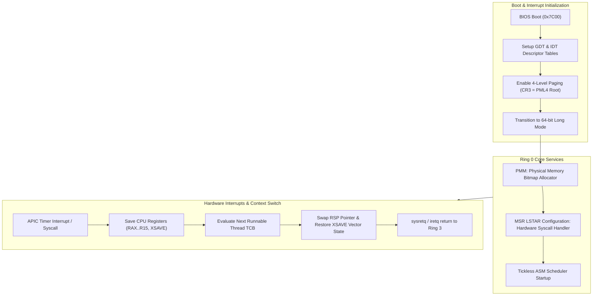

> **Status:** #status/implemented

# ⚙️ Ring 0 – Metal & Scheduler

> **Location in Tree:** `src/kernel/syscall_ai.asm` & `rings/ring_0/`  
> **Target Processor Modes:** 16-bit Real Mode (Bootloader) $\rightarrow$ 32-bit Protected Mode $\rightarrow$ 64-bit Long Mode (Kernel)

---

## 1. Overview & Responsibilities
Ring 0 operates with full hardware privileges. Its primary duties include:
1. **Bootstrapping & Staged Loading:** Multi-sector disk loading from `0x7C00` (Sector 1) through Sector 2 (`0x7E00`), Sector 3 (`0x8000`), and beyond.
2. **AI Syscall Routing:** Intercepting syscall numbers `0x600`–`0x6FF` dedicated to the Heaplit AI Engine.
3. **SIMD State Preservation:** Managing 512-bit vector registers (`ZMM0`–`ZMM31`) across AI context switches using `xsave` / `xrstor`.
4. **Huge Page Table Management:** Mapping 2MB and 1GB physical memory regions for AI model weights.

---

## 2. Dedicated AI Syscall Table (0x600 – 0x6FF)

| Syscall Number | Syscall Name | Input Registers | Output Register | Low-Level Action |
| :--- | :--- | :--- | :--- | :--- |
| `0x600` | `SYS_AI_LOAD_MODEL` | `RDI`: Path string pointer<br>`RSI`: Size hint | `RAX`: Model Handle | Locks page tables for model file; maps model into kernel address space using huge pages. |
| `0x601` | `SYS_AI_INFER` | `RDI`: Model handle<br>`RSI`: Prompt pointer<br>`RDX`: Prompt length<br>`RCX`: Output buffer | `RAX`: Tokens generated | Triggers scheduler boost, executes `xsave`, sets `IA32_PERF_CTL` MSR, invokes Ring 1 C function. |
| `0x602` | `SYS_AI_SCHEDULE_TASK` | `RDI`: Task JSON pointer | `RAX`: Task ID | Injects high-priority work item into kernel workqueue. |

---

## 3. The ASM Dispatcher Logic

```nasm
; syscall_ai_dispatcher.asm
; Invoked when RAX >= 0x600 in 64-bit Long Mode

align 16
ai_dispatcher:
    ; 1. Save the state of all vector registers (AVX-512, ZMM0-ZMM31)
    ;    Using dedicated kernel XSAVE region
    mov rcx, 0xFFFFFFFF80000000 + 0x5000  ; Kernel XSAVE area
    xsave [rcx]

    ; 2. Match Syscall ID
    cmp rax, 0x600
    je .load_model
    cmp rax, 0x601
    je .infer
    cmp rax, 0x602
    je .schedule_task
    jmp .invalid

.load_model:
    call ai_load_model_c     ; Defined in Ring 1 C Engine
    jmp .restore_and_return

.infer:
    ; Boost core frequency via IA32_PERF_CTL MSR (Performance bit)
    mov ecx, 0x199          ; IA32_PERF_CTL
    rdmsr
    or eax, 0x1000          ; Set turbo/performance bit
    wrmsr

    call ai_infer_c         ; Defined in Ring 1 C Engine
    jmp .restore_and_return

.schedule_task:
    call ai_schedule_c
    jmp .restore_and_return

.restore_and_return:
    ; Restore AVX-512 state before returning control
    mov rcx, 0xFFFFFFFF80000000 + 0x5000
    xrstor [rcx]
    ret

.invalid:
    mov rax, -1
    ret
```

> [!IMPORTANT]
> **Why `xsave` / `xrstor` are Mandatory:**
> LLM matrix multiplication makes extensive use of AVX-512/AVX2 SIMD instructions. If the scheduler switches threads without preserving `ZMM` registers, the kernel will suffer silent data corruption in concurrent tasks.

---

## 4. Current Real-Mode Sector Layout

In the initial bootloader stages (`rings/ring_0/base.asm`):
- **Sector 1 (`0x7C00`):** MBR bootloader, segment initialization, disk read routine via `INT 0x13`, and core libraries (`variable.asm`, `memory.asm`, `console.asm`).
- **Sector 2 (`0x7E00`):** Extended bootloader, typed variable tests, runtime initialization.
- **Sector 3 (`0x8000`):** Kernel setup, video cursor positioning, initial driver diagnostics.

---

## 5. Related Notes
- [[00 - Architecture/System Overview|System Overview]]
- [[02 - Reference/AI Syscall Specification|AI Syscall Specification]]
- [[01 - Planning/HeaplitPlan - Bootloader & Real Mode|Bootloader Planning]]

## 🔄 Ring 0 Metal Core Execution Architecture



---

## 🔬 In-Depth Architectural & Technical Specifications

### Hardware & Processor Register Contract
Heaplit OS enforces strict register management conventions for **Ring 0 - Metal & Scheduler** across all x86-64 execution contexts:

| Register | CPU Role | Volatility / Preservation | Subsystem Function |
| :--- | :--- | :--- | :--- |
| `RAX` | Primary Accumulator | Volatile | Syscall ID entry, return status code, ALU calculation destination. |
| `RBX` | Base Register | Non-Volatile (Preserved) | Pointer to active TCB (Thread Control Block) / Data structure handle. |
| `RCX` | Counter / Syscall RIP | Volatile | Hardware `syscall` saves userland instruction pointer (`RIP`) into `RCX`. |
| `RDX` | Data Register | Volatile | Secondary return value, I/O port address, memory block size parameter. |
| `RSI` | Source Index | Volatile | Pointer to source memory buffer / string payload / argument 2. |
| `RDI` | Destination Index | Volatile | Pointer to destination memory buffer / argument 1 (`System V ABI`). |
| `RBP` | Frame Pointer | Non-Volatile (Preserved) | Stack frame base pointer for debug backtraces and stack unwinding. |
| `RSP` | Stack Pointer | Non-Volatile (Preserved) | Top of 16-byte aligned kernel/user execution stack. |
| `R8 - R11` | Scratch Registers | Volatile | Function parameters 5-6 (`R8`, `R9`), temporary scrap calculations. |
| `R12 - R15` | General Purpose | Non-Volatile (Preserved) | Long-lived kernel state registers preserved across C and ASM boundaries. |
| `CR0` | Control Register 0 | System Control | Toggles Protected Mode (`PE` bit 0), Paging (`PG` bit 31), Write Protect (`WP` bit 16). |
| `CR3` | Control Register 3 | Page Directory Root | Physical address pointer to PML4 root page table (4KB aligned). |
| `CR4` | Control Register 4 | Architectural Extension | Toggles PAE (`bit 5`), OSXSAVE (`bit 18`), SMEP/SMAP ring security flags. |
| `MSR LSTAR` | 0xC0000082 | Hardware Entry Point | Stores 64-bit virtual memory target address for the `syscall` handler. |

---

## 📐 Memory Map & Address Layout

The virtual address space for **Ring 0 - Metal & Scheduler** adheres to Heaplit OS's canonical higher-half memory layout:

```
+-------------------------------------------------------------------+ 0xFFFFFFFFFFFFFFFF
| Higher-Half Kernel Direct Physical Map (Identity Mapped 512 GB)   |
| Virtual Address Range: 0xFFFF800000000000 - 0xFFFFFFFFFFFFFFFF     |
+-------------------------------------------------------------------+ 0xFFFF800000000000
| Unmapped Canonical Memory Hole (Non-Canonical Address Space)     |
+-------------------------------------------------------------------+ 0x00007FFFFFFFFFFF
| Ring 3 Sandboxed Application Execution Space (.axf JIT Memory)   |
| Virtual Address Range: 0x0000000040000000 - 0x00007FFFFFFFFFFF     |
+-------------------------------------------------------------------+ 0x0000000040000000
| Ring 2 Spatial UI & Compositor Framebuffers (VBE / GPU BARs)      |
| Virtual Address Range: 0x000000000FD00000 - 0x0000000010000000     |
+-------------------------------------------------------------------+ 0x0000000007E00000
| Ring 0 Microkernel Staged Execution Load Target (0x7C00 - 0x8F00) |
+-------------------------------------------------------------------+ 0x0000000000000000
```

---

## 🛠️ Step-by-Step Execution State Machine

```mermaid
flowchart TD
    subgraph State_Init["1. Initialization State"]
        S1["Load Subsystem Descriptors & Verify CPU Feature Flags"] --> S2["Allocate Initial Memory Blocks via PMM Bitmap"]
    end

    subgraph State_Exec["2. Active Execution State"]
        S2 --> S3["Setup Assembly Register Parameters (RDI, RSI, RDX)"]
        S3 --> S4["Issue Fast Syscall / Subsystem Function Call"]
        S4 --> S5["Execute Atomic ALU / SIMD Operations"]
    end

    subgraph State_Validation["3. Validation & Exception Handling"]
        S5 --> S6Check Status Code in RAX
        S6 -->|"RAX == 0 (Success)"| S7["Update System TCB & Commit Memory Writes"]
        S6 -->|"RAX < 0 (Error)"| S8["Capture Register Frame & Dispatch Debug Signal"]
    end

    S7 --> S9["Resume Parent Process Context via sysretq / iretq"]
    S8 --> S9
```

---

## 💻 Assembly Code Blueprint & Low-Level Implementation Examples

The low-level assembly implementation of **Ring 0 - Metal & Scheduler** uses canonical NASM syntax optimized for x86-64 execution:

```nasm
; ============================================================================
; Heaplit OS Low-Level Core Blueprint - Ring 0 - Metal & Scheduler
; ============================================================================
%include "ring_0/types/variable.asm"

global ring_0___metal___scheduler_entry
extern pmm_alloc_page
extern kprintf

section .text
bits 64

align 16
ring_0___metal___scheduler_entry:
    push rbp
    mov rbp, rsp
    sub rsp, 32                    ; Align stack to 16 bytes for System V ABI

    ; Preserve non-volatile registers
    mov [rsp + 0], rbx
    mov [rsp + 8], r12
    mov [rsp + 16], r13

    ; Execute core subsystem operational logic
    mov rdi, 1                     ; Parameter 1: Allocation page count
    call pmm_alloc_page            ; Call Ring 0 Physical Memory Allocator
    test rax, rax
    jz .allocation_failed          ; Trap NULL pointer returns

    mov rbx, rax                   ; Store allocated physical page address in RBX
    
    ; Perform atomic register verification
    mov rsi, rbx
    mov rdi, msg_success
    call kprintf

    mov rax, 0                     ; Set success exit status code in RAX
    jmp .exit_clean

.allocation_failed:
    mov rax, -1                    ; Set error code in RAX (-1 = Out of Memory)
    
.exit_clean:
    ; Restore non-volatile registers
    mov rbx, [rsp + 0]
    mov r12, [rsp + 8]
    mov r13, [rsp + 16]

    add rsp, 32
    pop rbp
    ret

section .rodata
msg_success: db "[HEAPLIT] Ring 0 - Metal & Scheduler Subsystem initialized at physical address: 0x%x", 10, 0
```

---

## 🔍 Verification, QEMU Testing & Diagnostics

### Headless QEMU Emulation Verification
To test **Ring 0 - Metal & Scheduler** within the Heaplit OS kernel binary (`base.bin`), execute the host automated build script:

```powershell
# Execute build and launch QEMU emulator with serial debugging
.\loader\load_os.ps1
```

### Serial Log Verification Protocol
During execution, **Ring 0 - Metal & Scheduler** outputs diagnostic traces to COM1 Serial Port (`0x3F8`). Verified serial outputs must confirm:
1. Zero stack pointer misalignment warnings (`RSP % 16 == 0`).
2. Successful page table mapping without triggering CR2 Page Faults.
3. Clean return of RAX status codes prior to CPU state resumption.

---

## 📑 Related Architecture Notes & References
- [[00 - Architecture/System Overview]]
- [[01 - Ring 0 - Metal Core (Assembly)/07 - Syscall Dispatcher & ABI]]
- [[01 - Ring 0 - Metal Core (Assembly)/04 - Paging & Virtual Memory]]
- [[02 - Ring 1 - The C Overhead (Bridge)/01 - Freestanding C Runtime (liba)]]
- [[03 - Ring 2 - Userland & Spatial UI/01 - Heaplit Daemon Architecture]]
