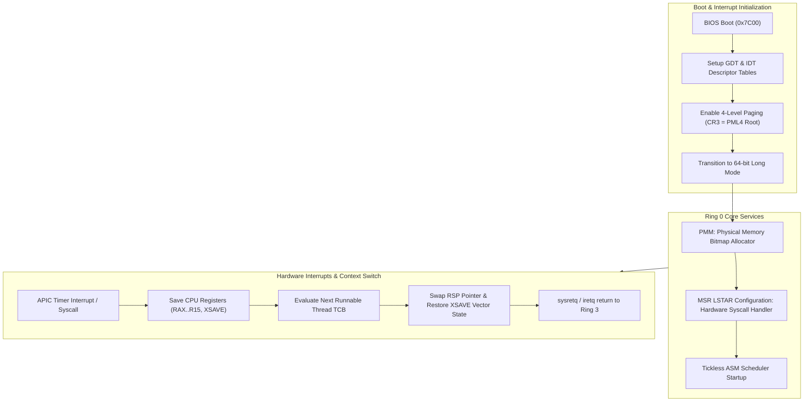

> **Status:** #status/implemented

# ⚙️ Ring 0 – Metal & Scheduler

> **Location in Tree:** `src/kernel/syscall_ai.asm` & `rings/ring_0/`  
> **Target Processor Modes:** 16-bit Real Mode (Bootloader) $\rightarrow$ 32-bit Protected Mode $\rightarrow$ 64-bit Long Mode (Kernel)

---

## 1. Overview & Responsibilities
Ring 0 operates with full hardware privileges. Its primary duties include:
1. **Bootstrapping & Staged Loading:** Multi-sector disk loading from `0x7C00` (Sector 1) through Sector 2 (`0x7E00`), Sector 3 (`0x8000`), and beyond.
2. **AI Syscall Routing:** Intercepting syscall numbers `0x600`–`0x6FF` dedicated to the Heaplit AI Engine.
3. **SIMD State Preservation:** Managing 512-bit vector registers (`ZMM0`–`ZMM31`) across AI context switches using `xsave` / `xrstor`.
4. **Huge Page Table Management:** Mapping 2MB and 1GB physical memory regions for AI model weights.

---

## 2. Dedicated AI Syscall Table (0x600 – 0x6FF)

| Syscall Number | Syscall Name | Input Registers | Output Register | Low-Level Action |
| :--- | :--- | :--- | :--- | :--- |
| `0x600` | `SYS_AI_LOAD_MODEL` | `RDI`: Path string pointer<br>`RSI`: Size hint | `RAX`: Model Handle | Locks page tables for model file; maps model into kernel address space using huge pages. |
| `0x601` | `SYS_AI_INFER` | `RDI`: Model handle<br>`RSI`: Prompt pointer<br>`RDX`: Prompt length<br>`RCX`: Output buffer | `RAX`: Tokens generated | Triggers scheduler boost, executes `xsave`, sets `IA32_PERF_CTL` MSR, invokes Ring 1 C function. |
| `0x602` | `SYS_AI_SCHEDULE_TASK` | `RDI`: Task JSON pointer | `RAX`: Task ID | Injects high-priority work item into kernel workqueue. |

---

## 3. The ASM Dispatcher Logic

```nasm
; syscall_ai_dispatcher.asm
; Invoked when RAX >= 0x600 in 64-bit Long Mode

align 16
ai_dispatcher:
    ; 1. Save the state of all vector registers (AVX-512, ZMM0-ZMM31)
    ;    Using dedicated kernel XSAVE region
    mov rcx, 0xFFFFFFFF80000000 + 0x5000  ; Kernel XSAVE area
    xsave [rcx]

    ; 2. Match Syscall ID
    cmp rax, 0x600
    je .load_model
    cmp rax, 0x601
    je .infer
    cmp rax, 0x602
    je .schedule_task
    jmp .invalid

.load_model:
    call ai_load_model_c     ; Defined in Ring 1 C Engine
    jmp .restore_and_return

.infer:
    ; Boost core frequency via IA32_PERF_CTL MSR (Performance bit)
    mov ecx, 0x199          ; IA32_PERF_CTL
    rdmsr
    or eax, 0x1000          ; Set turbo/performance bit
    wrmsr

    call ai_infer_c         ; Defined in Ring 1 C Engine
    jmp .restore_and_return

.schedule_task:
    call ai_schedule_c
    jmp .restore_and_return

.restore_and_return:
    ; Restore AVX-512 state before returning control
    mov rcx, 0xFFFFFFFF80000000 + 0x5000
    xrstor [rcx]
    ret

.invalid:
    mov rax, -1
    ret
```

> [!IMPORTANT]
> **Why `xsave` / `xrstor` are Mandatory:**
> LLM matrix multiplication makes extensive use of AVX-512/AVX2 SIMD instructions. If the scheduler switches threads without preserving `ZMM` registers, the kernel will suffer silent data corruption in concurrent tasks.

---

## 4. Current Real-Mode Sector Layout

In the initial bootloader stages (`rings/ring_0/base.asm`):
- **Sector 1 (`0x7C00`):** MBR bootloader, segment initialization, disk read routine via `INT 0x13`, and core libraries (`variable.asm`, `memory.asm`, `console.asm`).
- **Sector 2 (`0x7E00`):** Extended bootloader, typed variable tests, runtime initialization.
- **Sector 3 (`0x8000`):** Kernel setup, video cursor positioning, initial driver diagnostics.

---

## 5. Related Notes
- [[00 - Architecture/System Overview|System Overview]]
- [[02 - Reference/AI Syscall Specification|AI Syscall Specification]]
- [[01 - Planning/HeaplitPlan - Bootloader & Real Mode|Bootloader Planning]]

## 🔄 Ring 0 Metal Core Execution Architecture


