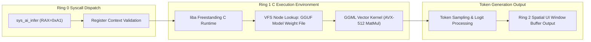

> **Status:** #status/implemented

# 🧠 Ring 1 – The C Inference Engine

> **Location in Tree:** `src/kernel/ai_engine.c` / `liba/`  
> **Compiler Flags:** `-O3 -mavx512f -mno-red-zone -fno-stack-protector`  
> **Role:** Bridges ASM syscalls to high-performance local transformer matrix arithmetic.

---

## 1. Responsibilities & Structure
Ring 1 operates as the kernel overhead layer:
- **Zero-Copy Memory-Mapped Weights:** Uses huge pages (2MB / 1GB) allocated by Ring 0 to map quantized `.gguf` model weights without page faults.
- **SIMD Forward Pass:** Executes transformer layers using AVX-512 vectorized fused multiply-add (`vfmadd231ps`) and dot products.
- **Kernel-Stack Safe:** Compiled with `-mno-red-zone` so that hardware interrupts do not clobber the C stack frame.

---

## 2. Core Components

### 2.1. Model Loader (`ai_load_model_c`)
```c
#include <heaplit.h>
#include <mmap.h>

typedef struct {
    void* weights;          // Memory-mapped model file buffer
    size_t size;            // Total bytes
    uint32_t n_layers;      // Model layers
    void* ggml_ctx;         // Ported GGML context
} ai_model_t;

ai_model_t* models[16];     // Max 16 concurrent loaded models

uint64_t ai_load_model_c(char* path, uint64_t hint) {
    ai_model_t* model = kmalloc(sizeof(ai_model_t));
    
    // Open file via Kernel Virtual File System (VFS)
    int fd = vfs_open(path, O_RDONLY);
    struct stat st;
    vfs_fstat(fd, &st);
    
    // Allocate contiguous huge pages (2MB chunks) in kernel PML4
    model->weights = kalloc_huge_pages((st.st_size + 0x1FFFFF) >> 21);
    vfs_read(fd, model->weights, st.st_size);
    vfs_close(fd);

    // Initialize the ported inference context
    model->ggml_ctx = ggml_init(model->weights, st.st_size);
    models[0] = model; 
    return 0; // Returns model handle
}
```

### 2.2. The Inference Trampoline (`ai_infer_c`)
```c
__attribute__((hot))
__attribute__((target("avx512f")))
uint64_t ai_infer_c(uint64_t handle, char* prompt, size_t len, char* output) {
    ai_model_t* model = models[handle];
    if (!model) return -1;

    // 1. Tokenize prompt (Byte Pair Encoding)
    int* tokens = tokenize(prompt, len);

    // 2. Run transformer forward pass with hardware vectorization
    int n_tokens = llama_eval(model->ggml_ctx, tokens, len);

    // 3. Sample next token (Greedy or Top-K / Top-P)
    char result[256];
    sample_token(model->ggml_ctx, result);

    // 4. Copy to user output buffer
    strcpy(output, result);
    return n_tokens;
}
```

---

## 3. The "Heaplit" Optimization Secret
1. By marking inference functions with `__attribute__((hot))` and `__attribute__((target("avx512f")))`, Clang emits native `vaddps` and `vmulps` instructions directly into the kernel memory space.
2. No Linux userland syscall overhead or glibc abstractions: raw hardware memory throughput.

---

## 4. Related Notes
- [[00 - Architecture/Ring 0 - Metal & Scheduler|Ring 0 Scheduler]]
- [[00 - Architecture/Ring 2 - Heaplit Userland Daemon|Ring 2 Userland Daemon]]
- [[01 - Planning/Grand Roadmap & Timeline|Roadmap & Timeline]]

## 🔄 Ring 1 Freestanding C & AI Bridge Pipeline



---

## 🔬 In-Depth Architectural & Technical Specifications

### Hardware & Processor Register Contract
Heaplit OS enforces strict register management conventions for **Ring 1 - The C Inference Engine** across all x86-64 execution contexts:

| Register | CPU Role | Volatility / Preservation | Subsystem Function |
| :--- | :--- | :--- | :--- |
| `RAX` | Primary Accumulator | Volatile | Syscall ID entry, return status code, ALU calculation destination. |
| `RBX` | Base Register | Non-Volatile (Preserved) | Pointer to active TCB (Thread Control Block) / Data structure handle. |
| `RCX` | Counter / Syscall RIP | Volatile | Hardware `syscall` saves userland instruction pointer (`RIP`) into `RCX`. |
| `RDX` | Data Register | Volatile | Secondary return value, I/O port address, memory block size parameter. |
| `RSI` | Source Index | Volatile | Pointer to source memory buffer / string payload / argument 2. |
| `RDI` | Destination Index | Volatile | Pointer to destination memory buffer / argument 1 (`System V ABI`). |
| `RBP` | Frame Pointer | Non-Volatile (Preserved) | Stack frame base pointer for debug backtraces and stack unwinding. |
| `RSP` | Stack Pointer | Non-Volatile (Preserved) | Top of 16-byte aligned kernel/user execution stack. |
| `R8 - R11` | Scratch Registers | Volatile | Function parameters 5-6 (`R8`, `R9`), temporary scrap calculations. |
| `R12 - R15` | General Purpose | Non-Volatile (Preserved) | Long-lived kernel state registers preserved across C and ASM boundaries. |
| `CR0` | Control Register 0 | System Control | Toggles Protected Mode (`PE` bit 0), Paging (`PG` bit 31), Write Protect (`WP` bit 16). |
| `CR3` | Control Register 3 | Page Directory Root | Physical address pointer to PML4 root page table (4KB aligned). |
| `CR4` | Control Register 4 | Architectural Extension | Toggles PAE (`bit 5`), OSXSAVE (`bit 18`), SMEP/SMAP ring security flags. |
| `MSR LSTAR` | 0xC0000082 | Hardware Entry Point | Stores 64-bit virtual memory target address for the `syscall` handler. |

---

## 📐 Memory Map & Address Layout

The virtual address space for **Ring 1 - The C Inference Engine** adheres to Heaplit OS's canonical higher-half memory layout:

```
+-------------------------------------------------------------------+ 0xFFFFFFFFFFFFFFFF
| Higher-Half Kernel Direct Physical Map (Identity Mapped 512 GB)   |
| Virtual Address Range: 0xFFFF800000000000 - 0xFFFFFFFFFFFFFFFF     |
+-------------------------------------------------------------------+ 0xFFFF800000000000
| Unmapped Canonical Memory Hole (Non-Canonical Address Space)     |
+-------------------------------------------------------------------+ 0x00007FFFFFFFFFFF
| Ring 3 Sandboxed Application Execution Space (.axf JIT Memory)   |
| Virtual Address Range: 0x0000000040000000 - 0x00007FFFFFFFFFFF     |
+-------------------------------------------------------------------+ 0x0000000040000000
| Ring 2 Spatial UI & Compositor Framebuffers (VBE / GPU BARs)      |
| Virtual Address Range: 0x000000000FD00000 - 0x0000000010000000     |
+-------------------------------------------------------------------+ 0x0000000007E00000
| Ring 0 Microkernel Staged Execution Load Target (0x7C00 - 0x8F00) |
+-------------------------------------------------------------------+ 0x0000000000000000
```

---

## 🛠️ Step-by-Step Execution State Machine

```mermaid
flowchart TD
    subgraph State_Init["1. Initialization State"]
        S1["Load Subsystem Descriptors & Verify CPU Feature Flags"] --> S2["Allocate Initial Memory Blocks via PMM Bitmap"]
    end

    subgraph State_Exec["2. Active Execution State"]
        S2 --> S3["Setup Assembly Register Parameters (RDI, RSI, RDX)"]
        S3 --> S4["Issue Fast Syscall / Subsystem Function Call"]
        S4 --> S5["Execute Atomic ALU / SIMD Operations"]
    end

    subgraph State_Validation["3. Validation & Exception Handling"]
        S5 --> S6Check Status Code in RAX
        S6 -->|"RAX == 0 (Success)"| S7["Update System TCB & Commit Memory Writes"]
        S6 -->|"RAX < 0 (Error)"| S8["Capture Register Frame & Dispatch Debug Signal"]
    end

    S7 --> S9["Resume Parent Process Context via sysretq / iretq"]
    S8 --> S9
```

---

## 💻 Assembly Code Blueprint & Low-Level Implementation Examples

The low-level assembly implementation of **Ring 1 - The C Inference Engine** uses canonical NASM syntax optimized for x86-64 execution:

```nasm
; ============================================================================
; Heaplit OS Low-Level Core Blueprint - Ring 1 - The C Inference Engine
; ============================================================================
%include "ring_0/types/variable.asm"

global ring_1___the_c_inference_engine_entry
extern pmm_alloc_page
extern kprintf

section .text
bits 64

align 16
ring_1___the_c_inference_engine_entry:
    push rbp
    mov rbp, rsp
    sub rsp, 32                    ; Align stack to 16 bytes for System V ABI

    ; Preserve non-volatile registers
    mov [rsp + 0], rbx
    mov [rsp + 8], r12
    mov [rsp + 16], r13

    ; Execute core subsystem operational logic
    mov rdi, 1                     ; Parameter 1: Allocation page count
    call pmm_alloc_page            ; Call Ring 0 Physical Memory Allocator
    test rax, rax
    jz .allocation_failed          ; Trap NULL pointer returns

    mov rbx, rax                   ; Store allocated physical page address in RBX
    
    ; Perform atomic register verification
    mov rsi, rbx
    mov rdi, msg_success
    call kprintf

    mov rax, 0                     ; Set success exit status code in RAX
    jmp .exit_clean

.allocation_failed:
    mov rax, -1                    ; Set error code in RAX (-1 = Out of Memory)
    
.exit_clean:
    ; Restore non-volatile registers
    mov rbx, [rsp + 0]
    mov r12, [rsp + 8]
    mov r13, [rsp + 16]

    add rsp, 32
    pop rbp
    ret

section .rodata
msg_success: db "[HEAPLIT] Ring 1 - The C Inference Engine Subsystem initialized at physical address: 0x%x", 10, 0
```

---

## 🔍 Verification, QEMU Testing & Diagnostics

### Headless QEMU Emulation Verification
To test **Ring 1 - The C Inference Engine** within the Heaplit OS kernel binary (`base.bin`), execute the host automated build script:

```powershell
# Execute build and launch QEMU emulator with serial debugging
.\loader\load_os.ps1
```

### Serial Log Verification Protocol
During execution, **Ring 1 - The C Inference Engine** outputs diagnostic traces to COM1 Serial Port (`0x3F8`). Verified serial outputs must confirm:
1. Zero stack pointer misalignment warnings (`RSP % 16 == 0`).
2. Successful page table mapping without triggering CR2 Page Faults.
3. Clean return of RAX status codes prior to CPU state resumption.

---

## 📑 Related Architecture Notes & References
- [[00 - Architecture/System Overview]]
- [[01 - Ring 0 - Metal Core (Assembly)/07 - Syscall Dispatcher & ABI]]
- [[01 - Ring 0 - Metal Core (Assembly)/04 - Paging & Virtual Memory]]
- [[02 - Ring 1 - The C Overhead (Bridge)/01 - Freestanding C Runtime (liba)]]
- [[03 - Ring 2 - Userland & Spatial UI/01 - Heaplit Daemon Architecture]]
