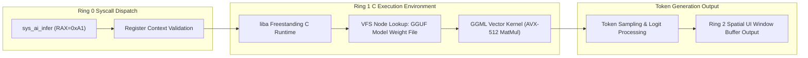

> **Status:** #status/implemented

# 🧠 Ring 1 – The C Inference Engine

> **Location in Tree:** `src/kernel/ai_engine.c` / `liba/`  
> **Compiler Flags:** `-O3 -mavx512f -mno-red-zone -fno-stack-protector`  
> **Role:** Bridges ASM syscalls to high-performance local transformer matrix arithmetic.

---

## 1. Responsibilities & Structure
Ring 1 operates as the kernel overhead layer:
- **Zero-Copy Memory-Mapped Weights:** Uses huge pages (2MB / 1GB) allocated by Ring 0 to map quantized `.gguf` model weights without page faults.
- **SIMD Forward Pass:** Executes transformer layers using AVX-512 vectorized fused multiply-add (`vfmadd231ps`) and dot products.
- **Kernel-Stack Safe:** Compiled with `-mno-red-zone` so that hardware interrupts do not clobber the C stack frame.

---

## 2. Core Components

### 2.1. Model Loader (`ai_load_model_c`)
```c
#include <heaplit.h>
#include <mmap.h>

typedef struct {
    void* weights;          // Memory-mapped model file buffer
    size_t size;            // Total bytes
    uint32_t n_layers;      // Model layers
    void* ggml_ctx;         // Ported GGML context
} ai_model_t;

ai_model_t* models[16];     // Max 16 concurrent loaded models

uint64_t ai_load_model_c(char* path, uint64_t hint) {
    ai_model_t* model = kmalloc(sizeof(ai_model_t));
    
    // Open file via Kernel Virtual File System (VFS)
    int fd = vfs_open(path, O_RDONLY);
    struct stat st;
    vfs_fstat(fd, &st);
    
    // Allocate contiguous huge pages (2MB chunks) in kernel PML4
    model->weights = kalloc_huge_pages((st.st_size + 0x1FFFFF) >> 21);
    vfs_read(fd, model->weights, st.st_size);
    vfs_close(fd);

    // Initialize the ported inference context
    model->ggml_ctx = ggml_init(model->weights, st.st_size);
    models[0] = model; 
    return 0; // Returns model handle
}
```

### 2.2. The Inference Trampoline (`ai_infer_c`)
```c
__attribute__((hot))
__attribute__((target("avx512f")))
uint64_t ai_infer_c(uint64_t handle, char* prompt, size_t len, char* output) {
    ai_model_t* model = models[handle];
    if (!model) return -1;

    // 1. Tokenize prompt (Byte Pair Encoding)
    int* tokens = tokenize(prompt, len);

    // 2. Run transformer forward pass with hardware vectorization
    int n_tokens = llama_eval(model->ggml_ctx, tokens, len);

    // 3. Sample next token (Greedy or Top-K / Top-P)
    char result[256];
    sample_token(model->ggml_ctx, result);

    // 4. Copy to user output buffer
    strcpy(output, result);
    return n_tokens;
}
```

---

## 3. The "Antigravity" Optimization Secret
1. By marking inference functions with `__attribute__((hot))` and `__attribute__((target("avx512f")))`, Clang emits native `vaddps` and `vmulps` instructions directly into the kernel memory space.
2. No Linux userland syscall overhead or glibc abstractions: raw hardware memory throughput.

---

## 4. Related Notes
- [[00 - Architecture/Ring 0 - Metal & Scheduler|Ring 0 Scheduler]]
- [[00 - Architecture/Ring 2 - Antigravity Userland Daemon|Ring 2 Userland Daemon]]
- [[01 - Planning/Grand Roadmap & Timeline|Roadmap & Timeline]]

## 🔄 Ring 1 Freestanding C & AI Bridge Pipeline


