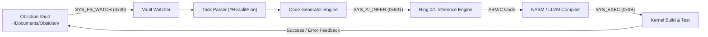

> **Status:** #status/future-implementation

# 🤖 Ring 2 – Heaplit Userland Daemon

> **Binary Path:** `/system/bin/heaplit`  
> **IPC Endpoint:** `/tmp/heaplit.sock`  
> **Source Language:** C++ / Custom Language (compiled with LLVM)

---

## 1. Role & Architectural Responsibilities
The **Heaplit Daemon** is the primary autonomous agent process inside Heaplit OS. It runs in userland (Ring 2/3) and acts as the developer's pair-programmer and autonomous co-architect.



---

## 2. Core Subsystems

### 2.1. Obsidian Vault Watcher
- Listens on kernel filesystem events using `SYS_FS_WATCH` (`0x30`).
- Monitors markdown files tagged with `#HeaplitPlan`.
- Parses unfinished checkbox items: `- [ ] ...` and `@Heaplit:` directives.

### 2.2. Code Generator & Prompt Synthesizer
- Builds structured contextual prompts with existing kernel headers and registers.
- Dispatches prompts to the hardware inference engine using `SYS_AI_INFER` (`0x601`).
- Receives generated NASM / C syntax strings.

### 2.3. Compiler Hook & Injection
- Writes generated files directly into `src/boot/`, `src/kernel/`, or `rings/`.
- Executes `nasm -f bin` or `make` via `SYS_EXEC` (`0x3B`).
- If assembly errors occur, captures stderr and updates the `# Build Errors` section in the corresponding Obsidian note for iterative correction.

---

## 3. Daemon IPC API (`/tmp/heaplit.sock`)

The daemon provides a JSON-over-socket interface for the OS GUI/shell:

```json
// 1. Request Plan Generation
{ "cmd": "plan", "text": "Implement PCI bus enumeration in x86 ASM" }

// 2. Apply Code to Source Tree
{ "cmd": "apply", "file": "pci.asm" }

// 3. Query Autonomous Build Progress
{ "cmd": "status" }
```

---

## 4. 24/7 Autonomous Execution Loop
1. **Boot Initialization:** Kernel launches `/system/bin/heaplit` as the first user process.
2. **Model Loading:** Calls `SYS_AI_LOAD_MODEL` (`0x600`) to cache the quantized GGUF weights.
3. **Idle State:** Enters zero-CPU sleep via `hlt` loop in the ASM scheduler until awakened by `SYS_FS_NOTIFY`.
4. **Think & Act:** Generates code, compiles, executes QEMU test, and records the transcript in Obsidian.

---

## 5. Related Notes
- [[00 - Architecture/Obsidian Integration & 2-Way Sync|Two-Way Obsidian Sync]]
- [[01 - Planning/Grand Roadmap & Timeline|Roadmap & Timeline]]
- [[02 - Reference/AI Syscall Specification|AI Syscall Specification]]
