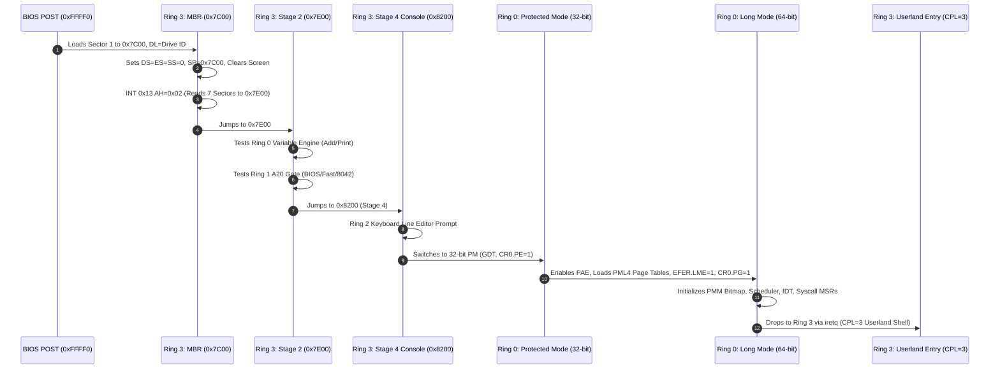

> **Status:** #status/implemented

# 🏛️ Heaplit OS System Architecture

Heaplit OS is designed from first principles as a **Sovereign, Compiler-Native, AI-Embedded Operating System**. Rather than treating the AI Agent (**Antigravity**) as an untrusted, heavy userland web app, the AI engine is integrated directly into the ring execution hierarchy of the OS, while the bare-metal kernel speaks pure assembly directly to the hardware.

---

## 1. The 4-Layer Ring Dependency Hierarchy

Heaplit OS enforces a strict mathematical dependency hierarchy across its execution and organizational layers:

$$\text{A module in Ring } N \text{ can depend on / require modules from Ring } M \iff M \le N$$

Violating this rule introduces circular dependencies, layer violations, or silent loading crashes.

```mermaid
graph TD
    subgraph Ring3["Ring 3: Staged Boot Orchestration & Userland Applications"]
        R3_1["base.asm (Master Multi-Sector Orchestrator)"]
        R3_2["mbr.asm (Sector 1 Bootloader @ 0x7C00)"]
        R3_3["stage2.asm (Sectors 2-3 Diagnostics & Hardware Tests)"]
        R3_4["stage4_console.asm (Sector 4 Interactive Console)"]
        R3_5["entry.asm (Ring 3 Userland Shell & Applications)"]
    end

    subgraph Ring2["Ring 2: Presentation & Interactive Input Services"]
        R2_1["console.asm (Video Mode, Cursor Positioning, Hex/String Printers)"]
        R2_2["keyboard.asm (BIOS INT 0x16 Polling, Line Buffer Editor, Backspace)"]
        R2_3["The Lens Graph UI & Spatial Compositor (Future)"]
    end

    subgraph Ring1["Ring 1: Hardware Abstraction, Drivers & C Runtime Bridge"]
        R1_1["a20.asm (Multi-tier A20 Line Gate Enabler)"]
        R1_2["liba (Freestanding C Runtime: string.c, kprintf.c)"]
        R1_3["drivers (PCIe Scanner, VFS, GGML AI Engine Bridge)"]
    end

    subgraph Ring0["Ring 0: Pure Metal Utilities & Microkernel Core"]
        R0_1["types (variable.asm 6-byte engine, math.asm, string.asm)"]
        R0_2["memory (memory.asm block ops, pmm.asm 4KB bitmap allocator)"]
        R0_3["cpu (gdt.asm, idt.asm, paging.asm, protected_mode.asm, long_mode.asm)"]
        R0_4["sched (scheduler.asm tickless switch <100 cycles)"]
        R0_5["syscalls (syscall.asm MSR LSTAR, syscall_ai.asm 0x600-0x602 XSAVE)"]
    end

    Ring3 -->|Can Require Ring 0, 1, 2, 3| Ring2
    Ring3 -->|Can Require Ring 0, 1, 2, 3| Ring1
    Ring3 -->|Can Require Ring 0, 1, 2, 3| Ring0
    Ring2 -->|Can Require Ring 0, 1, 2| Ring1
    Ring2 -->|Can Require Ring 0, 1, 2| Ring0
    Ring1 -->|Can Require Ring 0, 1| Ring0
    Ring0 -->|Strictly Independent (M = 0)| Ring0
```

---

## 2. Layer-by-Layer Responsibilities

| Ring Layer | Directory Path | Allowed Dependencies | Core Responsibilities |
| :--- | :--- | :--- | :--- |
| **Ring 0** | `rings/ring_0/` | **Ring 0 only ($M \le 0$)** | Independent metal utilities, dynamic variable type system, string/math functions, memory block operations, PMM bitmap allocator, GDT/IDT/Paging tables, tickless scheduler, fast MSR LSTAR syscall dispatcher, AVX-512 XSAVE engine. **MUST NOT require Ring 1, 2, or 3.** |
| **Ring 1** | `rings/ring_1/` | **Ring 0, Ring 1 ($M \le 1$)** | Hardware lines (A20 gate), freestanding C runtime (`liba`), device drivers (PCIe enumeration, VFS with xattr graph hooks, GGML inference bridge). **MUST NOT require Ring 2 or 3.** |
| **Ring 2** | `rings/ring_2/` | **Ring 0, Ring 1, Ring 2 ($M \le 2$)** | Presentation and input services: VGA video mode control, cursor management, hex/string printers, interactive keyboard reader, line buffer editor with backspace handling. **MUST NOT require Ring 3.** |
| **Ring 3** | `rings/ring_3/` | **Ring 0, Ring 1, Ring 2, Ring 3 ($M \le 3$)** | Top-level staged boot orchestrator (`base.asm`), MBR bootstrap (`mbr.asm`), stage diagnostics (`stage2.asm`), interactive shell stage (`stage4_console.asm`), userland CPL=3 entrypoint (`entry.asm`), and Antigravity userland daemon. |

---

## 3. The Non-Monolithic "Scaffolded Abstraction" Mandate

Monolithic kernel codebases suffer from tight coupling, high cognitive overhead, and failure cascades. Heaplit OS enforces **Scaffolded Abstractions**:
- Every subsystem is isolated into a dedicated folder (`boot/`, `cpu/`, `memory/`, `types/`, `sched/`, `syscalls/`, `hardware/`, `console/`, `input/`, `userland/`).
- Each module has a single, well-defined responsibility.
- Modules expose clean procedural or structure-based ABIs.
- High-level orchestrators compose lower-level primitives without embedding low-level implementations.

---

## 4. Execution Flow: From Power-On to Userland



---

## 5. Related Architectural Documents
- [[00 - Architecture/Exhaustive Code Architecture & Implementation Walkthrough|Exhaustive Code Architecture & Walkthrough]]
- [[00 - Architecture/Code Quality & Engineering Guidelines|Code Quality & Engineering Guidelines]]
- [[01 - Ring 0 - Metal Core (Assembly)/01 - Boot Sequence & Staged Loading|Ring 0 Boot & Staged Loading]]
- [[02 - Ring 1 - The C Overhead (Bridge)/01 - Freestanding C Runtime (liba)|Ring 1 Freestanding C Runtime]]
- [[03 - Ring 2 - Userland & Spatial UI/01 - Antigravity Daemon Architecture|Ring 2 / Ring 3 Userland Architecture]]
