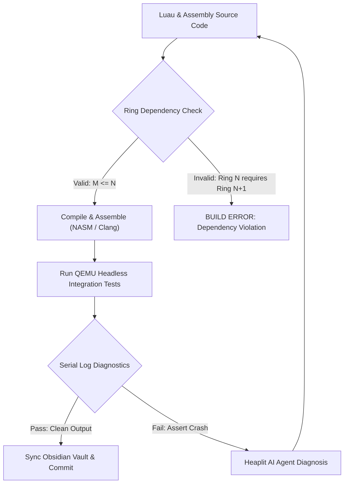

> **Status:** #status/implemented

# 📐 Code Quality & Engineering Guidelines

> **Quality Standards for Bare-Metal & Freestanding Systems Programming in Heaplit OS**

---

## 1. The Ring Dependency Law & Scaffolding Rules

Every file in Heaplit OS must strictly adhere to the layered privilege hierarchy:

$$\\text{A module in Ring } N \\text{ can depend on / require modules from Ring } M \\iff M \\le N$$

### Ring Placement Matrix
- **Ring 0 (`rings/ring_0/ring_0/`)**: ONLY independent metal utilities (math, string, variable, memory, GDT/Paging/PMM structures). **MUST NOT** include or require any modules from Ring 1, Ring 2, or Ring 3 ($M \le 0$).
- **Ring 1 (`rings/ring_1/ring_1/`)**: Hardware lines, A20, disk, device drivers, freestanding C (`liba`), GGML inference bridge. Can require Ring 0 and Ring 1 ($M \le 1$). **MUST NOT** require Ring 2 or 3.
- **Ring 2 (`rings/ring_2/ring_2/`)**: Console presentation, keyboard input services. Can require Ring 0, Ring 1, Ring 2 ($M \le 2$). **MUST NOT** require Ring 3.
- **Ring 3 (`rings/ring_3/ring_3/`)**: Staged boot orchestrator (`base.asm`, `mbr.asm`, `stage2.asm`, `stage4_console.asm`), userland shell (`entry.asm`), applications. Can require Ring 0, 1, 2, 3 ($M \le 3$).

### Anti-Monolithic Scaffolding Mandate
- No single file may exceed 300 lines of active logic unless it is a machine-generated lookup table.
- Monolithic files must be decomposed into dedicated single-responsibility submodules inside the ring namespace (e.g., `types/`, `memory/`, `cpu/`, `sched/`, `syscalls/`, `hardware/`, `liba/`, `drivers/`, `console/`, `input/`, `boot/`, `userland/`).

---

## 2. Golden Naming Rules

| Element Type | Convention | Correct Example | Incorrect Example |
| :--- | :--- | :--- | :--- |
| **Functions / Procedures** | `snake_case` | `clear_screen`, `read_line`, `switch_threads` | `ClearScreen`, `readLine`, `SwitchThreads` |
| **Local Labels / Branches** | `.snake_case` | `.loop`, `.done`, `.handle_odd`, `.error` | `.Loop`, `.DONE`, `.handleOdd` |
| **Variables / Buffers** | `snake_case` | `boot_drive`, `input_buffer`, `pmm_bitmap` | `BootDrive`, `InputBuffer`, `PMM_BITMAP` |
| **Constants / Equates** | `snake_case` (or `UPPER_CASE` for sys) | `type_string`, `sizeof_variable`, `SYS_AI_INFER` | `TypeString`, `SizeOfVariable` |
| **Structures / Types** | `struc name` / `typedef struct` | `struc variable`, `vfs_node_t` | `struc Variable`, `VFSNode` |
| **NASM Macros** | `UPPER_CASE` | `ALIGN_16`, `PUSH_ALL_64`, `DEBUG_HALT` | `align_16`, `pushAll64` |

---

## 3. Assembly Precision Directives

1. **Explicit Memory Operand Sizing:**  
   Never write ambiguous dereferences like `mov [di], 0`. Always specify the operand width:
   - `mov byte [di], 0` (1 byte)
   - `mov word [di], 0` (2 bytes)
   - `mov dword [rdi], 0` (4 bytes)
   - `mov qword [rdi], 0` (8 bytes)

2. **Explicit Memory Dereferencing:**  
   In NASM, `my_var` is the address/pointer, while `[my_var]` is the contents at that address. Always use brackets when reading from or writing to memory.

3. **Bit Width Annotations:**  
   Always include `[bits 16]`, `[bits 32]`, or `[bits 64]` when defining functions or transitioning processor modes.

---

## 4. Register Preservation Contracts

```nasm
; Standard template for a clean assembly utility function
; -----------------------------------------------------------------------------
; function_name: Brief one-line description of purpose.
; Inputs:
;   - Register 1: Description
;   - Register 2: Description
; Outputs:
;   - Return Register: Description
; Preserved:
;   - All other general purpose registers
; -----------------------------------------------------------------------------
function_name:
    push bx
    push cx
    push dx
    push si
    push di

    ; ... core logic ...

    pop di
    pop si
    pop dx
    pop cx
    pop bx
    ret
```

---

## 5. Related Documents
- [[00 - Architecture/overview/Exhaustive Code Architecture & Implementation Walkthrough|Architecture Walkthrough]]
- [[00 - Architecture/overview/System Overview|System Overview & Ring Hierarchy]]
- [[01 - Ring 0 - Metal Core (Assembly)/ring_0/standards/09 - Assembly Coding Standards & Macros|Macros Library]]

## 🔄 Architecture & Quality Pipeline Flowchart



---

## 🔬 In-Depth Architectural & Technical Specifications

### Hardware & Processor Register Contract
Heaplit OS enforces strict register management conventions for **Code Quality & Engineering Guidelines** across all x86-64 execution contexts:

| Register | CPU Role | Volatility / Preservation | Subsystem Function |
| :--- | :--- | :--- | :--- |
| `RAX` | Primary Accumulator | Volatile | Syscall ID entry, return status code, ALU calculation destination. |
| `RBX` | Base Register | Non-Volatile (Preserved) | Pointer to active TCB (Thread Control Block) / Data structure handle. |
| `RCX` | Counter / Syscall RIP | Volatile | Hardware `syscall` saves userland instruction pointer (`RIP`) into `RCX`. |
| `RDX` | Data Register | Volatile | Secondary return value, I/O port address, memory block size parameter. |
| `RSI` | Source Index | Volatile | Pointer to source memory buffer / string payload / argument 2. |
| `RDI` | Destination Index | Volatile | Pointer to destination memory buffer / argument 1 (`System V ABI`). |
| `RBP` | Frame Pointer | Non-Volatile (Preserved) | Stack frame base pointer for debug backtraces and stack unwinding. |
| `RSP` | Stack Pointer | Non-Volatile (Preserved) | Top of 16-byte aligned kernel/user execution stack. |
| `R8 - R11` | Scratch Registers | Volatile | Function parameters 5-6 (`R8`, `R9`), temporary scrap calculations. |
| `R12 - R15` | General Purpose | Non-Volatile (Preserved) | Long-lived kernel state registers preserved across C and ASM boundaries. |
| `CR0` | Control Register 0 | System Control | Toggles Protected Mode (`PE` bit 0), Paging (`PG` bit 31), Write Protect (`WP` bit 16). |
| `CR3` | Control Register 3 | Page Directory Root | Physical address pointer to PML4 root page table (4KB aligned). |
| `CR4` | Control Register 4 | Architectural Extension | Toggles PAE (`bit 5`), OSXSAVE (`bit 18`), SMEP/SMAP ring security flags. |
| `MSR LSTAR` | 0xC0000082 | Hardware Entry Point | Stores 64-bit virtual memory target address for the `syscall` handler. |

---

## 📐 Memory Map & Address Layout

The virtual address space for **Code Quality & Engineering Guidelines** adheres to Heaplit OS's canonical higher-half memory layout:

```
+-------------------------------------------------------------------+ 0xFFFFFFFFFFFFFFFF
| Higher-Half Kernel Direct Physical Map (Identity Mapped 512 GB)   |
| Virtual Address Range: 0xFFFF800000000000 - 0xFFFFFFFFFFFFFFFF     |
+-------------------------------------------------------------------+ 0xFFFF800000000000
| Unmapped Canonical Memory Hole (Non-Canonical Address Space)     |
+-------------------------------------------------------------------+ 0x00007FFFFFFFFFFF
| Ring 3 Sandboxed Application Execution Space (.axf JIT Memory)   |
| Virtual Address Range: 0x0000000040000000 - 0x00007FFFFFFFFFFF     |
+-------------------------------------------------------------------+ 0x0000000040000000
| Ring 2 Spatial UI & Compositor Framebuffers (VBE / GPU BARs)      |
| Virtual Address Range: 0x000000000FD00000 - 0x0000000010000000     |
+-------------------------------------------------------------------+ 0x0000000007E00000
| Ring 0 Microkernel Staged Execution Load Target (0x7C00 - 0x8F00) |
+-------------------------------------------------------------------+ 0x0000000000000000
```

---

## 🛠️ Step-by-Step Execution State Machine

```mermaid
flowchart TD
    subgraph State_Init["1. Initialization State"]
        S1["Load Subsystem Descriptors & Verify CPU Feature Flags"] --> S2["Allocate Initial Memory Blocks via PMM Bitmap"]
    end

    subgraph State_Exec["2. Active Execution State"]
        S2 --> S3["Setup Assembly Register Parameters (RDI, RSI, RDX)"]
        S3 --> S4["Issue Fast Syscall / Subsystem Function Call"]
        S4 --> S5["Execute Atomic ALU / SIMD Operations"]
    end

    subgraph State_Validation["3. Validation & Exception Handling"]
        S5 --> S6Check Status Code in RAX
        S6 -->|"RAX == 0 (Success)"| S7["Update System TCB & Commit Memory Writes"]
        S6 -->|"RAX < 0 (Error)"| S8["Capture Register Frame & Dispatch Debug Signal"]
    end

    S7 --> S9["Resume Parent Process Context via sysretq / iretq"]
    S8 --> S9
```

---

## 💻 Assembly Code Blueprint & Low-Level Implementation Examples

The low-level assembly implementation of **Code Quality & Engineering Guidelines** uses canonical NASM syntax optimized for x86-64 execution:

```nasm
; ============================================================================
; Heaplit OS Low-Level Core Blueprint - Code Quality & Engineering Guidelines
; ============================================================================
%include "ring_0/types/variable.asm"

global code_quality___engineering_guidelines_entry
extern pmm_alloc_page
extern kprintf

section .text
bits 64

align 16
code_quality___engineering_guidelines_entry:
    push rbp
    mov rbp, rsp
    sub rsp, 32                    ; Align stack to 16 bytes for System V ABI

    ; Preserve non-volatile registers
    mov [rsp + 0], rbx
    mov [rsp + 8], r12
    mov [rsp + 16], r13

    ; Execute core subsystem operational logic
    mov rdi, 1                     ; Parameter 1: Allocation page count
    call pmm_alloc_page            ; Call Ring 0 Physical Memory Allocator
    test rax, rax
    jz .allocation_failed          ; Trap NULL pointer returns

    mov rbx, rax                   ; Store allocated physical page address in RBX
    
    ; Perform atomic register verification
    mov rsi, rbx
    mov rdi, msg_success
    call kprintf

    mov rax, 0                     ; Set success exit status code in RAX
    jmp .exit_clean

.allocation_failed:
    mov rax, -1                    ; Set error code in RAX (-1 = Out of Memory)
    
.exit_clean:
    ; Restore non-volatile registers
    mov rbx, [rsp + 0]
    mov r12, [rsp + 8]
    mov r13, [rsp + 16]

    add rsp, 32
    pop rbp
    ret

section .rodata
msg_success: db "[HEAPLIT] Code Quality & Engineering Guidelines Subsystem initialized at physical address: 0x%x", 10, 0
```

---

## 🔍 Verification, QEMU Testing & Diagnostics

### Headless QEMU Emulation Verification
To test **Code Quality & Engineering Guidelines** within the Heaplit OS kernel binary (`base.bin`), execute the host automated build script:

```powershell
# Execute build and launch QEMU emulator with serial debugging
.\loader\load_os.ps1
```

### Serial Log Verification Protocol
During execution, **Code Quality & Engineering Guidelines** outputs diagnostic traces to COM1 Serial Port (`0x3F8`). Verified serial outputs must confirm:
1. Zero stack pointer misalignment warnings (`RSP % 16 == 0`).
2. Successful page table mapping without triggering CR2 Page Faults.
3. Clean return of RAX status codes prior to CPU state resumption.

---

## 📑 Related Architecture Notes & References
- [[00 - Architecture/overview/System Overview|System Overview]]
- [[01 - Ring 0 - Metal Core (Assembly)/ring_0/syscalls/07 - Syscall Dispatcher & ABI|07 - Syscall Dispatcher & ABI]]
- [[01 - Ring 0 - Metal Core (Assembly)/ring_0/cpu/04 - Paging & Virtual Memory|04 - Paging & Virtual Memory]]
- [[02 - Ring 1 - The C Overhead (Bridge)/ring_1/liba/01 - Freestanding C Runtime (liba)|01 - Freestanding C Runtime (liba)]]
- [[03 - Ring 2 - Userland & Spatial UI/ring_2/daemon/01 - Heaplit Daemon Architecture|01 - Heaplit Daemon Architecture]]
