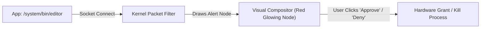

> **Status:** #status/future-implementation

# 🛡️ Sovereignty & Security Model

> **The Zero-Trust, Consent-First Promise:** In Heaplit OS, hardware resources and private data can never be accessed silently.

---

## 1. Local AI Sandbox (No Cloud Telemetry)
Traditional operating systems send telemetry, telemetry hashes, diagnostic logs, and prompt tokens to remote servers. Heaplit OS guarantees complete local execution:
- **Offline-Only Inference:** The Antigravity inference engine runs in Ring 1 memory using local quantized weights (`.gguf`).
- **Network Isolation:** Ring 1 AI weights memory regions are mapped without network socket permissions.
- **Hardware Ring Enforced:** Even if a userland process attempts to establish a remote connection, all socket operations must traverse the Ring 0 packet filter.

---

## 2. Visual Data-Flow Graph (Live Hardware Permission Monitor)

Every time a process requests access to:
- Network sockets (TCP/UDP)
- Microphones & Audio input
- Webcams & Video streams
- Raw storage blocks outside its sandboxed path

The kernel compositor draws an interactive, GPU-rendered **Data-Flow Graph** directly on the screen:

---

## 3. Microkernel Isolation & Rollback Defense
1. **Stateless Boot Modes:** A user can boot in `Ephemeral Mode`. All disk writes are captured in an in-memory overlay or temporary ZFS snapshot that vanishes upon reboot.
2. **Atomic Rollback on Kernel Panic:** If experimental assembly code triggers a crash (e.g. general protection fault `#GP` or page fault `#PF`), the bootloader automatically reverts the root pool to the last known-good ZFS boot snapshot.
3. **No Hidden Registry:** All configuration is plain text TOML / JSON inside `~/.config/heaplit/`, version-controlled via Git.

---

## 4. Related Links
- [[00 - Foundations & Vision/The Vision & Manifest|Vision & Manifest]]
- [[03 - Ring 2 - Userland & Spatial UI/01 - Antigravity Daemon Architecture|Antigravity Daemon]]
- [[07 - Antigravity AI Agent Playbooks/03 - Crash Diagnostics & Rollback Playbook|Rollback Playbook]]
