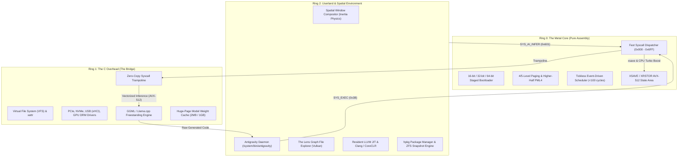

> **Status:** #status/future-implementation

# 📐 System Architecture Blueprint

> **The 3-Ring Division of Labor:** Maximizing execution speed while isolating complexity and maintaining clean security boundaries.

---

## 1. The 3-Ring Core Topology

---

## 2. Technical Ring Breakdown

### Ring 0: The Metal Core (Pure Assembly)
- **Languages:** NASM / GAS x86_64 (ARM64 / RISC-V ports in Phase 4).
- **Core Kernel Responsibilities:**
  - Multi-stage bootstrapping (`0x7C00` MBR $\rightarrow$ `0x7E00` Extended Sector $\rightarrow$ `0x8000` Kernel Entry).
  - Global Descriptor Table (GDT), Interrupt Descriptor Table (IDT), Task State Segment (TSS).
  - 4-Level & 5-Level Paging setup (`PML4` / `PML5`), identity mapping lower memory and higher-half mapping (`0xFFFFFFFF80000000`).
  - Physical Memory Manager (Bitmap / Buddy Allocator).
  - **Tickless Event-Driven Scheduler:** Does not rely on periodic timer interrupts. Context switching is a hand-tuned ~20-instruction macro swapping `CR3`, `RSP`, `RFLAGS`, and general-purpose registers in under 100 clock cycles.
  - **AI Syscall Dispatcher:** Handles `SYS_AI_LOAD_MODEL` (`0x600`), `SYS_AI_INFER` (`0x601`), and `SYS_AI_SCHEDULE_TASK` (`0x602`).

### Ring 1: The C Overhead (The Bridge)
- **Language:** Freestanding C (`-O3 -mavx512f -mno-red-zone -fno-stack-protector`).
- **Core Responsibilities:**
  - Device drivers: PCIe enumeration, NVMe storage controllers, USB xHCI host controllers.
  - Virtual File System (VFS) with POSIX and extended attribute (`xattr`) support.
  - Filesystem drivers: FAT32, EXT4, and ZFS read/write.
  - **AI Inference Engine:** Ported GGML/Llama.cpp runtime. Clang auto-vectorizes transformer matrix arithmetic into native AVX-512 `vfmadd231ps` instructions running directly in kernel memory space.

### Ring 2: The Userland (Spatial & Compiler Native)
- **Languages:** Custom high-level language compiled to LLVM Bitcode (`.axf`), native Clang C/C++, and CoreCLR (C# RyuJIT).
- **Core Responsibilities:**
  - **Antigravity Daemon:** Watches `~/Documents/Obsidian/` via `SYS_FS_WATCH` (`0x30`), generates kernel code, and triggers automated builds.
  - **Spatial Window Compositor:** Physics-based window management with inertia and sub-pixel GPU acceleration.
  - **The Lens File Explorer:** Visualizes filesystem nodes as a real-time force-directed graph.
  - **Live Theming:** Watches `~/.config/heaplit/theme.toml` and live-updates UI shaders with zero latency.

---

## 3. Related Links
- [[01 - Ring 0 - Metal Core (Assembly)/01 - Boot Sequence & Staged Loading|Boot Sequence Specification]]
- [[01 - Ring 0 - Metal Core (Assembly)/06 - Tickless ASM Scheduler|Tickless Scheduler]]
- [[02 - Ring 1 - The C Overhead (Bridge)/02 - GGML & Llama.cpp Kernel Port|GGML C Engine]]
- [[03 - Ring 2 - Userland & Spatial UI/01 - Antigravity Daemon Architecture|Antigravity Daemon]]
