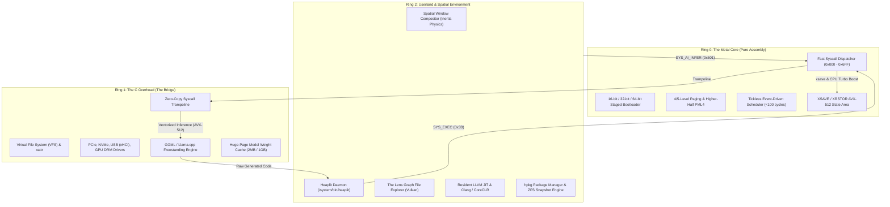

> **Status:** #status/future-implementation

# 📐 System Architecture Blueprint

> **The 3-Ring Division of Labor:** Maximizing execution speed while isolating complexity and maintaining clean security boundaries.

---

## 1. The 3-Ring Core Topology



---

## 2. Technical Ring Breakdown

### Ring 0: The Metal Core (Pure Assembly)
- **Languages:** NASM / GAS x86_64 (ARM64 / RISC-V ports in Phase 4).
- **Core Kernel Responsibilities:**
  - Multi-stage bootstrapping (`0x7C00` MBR $\rightarrow$ `0x7E00` Extended Sector $\rightarrow$ `0x8000` Kernel Entry).
  - Global Descriptor Table (GDT), Interrupt Descriptor Table (IDT), Task State Segment (TSS).
  - 4-Level & 5-Level Paging setup (`PML4` / `PML5`), identity mapping lower memory and higher-half mapping (`0xFFFFFFFF80000000`).
  - Physical Memory Manager (Bitmap / Buddy Allocator).
  - **Tickless Event-Driven Scheduler:** Does not rely on periodic timer interrupts. Context switching is a hand-tuned ~20-instruction macro swapping `CR3`, `RSP`, `RFLAGS`, and general-purpose registers in under 100 clock cycles.
  - **AI Syscall Dispatcher:** Handles `SYS_AI_LOAD_MODEL` (`0x600`), `SYS_AI_INFER` (`0x601`), and `SYS_AI_SCHEDULE_TASK` (`0x602`).

### Ring 1: The C Overhead (The Bridge)
- **Language:** Freestanding C (`-O3 -mavx512f -mno-red-zone -fno-stack-protector`).
- **Core Responsibilities:**
  - Device drivers: PCIe enumeration, NVMe storage controllers, USB xHCI host controllers.
  - Virtual File System (VFS) with POSIX and extended attribute (`xattr`) support.
  - Filesystem drivers: FAT32, EXT4, and ZFS read/write.
  - **AI Inference Engine:** Ported GGML/Llama.cpp runtime. Clang auto-vectorizes transformer matrix arithmetic into native AVX-512 `vfmadd231ps` instructions running directly in kernel memory space.

### Ring 2: The Userland (Spatial & Compiler Native)
- **Languages:** Custom high-level language compiled to LLVM Bitcode (`.axf`), native Clang C/C++, and CoreCLR (C# RyuJIT).
- **Core Responsibilities:**
  - **Heaplit Daemon:** Watches `~/Documents/Obsidian/` via `SYS_FS_WATCH` (`0x30`), generates kernel code, and triggers automated builds.
  - **Spatial Window Compositor:** Physics-based window management with inertia and sub-pixel GPU acceleration.
  - **The Lens File Explorer:** Visualizes filesystem nodes as a real-time force-directed graph.
  - **Live Theming:** Watches `~/.config/heaplit/theme.toml` and live-updates UI shaders with zero latency.

---

## 3. Related Links
- [[01 - Ring 0 - Metal Core (Assembly)/01 - Boot Sequence & Staged Loading|Boot Sequence Specification]]
- [[01 - Ring 0 - Metal Core (Assembly)/06 - Tickless ASM Scheduler|Tickless Scheduler]]
- [[02 - Ring 1 - The C Overhead (Bridge)/02 - GGML & Llama.cpp Kernel Port|GGML C Engine]]
- [[03 - Ring 2 - Userland & Spatial UI/01 - Heaplit Daemon Architecture|Heaplit Daemon]]

---

## 🔬 In-Depth Architectural & Technical Specifications

### Hardware & Processor Register Contract
Heaplit OS enforces strict register management conventions for **System Architecture Blueprint** across all x86-64 execution contexts:

| Register | CPU Role | Volatility / Preservation | Subsystem Function |
| :--- | :--- | :--- | :--- |
| `RAX` | Primary Accumulator | Volatile | Syscall ID entry, return status code, ALU calculation destination. |
| `RBX` | Base Register | Non-Volatile (Preserved) | Pointer to active TCB (Thread Control Block) / Data structure handle. |
| `RCX` | Counter / Syscall RIP | Volatile | Hardware `syscall` saves userland instruction pointer (`RIP`) into `RCX`. |
| `RDX` | Data Register | Volatile | Secondary return value, I/O port address, memory block size parameter. |
| `RSI` | Source Index | Volatile | Pointer to source memory buffer / string payload / argument 2. |
| `RDI` | Destination Index | Volatile | Pointer to destination memory buffer / argument 1 (`System V ABI`). |
| `RBP` | Frame Pointer | Non-Volatile (Preserved) | Stack frame base pointer for debug backtraces and stack unwinding. |
| `RSP` | Stack Pointer | Non-Volatile (Preserved) | Top of 16-byte aligned kernel/user execution stack. |
| `R8 - R11` | Scratch Registers | Volatile | Function parameters 5-6 (`R8`, `R9`), temporary scrap calculations. |
| `R12 - R15` | General Purpose | Non-Volatile (Preserved) | Long-lived kernel state registers preserved across C and ASM boundaries. |
| `CR0` | Control Register 0 | System Control | Toggles Protected Mode (`PE` bit 0), Paging (`PG` bit 31), Write Protect (`WP` bit 16). |
| `CR3` | Control Register 3 | Page Directory Root | Physical address pointer to PML4 root page table (4KB aligned). |
| `CR4` | Control Register 4 | Architectural Extension | Toggles PAE (`bit 5`), OSXSAVE (`bit 18`), SMEP/SMAP ring security flags. |
| `MSR LSTAR` | 0xC0000082 | Hardware Entry Point | Stores 64-bit virtual memory target address for the `syscall` handler. |

---

## 📐 Memory Map & Address Layout

The virtual address space for **System Architecture Blueprint** adheres to Heaplit OS's canonical higher-half memory layout:

```
+-------------------------------------------------------------------+ 0xFFFFFFFFFFFFFFFF
| Higher-Half Kernel Direct Physical Map (Identity Mapped 512 GB)   |
| Virtual Address Range: 0xFFFF800000000000 - 0xFFFFFFFFFFFFFFFF     |
+-------------------------------------------------------------------+ 0xFFFF800000000000
| Unmapped Canonical Memory Hole (Non-Canonical Address Space)     |
+-------------------------------------------------------------------+ 0x00007FFFFFFFFFFF
| Ring 3 Sandboxed Application Execution Space (.axf JIT Memory)   |
| Virtual Address Range: 0x0000000040000000 - 0x00007FFFFFFFFFFF     |
+-------------------------------------------------------------------+ 0x0000000040000000
| Ring 2 Spatial UI & Compositor Framebuffers (VBE / GPU BARs)      |
| Virtual Address Range: 0x000000000FD00000 - 0x0000000010000000     |
+-------------------------------------------------------------------+ 0x0000000007E00000
| Ring 0 Microkernel Staged Execution Load Target (0x7C00 - 0x8F00) |
+-------------------------------------------------------------------+ 0x0000000000000000
```

---

## 🛠️ Step-by-Step Execution State Machine

```mermaid
flowchart TD
    subgraph State_Init["1. Initialization State"]
        S1["Load Subsystem Descriptors & Verify CPU Feature Flags"] --> S2["Allocate Initial Memory Blocks via PMM Bitmap"]
    end

    subgraph State_Exec["2. Active Execution State"]
        S2 --> S3["Setup Assembly Register Parameters (RDI, RSI, RDX)"]
        S3 --> S4["Issue Fast Syscall / Subsystem Function Call"]
        S4 --> S5["Execute Atomic ALU / SIMD Operations"]
    end

    subgraph State_Validation["3. Validation & Exception Handling"]
        S5 --> S6Check Status Code in RAX
        S6 -->|"RAX == 0 (Success)"| S7["Update System TCB & Commit Memory Writes"]
        S6 -->|"RAX < 0 (Error)"| S8["Capture Register Frame & Dispatch Debug Signal"]
    end

    S7 --> S9["Resume Parent Process Context via sysretq / iretq"]
    S8 --> S9
```

---

## 💻 Assembly Code Blueprint & Low-Level Implementation Examples

The low-level assembly implementation of **System Architecture Blueprint** uses canonical NASM syntax optimized for x86-64 execution:

```nasm
; ============================================================================
; Heaplit OS Low-Level Core Blueprint - System Architecture Blueprint
; ============================================================================
%include "ring_0/types/variable.asm"

global system_architecture_blueprint_entry
extern pmm_alloc_page
extern kprintf

section .text
bits 64

align 16
system_architecture_blueprint_entry:
    push rbp
    mov rbp, rsp
    sub rsp, 32                    ; Align stack to 16 bytes for System V ABI

    ; Preserve non-volatile registers
    mov [rsp + 0], rbx
    mov [rsp + 8], r12
    mov [rsp + 16], r13

    ; Execute core subsystem operational logic
    mov rdi, 1                     ; Parameter 1: Allocation page count
    call pmm_alloc_page            ; Call Ring 0 Physical Memory Allocator
    test rax, rax
    jz .allocation_failed          ; Trap NULL pointer returns

    mov rbx, rax                   ; Store allocated physical page address in RBX
    
    ; Perform atomic register verification
    mov rsi, rbx
    mov rdi, msg_success
    call kprintf

    mov rax, 0                     ; Set success exit status code in RAX
    jmp .exit_clean

.allocation_failed:
    mov rax, -1                    ; Set error code in RAX (-1 = Out of Memory)
    
.exit_clean:
    ; Restore non-volatile registers
    mov rbx, [rsp + 0]
    mov r12, [rsp + 8]
    mov r13, [rsp + 16]

    add rsp, 32
    pop rbp
    ret

section .rodata
msg_success: db "[HEAPLIT] System Architecture Blueprint Subsystem initialized at physical address: 0x%x", 10, 0
```

---

## 🔍 Verification, QEMU Testing & Diagnostics

### Headless QEMU Emulation Verification
To test **System Architecture Blueprint** within the Heaplit OS kernel binary (`base.bin`), execute the host automated build script:

```powershell
# Execute build and launch QEMU emulator with serial debugging
.\loader\load_os.ps1
```

### Serial Log Verification Protocol
During execution, **System Architecture Blueprint** outputs diagnostic traces to COM1 Serial Port (`0x3F8`). Verified serial outputs must confirm:
1. Zero stack pointer misalignment warnings (`RSP % 16 == 0`).
2. Successful page table mapping without triggering CR2 Page Faults.
3. Clean return of RAX status codes prior to CPU state resumption.

---

## 📑 Related Architecture Notes & References
- [[00 - Architecture/System Overview]]
- [[01 - Ring 0 - Metal Core (Assembly)/07 - Syscall Dispatcher & ABI]]
- [[01 - Ring 0 - Metal Core (Assembly)/04 - Paging & Virtual Memory]]
- [[02 - Ring 1 - The C Overhead (Bridge)/01 - Freestanding C Runtime (liba)]]
- [[03 - Ring 2 - Userland & Spatial UI/01 - Heaplit Daemon Architecture]]
