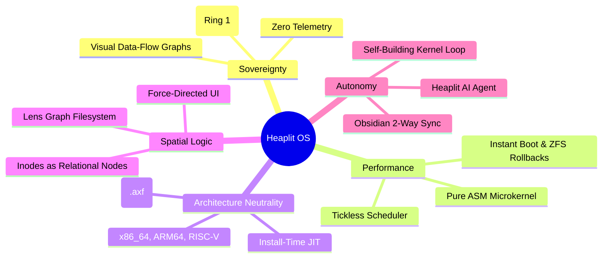

> **Status:** #status/future-implementation

# 🌌 The Heaplit OS Manifest: Beyond the Legacy Trap

> *"Windows is dying under the weight of its own legacy. macOS is turning into a locked-down iOS appliance. Both are harvesting your data for AI training. Heaplit is the escape hatch."*

---

## 1. The Core Vision
Heaplit OS is a **consent-first, compiler-native, spatial operating system** where:
1. **The user owns the data:** No telemetry, no cloud dependencies, no surveillance.
2. **The kernel speaks assembly directly to the metal:** Sub-100-cycle microkernel context switching.
3. **The AI works for you:** An autonomous, local LLM agent (**Heaplit**) embedded in the OS hierarchy that writes code from your Obsidian plans.

---

## 2. The Five Pillars

| Pillar | Philosophy | How We Execute It |
| :--- | :--- | :--- |
| **1. Sovereignty** | Your data stays on your machine forever. | All AI runs locally in Ring 1. The kernel renders a visual data-flow graph for every hardware / network / camera request. |
| **2. Performance** | Software should get faster over time, not slower. | Stateless boot options. Microkernel context switches written in pure Assembly (< 100 CPU cycles). |
| **3. Architecture-Neutrality** | You shouldn't care if you're on x86, ARM, or RISC-V. | Applications are distributed as LLVM Bitcode (`.axf`). The OS JIT-compiles them for your exact CPU on install. |
| **4. Spatial Logic** | Files aren't just a rigid tree; they are a living graph. | The **Lens** app visualizes semantic and spatial relationships. Folders are merely filter views on a graph database. |
| **5. Autonomy** | The operating system helps you build itself. | The **Heaplit** agent reads your Obsidian markdown plans and generates the Assembly/C code to implement features. |

---

## 3. The Comparison: Why Heaplit Wins

| Feature | Windows 11 | macOS Sonoma | Heaplit OS (The Heaplit Way) |
| :--- | :--- | :--- | :--- |
| **AI Assistant** | Copilot (Cloud telemetry, ad-supported). | Siri (Cloud-dependent, locked down). | **Heaplit (Ring 1 Local LLM). Writes kernel code from Obsidian notes.** |
| **File System** | NTFS (30-year-old tree, fragmented). | APFS (Tree, closed-source). | **Graph + POSIX Hybrid (Lens app). Files are interconnected graph nodes.** |
| **Window Manager** | DWM (Static, heavy, tearing). | Quartz (Static, non-customizable). | **Spatial Compositor (Inertia physics, GPU-accelerated frosted glass).** |
| **Compiler** | MSVC (Gigabytes of installer bloat). | Xcode (Locked to Apple platform). | **Built-in LLVM JIT. Apps are Bitcode; compile natively on install.** |
| **Theming** | Registry hacks, breaks on update. | System Settings (Strictly limited). | **Live TOML config (`~/.config/heaplit/theme.toml`). Instant hot-reload.** |
| **C# / .NET Support** | .NET Framework (Heavy runtime overhead). | No native kernel tie-in. | **CoreCLR (RyuJIT) integrated into the kernel scheduler with AVX-512.** |
| **System Rollback** | System Restore (Frequently corrupts). | Time Machine (Slow external backup). | **ZFS/Bcachefs Snapshots at boot. Instant atomic rollback on crash.** |

---

## 4. Navigation
- [[00 - Foundations & Vision/System Architecture Blueprint|System Architecture Blueprint]]
- [[00 - Foundations & Vision/Sovereignty & Security Model|Sovereignty & Security Model]]
- [[06 - Master Planning & Roadmaps/01 - 5-Year Vision & Phased Timeline|5-Year Roadmap]]
