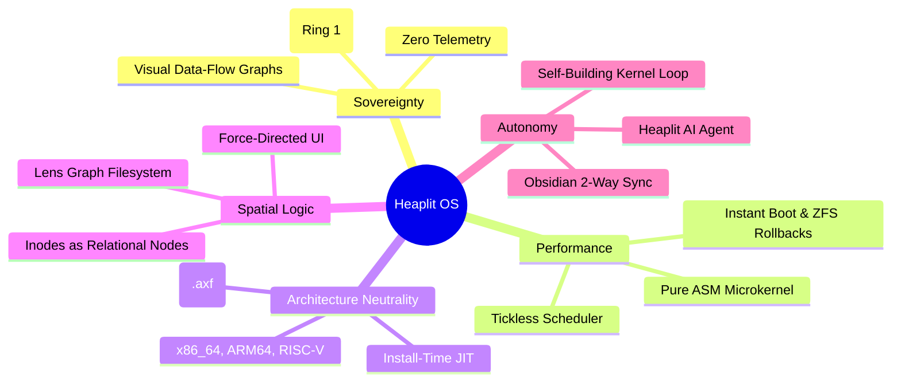

> **Status:** #status/future-implementation

# 🌌 The Heaplit OS Manifest: Beyond the Legacy Trap

> *"Windows is dying under the weight of its own legacy. macOS is turning into a locked-down iOS appliance. Both are harvesting your data for AI training. Heaplit is the escape hatch."*

---

## 1. The Core Vision
Heaplit OS is a **consent-first, compiler-native, spatial operating system** where:
1. **The user owns the data:** No telemetry, no cloud dependencies, no surveillance.
2. **The kernel speaks assembly directly to the metal:** Sub-100-cycle microkernel context switching.
3. **The AI works for you:** An autonomous, local LLM agent (**Heaplit**) embedded in the OS hierarchy that writes code from your Obsidian plans.

---

## 2. The Five Pillars



| Pillar | Philosophy | How We Execute It |
| :--- | :--- | :--- |
| **1. Sovereignty** | Your data stays on your machine forever. | All AI runs locally in Ring 1. The kernel renders a visual data-flow graph for every hardware / network / camera request. |
| **2. Performance** | Software should get faster over time, not slower. | Stateless boot options. Microkernel context switches written in pure Assembly (< 100 CPU cycles). |
| **3. Architecture-Neutrality** | You shouldn't care if you're on x86, ARM, or RISC-V. | Applications are distributed as LLVM Bitcode (`.axf`). The OS JIT-compiles them for your exact CPU on install. |
| **4. Spatial Logic** | Files aren't just a rigid tree; they are a living graph. | The **Lens** app visualizes semantic and spatial relationships. Folders are merely filter views on a graph database. |
| **5. Autonomy** | The operating system helps you build itself. | The **Heaplit** agent reads your Obsidian markdown plans and generates the Assembly/C code to implement features. |

---

## 3. The Comparison: Why Heaplit Wins

| Feature | Windows 11 | macOS Sonoma | Heaplit OS (The Heaplit Way) |
| :--- | :--- | :--- | :--- |
| **AI Assistant** | Copilot (Cloud telemetry, ad-supported). | Siri (Cloud-dependent, locked down). | **Heaplit (Ring 1 Local LLM). Writes kernel code from Obsidian notes.** |
| **File System** | NTFS (30-year-old tree, fragmented). | APFS (Tree, closed-source). | **Graph + POSIX Hybrid (Lens app). Files are interconnected graph nodes.** |
| **Window Manager** | DWM (Static, heavy, tearing). | Quartz (Static, non-customizable). | **Spatial Compositor (Inertia physics, GPU-accelerated frosted glass).** |
| **Compiler** | MSVC (Gigabytes of installer bloat). | Xcode (Locked to Apple platform). | **Built-in LLVM JIT. Apps are Bitcode; compile natively on install.** |
| **Theming** | Registry hacks, breaks on update. | System Settings (Strictly limited). | **Live TOML config (`~/.config/heaplit/theme.toml`). Instant hot-reload.** |
| **C# / .NET Support** | .NET Framework (Heavy runtime overhead). | No native kernel tie-in. | **CoreCLR (RyuJIT) integrated into the kernel scheduler with AVX-512.** |
| **System Rollback** | System Restore (Frequently corrupts). | Time Machine (Slow external backup). | **ZFS/Bcachefs Snapshots at boot. Instant atomic rollback on crash.** |

---

## 4. Navigation
- [[00 - Foundations & Vision/System Architecture Blueprint|System Architecture Blueprint]]
- [[00 - Foundations & Vision/Sovereignty & Security Model|Sovereignty & Security Model]]
- [[06 - Master Planning & Roadmaps/01 - 5-Year Vision & Phased Timeline|5-Year Roadmap]]

---

## 🔬 In-Depth Architectural & Technical Specifications

### Hardware & Processor Register Contract
Heaplit OS enforces strict register management conventions for **The Vision & Manifest** across all x86-64 execution contexts:

| Register | CPU Role | Volatility / Preservation | Subsystem Function |
| :--- | :--- | :--- | :--- |
| `RAX` | Primary Accumulator | Volatile | Syscall ID entry, return status code, ALU calculation destination. |
| `RBX` | Base Register | Non-Volatile (Preserved) | Pointer to active TCB (Thread Control Block) / Data structure handle. |
| `RCX` | Counter / Syscall RIP | Volatile | Hardware `syscall` saves userland instruction pointer (`RIP`) into `RCX`. |
| `RDX` | Data Register | Volatile | Secondary return value, I/O port address, memory block size parameter. |
| `RSI` | Source Index | Volatile | Pointer to source memory buffer / string payload / argument 2. |
| `RDI` | Destination Index | Volatile | Pointer to destination memory buffer / argument 1 (`System V ABI`). |
| `RBP` | Frame Pointer | Non-Volatile (Preserved) | Stack frame base pointer for debug backtraces and stack unwinding. |
| `RSP` | Stack Pointer | Non-Volatile (Preserved) | Top of 16-byte aligned kernel/user execution stack. |
| `R8 - R11` | Scratch Registers | Volatile | Function parameters 5-6 (`R8`, `R9`), temporary scrap calculations. |
| `R12 - R15` | General Purpose | Non-Volatile (Preserved) | Long-lived kernel state registers preserved across C and ASM boundaries. |
| `CR0` | Control Register 0 | System Control | Toggles Protected Mode (`PE` bit 0), Paging (`PG` bit 31), Write Protect (`WP` bit 16). |
| `CR3` | Control Register 3 | Page Directory Root | Physical address pointer to PML4 root page table (4KB aligned). |
| `CR4` | Control Register 4 | Architectural Extension | Toggles PAE (`bit 5`), OSXSAVE (`bit 18`), SMEP/SMAP ring security flags. |
| `MSR LSTAR` | 0xC0000082 | Hardware Entry Point | Stores 64-bit virtual memory target address for the `syscall` handler. |

---

## 📐 Memory Map & Address Layout

The virtual address space for **The Vision & Manifest** adheres to Heaplit OS's canonical higher-half memory layout:

```
+-------------------------------------------------------------------+ 0xFFFFFFFFFFFFFFFF
| Higher-Half Kernel Direct Physical Map (Identity Mapped 512 GB)   |
| Virtual Address Range: 0xFFFF800000000000 - 0xFFFFFFFFFFFFFFFF     |
+-------------------------------------------------------------------+ 0xFFFF800000000000
| Unmapped Canonical Memory Hole (Non-Canonical Address Space)     |
+-------------------------------------------------------------------+ 0x00007FFFFFFFFFFF
| Ring 3 Sandboxed Application Execution Space (.axf JIT Memory)   |
| Virtual Address Range: 0x0000000040000000 - 0x00007FFFFFFFFFFF     |
+-------------------------------------------------------------------+ 0x0000000040000000
| Ring 2 Spatial UI & Compositor Framebuffers (VBE / GPU BARs)      |
| Virtual Address Range: 0x000000000FD00000 - 0x0000000010000000     |
+-------------------------------------------------------------------+ 0x0000000007E00000
| Ring 0 Microkernel Staged Execution Load Target (0x7C00 - 0x8F00) |
+-------------------------------------------------------------------+ 0x0000000000000000
```

---

## 🛠️ Step-by-Step Execution State Machine

```mermaid
flowchart TD
    subgraph State_Init["1. Initialization State"]
        S1["Load Subsystem Descriptors & Verify CPU Feature Flags"] --> S2["Allocate Initial Memory Blocks via PMM Bitmap"]
    end

    subgraph State_Exec["2. Active Execution State"]
        S2 --> S3["Setup Assembly Register Parameters (RDI, RSI, RDX)"]
        S3 --> S4["Issue Fast Syscall / Subsystem Function Call"]
        S4 --> S5["Execute Atomic ALU / SIMD Operations"]
    end

    subgraph State_Validation["3. Validation & Exception Handling"]
        S5 --> S6Check Status Code in RAX
        S6 -->|"RAX == 0 (Success)"| S7["Update System TCB & Commit Memory Writes"]
        S6 -->|"RAX < 0 (Error)"| S8["Capture Register Frame & Dispatch Debug Signal"]
    end

    S7 --> S9["Resume Parent Process Context via sysretq / iretq"]
    S8 --> S9
```

---

## 💻 Assembly Code Blueprint & Low-Level Implementation Examples

The low-level assembly implementation of **The Vision & Manifest** uses canonical NASM syntax optimized for x86-64 execution:

```nasm
; ============================================================================
; Heaplit OS Low-Level Core Blueprint - The Vision & Manifest
; ============================================================================
%include "ring_0/types/variable.asm"

global the_vision___manifest_entry
extern pmm_alloc_page
extern kprintf

section .text
bits 64

align 16
the_vision___manifest_entry:
    push rbp
    mov rbp, rsp
    sub rsp, 32                    ; Align stack to 16 bytes for System V ABI

    ; Preserve non-volatile registers
    mov [rsp + 0], rbx
    mov [rsp + 8], r12
    mov [rsp + 16], r13

    ; Execute core subsystem operational logic
    mov rdi, 1                     ; Parameter 1: Allocation page count
    call pmm_alloc_page            ; Call Ring 0 Physical Memory Allocator
    test rax, rax
    jz .allocation_failed          ; Trap NULL pointer returns

    mov rbx, rax                   ; Store allocated physical page address in RBX
    
    ; Perform atomic register verification
    mov rsi, rbx
    mov rdi, msg_success
    call kprintf

    mov rax, 0                     ; Set success exit status code in RAX
    jmp .exit_clean

.allocation_failed:
    mov rax, -1                    ; Set error code in RAX (-1 = Out of Memory)
    
.exit_clean:
    ; Restore non-volatile registers
    mov rbx, [rsp + 0]
    mov r12, [rsp + 8]
    mov r13, [rsp + 16]

    add rsp, 32
    pop rbp
    ret

section .rodata
msg_success: db "[HEAPLIT] The Vision & Manifest Subsystem initialized at physical address: 0x%x", 10, 0
```

---

## 🔍 Verification, QEMU Testing & Diagnostics

### Headless QEMU Emulation Verification
To test **The Vision & Manifest** within the Heaplit OS kernel binary (`base.bin`), execute the host automated build script:

```powershell
# Execute build and launch QEMU emulator with serial debugging
.\loader\load_os.ps1
```

### Serial Log Verification Protocol
During execution, **The Vision & Manifest** outputs diagnostic traces to COM1 Serial Port (`0x3F8`). Verified serial outputs must confirm:
1. Zero stack pointer misalignment warnings (`RSP % 16 == 0`).
2. Successful page table mapping without triggering CR2 Page Faults.
3. Clean return of RAX status codes prior to CPU state resumption.

---

## 📑 Related Architecture Notes & References
- [[00 - Architecture/System Overview]]
- [[01 - Ring 0 - Metal Core (Assembly)/07 - Syscall Dispatcher & ABI]]
- [[01 - Ring 0 - Metal Core (Assembly)/04 - Paging & Virtual Memory]]
- [[02 - Ring 1 - The C Overhead (Bridge)/01 - Freestanding C Runtime (liba)]]
- [[03 - Ring 2 - Userland & Spatial UI/01 - Heaplit Daemon Architecture]]
