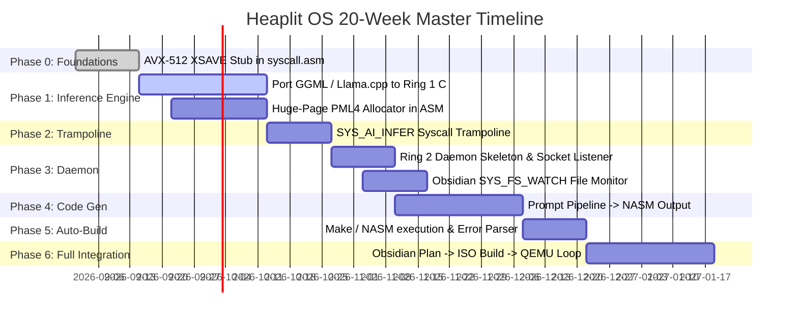

> **Status:** #status/implemented

# 🗺️ Heaplit OS Grand Roadmap & Timeline

> **Target Release:** 3-Month Minimum Viable Product (MVP)  
> **Goal:** Fully self-hosting, AI-native microkernel that executes prompts from Obsidian to build bare-metal features.

---

## 1. Master Implementation Timeline (Weeks 1 – 20)

---

## 2. Phase-by-Phase Breakdown

### Phase 0 (Weeks 1–2): ASM Dispatcher & SIMD State
- [x] Convert existing codebase to strict `snake_case` naming conventions.
- [x] Multi-sector bootloader loading (Sector 1 MBR $\rightarrow$ Sector 2 $\rightarrow$ Sector 3).
- [ ] Port `xsave` / `xrstor` 512-bit vector area at fixed address `0xFFFFFFFF80000000 + 0x5000`.
- [ ] CPUID feature check for AVX-512 foundation (`AVX512F`) and `XSAVEOPT`.

### Phase 1 (Weeks 3–6): Ring 1 C Engine & Model Mapper
- [ ] Port GGML transformer logic into freestanding C library (`liba`).
- [ ] Implement `-mno-red-zone` and `-mavx512f` builds.
- [ ] Implement huge-page virtual memory mapping (2MB / 1GB pages) in Ring 0.
- [ ] GGUF quantized weights file loader via kernel VFS.

### Phase 2 (Weeks 7–8): Syscall Trampoline Interface
- [ ] Connect ASM syscall `SYS_AI_INFER` (`0x601`) to `ai_infer_c`.
- [ ] `IA32_PERF_CTL` MSR performance frequency boost on inference entry.
- [ ] Implement safe zero-copy string buffer passing across rings.

### Phase 3 (Weeks 9–10): Ring 2 Daemon Skeleton
- [ ] Create `/system/bin/heaplit` daemon process.
- [ ] Expose `/tmp/heaplit.sock` IPC endpoint.
- [ ] Hook into `SYS_FS_WATCH` (`0x30`) to monitor `~/Documents/Obsidian/`.

### Phase 4 (Weeks 11–14): Autonomous Code Generation
- [ ] Construct ASM-optimized generation prompts with register context.
- [ ] BPE tokenization and sampling in Ring 1.
- [ ] Output verification and syntax validation for NASM code blocks.

### Phase 5 (Weeks 15–16): Auto-Build & Error Diagnostics
- [ ] Connect daemon to resident NASM/LLVM compiler.
- [ ] Parse compiler warnings and errors from stderr.
- [ ] Two-way writeback to Obsidian note `## Build Errors` section.

### Phase 6 (Weeks 17–20): Complete Self-Hosting Loop
- [ ] Heaplit reads `#HeaplitPlan`, writes kernel code, compiles ISO, and tests inside QEMU.
- [ ] Automatic rollback on panic or triple fault.

---

## 3. Related Action Plans
- [[01 - Planning/HeaplitPlan - Bootloader & Real Mode|Bootloader Action Plan]]
- [[01 - Planning/HeaplitPlan - Variable System & Memory|Variable System Plan]]
- [[01 - Planning/HeaplitPlan - AI Syscall Subsystem|AI Syscall Plan]]
