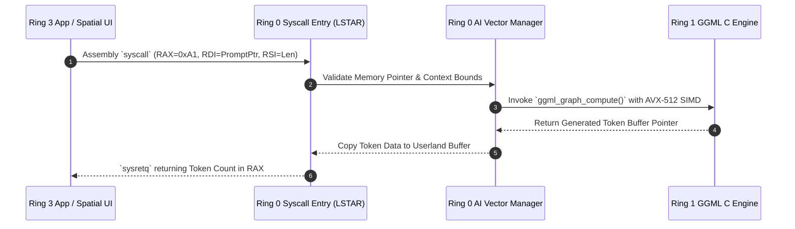

> **Status:** #status/implemented

# 📋 HeaplitPlan: AI Syscall Subsystem

Tags: #HeaplitPlan #Ring0 #Ring1 #ASM #MVP

> **Target:** Wire the bare-metal x86_64 Long Mode syscall handler to the dedicated Antigravity AI inference subsystem (`0x600`–`0x6FF`).

---

## 1. Actionable Milestones

- [ ] **MSR Syscall Registration:**
  - [ ] Configure `IA32_EFER.SCE` (Syscall Enable bit).
  - [ ] Set `IA32_STAR` (`0xC0000081`) with kernel and user CS/SS segment selectors.
  - [ ] Set `IA32_LSTAR` (`0xC0000082`) to point to the kernel ASM syscall entry point.
  - [ ] Set `IA32_SFMASK` (`0xC0000084`) to mask `RFLAGS` on syscall entry.
- [ ] **SIMD Context Preservation Area:**
  - [ ] Allocate 4KB aligned XSAVE buffer at `0xFFFFFFFF80000000 + 0x5000`.
  - [ ] Check `CPUID.(EAX=0xD, ECX=0)` for XSAVE area size and feature mask (`XCR0`).
  - [ ] Set `CR4.OSXSAVE = 1` and configure `XCR0` for X87, SSE, AVX, and AVX-512 states (`0x7` or `0xE7`).
- [ ] **Syscall Dispatcher (`syscall_ai_dispatcher.asm`):**
  - [ ] Intercept `RAX == 0x600` $\rightarrow$ `SYS_AI_LOAD_MODEL`
  - [ ] Intercept `RAX == 0x601` $\rightarrow$ `SYS_AI_INFER`
  - [ ] Intercept `RAX == 0x602` $\rightarrow$ `SYS_AI_SCHEDULE_TASK`
  - [ ] Implement `xsave` before C trampoline and `xrstor` before `sysretq`.
- [ ] **Ring 1 C Trampoline Interface:**
  - [ ] Implement `ai_load_model_c` in freestanding C.
  - [ ] Implement `ai_infer_c` with AVX-512 target flags.
  - [ ] Implement error propagation (`RAX = -1` on failure).

---

## 2. Antigravity Prompt Directive

```markdown
@Antigravity:
Implement the Long Mode assembly syscall handler in `src/kernel/syscall_ai.asm` that saves AVX-512 state with XSAVE, switches to the kernel stack, and calls `ai_infer_c`.
```

---

## 3. Related Files & Notes
- Syscall Spec: [[02 - Reference/AI Syscall Specification]]
- Ring 0 Spec: [[00 - Architecture/Ring 0 - Metal & Scheduler]]
- Ring 1 Spec: [[00 - Architecture/Ring 1 - The C Inference Engine]]

## 🔄 AI Syscall Subsystem Sequence Flowchart


