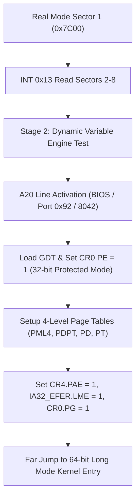

> **Status:** #status/implemented

# 📋 HeaplitPlan: Bootloader & Real Mode Execution

Tags: #HeaplitPlan #ASM #Ring0 #MVP

> **Target:** Robust multi-sector boot sequence that transitions from 16-bit Real Mode to 32-bit Protected Mode and 64-bit Long Mode.

---

## 1. Actionable Milestones

- [x] **Sector 1 (MBR at `0x7C00`):** Set up segment registers (`DS`, `ES`, `SS`, `SP=0x7C00`), save boot drive ID from `DL`.
- [x] **Multi-Sector Disk Read:** Use BIOS `INT 0x13, AH=0x02` to load extended sectors into `0x7E00` (Sector 2) and `0x8000` (Sector 3).
- [ ] **A20 Gate Enable Routine:**
  - [ ] Test A20 line status via memory wrap-around check at `0x0000:0x7E00` vs `0xFFFF:0x7E10`.
  - [ ] Method 1 (Fast A20): BIOS `INT 0x15, AX=0x2401`.
  - [ ] Method 2 (Fallback): 8042 Keyboard Controller via `in al, 0x64` / `out 0x64, al`.
  - [ ] Method 3 (Fast Port A): Port `0x92`.
- [ ] **Global Descriptor Table (GDT):**
  - [ ] Null Descriptor (8 bytes `0x00`).
  - [ ] 32-bit Kernel Code Segment (`0x08`, Base 0, Limit 4GB, Type `0x9A`, Flags `0xCF`).
  - [ ] 32-bit Kernel Data Segment (`0x10`, Base 0, Limit 4GB, Type `0x92`, Flags `0xCF`).
  - [ ] 64-bit Code Segment Descriptor (`0x18`, Long mode flag `0x20`).
- [ ] **Protected Mode Switch:**
  - [ ] Disable interrupts (`cli`).
  - [ ] Load GDT register (`lgdt [gdt_descriptor]`).
  - [ ] Set `PE` (Protection Enable) bit in `CR0` (`mov eax, cr0; or al, 1; mov cr0, eax`).
  - [ ] Far jump to flush CPU prefetch pipeline (`jmp 0x08:protected_mode_entry`).
- [ ] **Paging & Long Mode Switch:**
  - [ ] Set up identity-mapped 4-level PML4 page tables.
  - [ ] Enable PAE (`CR4.PAE = 1`).
  - [ ] Set `LME` (Long Mode Enable) in `EFER` MSR (`0xC0000080`).
  - [ ] Enable paging (`CR0.PG = 1`).
  - [ ] Long jump into 64-bit kernel entry point.

---

## 2. Antigravity Prompt Directive

```markdown
@Antigravity:
Generate the assembly module `rings/ring_0/ring_1/a20.asm` with full A20 line testing, fast BIOS INT 0x15 enable, and 8042 keyboard controller fallback routine.
```

---

## 3. Related Files & Notes
- Source: [`rings/ring_0/base.asm`](file:///C:/Users/Kyle/Downloads/Projects/Heaplit%20OS/rings/ring_0/base.asm)
- Loader: [`loader/load_os.ps1`](file:///C:/Users/Kyle/Downloads/Projects/Heaplit%20OS/loader/load_os.ps1)
- Architecture: [[00 - Architecture/Ring 0 - Metal & Scheduler]]

## 🔄 Bootloader & Long Mode Switch Pipeline


