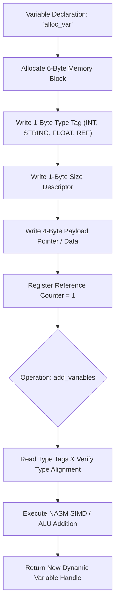

> **Status:** #status/implemented

# 📋 HeaplitPlan: Dynamic Variable System & Memory

Tags: #HeaplitPlan #ASM #Ring0 #MVP

> **Target:** Extend the low-level variable structure (`variable.asm`) into a versatile typed data management and arithmetic system in pure 16-bit / 32-bit Assembly.

---

## 1. Actionable Milestones

- [x] **Base Variable Struct:** Defined 6-byte aligned `struc variable` with `.type`, `.value`, `.pointer`, and `.padding`.
- [x] **Type Identifiers:** Defined tag constants `type_null` (0) through `type_string` (8).
- [ ] **Variable Memory Management:**
  - [ ] Implement `variable_pool_init` to manage a pre-allocated array of variable structs.
  - [ ] Implement `variable_alloc` and `variable_free` with a free-list bitmask.
- [ ] **Typed Utility Functions:**
  - [ ] `create_variable(DI: dest, AL: type, DX: value)`
  - [ ] `create_string_variable(DI: dest, SI: string_ptr)`
  - [ ] `get_variable_value(DI: var) -> AX: value`
  - [ ] `set_variable_value(DI: var, AX: value)`
  - [ ] `copy_variable(DI: dest, SI: src)`
  - [ ] `compare_variables(DI: var1, SI: var2) -> Flags`
- [ ] **Typed Math Routines:**
  - [ ] `add_variables(DI: dest, SI: src)`
  - [ ] `sub_variables(DI: dest, SI: src)`
  - [ ] `mul_variables(DI: dest, SI: src)`
  - [ ] `div_variables(DI: dest, SI: src)`
- [ ] **String & Display Utilities:**
  - [ ] `print_variable(DI: var)` (Prints booleans as `true`/`false`, integers formatted as decimal, strings as text).
  - [ ] String conversion helper `int_to_string` for number formatting.

---

## 2. Antigravity Prompt Directive

```markdown
@Antigravity:
Expand `rings/ring_0/ring_0/variable.asm` to support subtraction, multiplication, division, string variable initialization, and typed printing via `print_variable`.
```

---

## 3. Related Files & Notes
- API Reference: [[02 - Reference/Variable System API]]
- Memory Reference: [[02 - Reference/Memory Management API]]
- Source File: [`rings/ring_0/ring_0/variable.asm`](file:///C:/Users/Kyle/Downloads/Projects/Heaplit%20OS/rings/ring_0/ring_0/variable.asm)

## 🔄 Dynamic Variable System Flowchart


