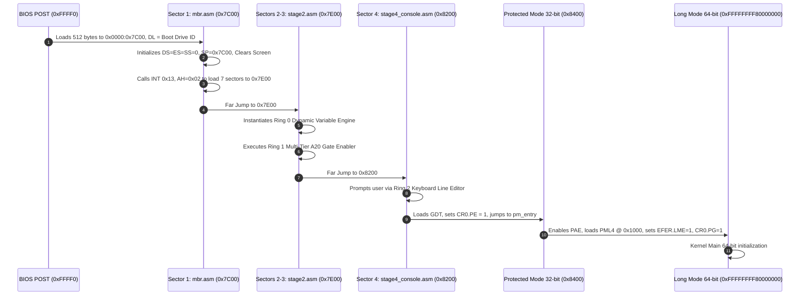

> **Status:** #status/implemented

# 🚀 Staged Boot Sequence & Multi-Sector Orchestration

> **Ring Placement:** `rings/ring_3/ring_3/boot/`  
> **Source Files:** `base.asm`, `mbr.asm`, `stage2.asm`, `stage4_console.asm`  
> **Compiled Output:** `base.bin` (4,096 bytes / 8 sectors)

---

## 1. Execution Flow & Memory Map

### Memory Map Layout

| Memory Range | Size | Component | Ring | Description |
| :--- | :--- | :--- | :--- | :--- |
| `0x00001000 - 0x00001FFF` | 4 KB | PML4 Table | Ring 0 | 4-Level Paging Root Table |
| `0x00002000 - 0x00002FFF` | 4 KB | PDPT Table | Ring 0 | Page Directory Pointer Table |
| `0x00003000 - 0x00003FFF` | 4 KB | PD Table | Ring 0 | 2MB Huge Page Directory Table |
| `0x00007000 - 0x00007BFF` | ~3 KB | Real Mode Stack | Ring 0 | Stack grows downward from `0x7C00` |
| `0x00007C00 - 0x00007DFF` | 512 B | Sector 1: MBR | Ring 3 | Bootstrap loader & disk sector reader |
| `0x00007E00 - 0x000081FF` | 1024 B | Sectors 2-3: Stage 2 | Ring 3 | Variable engine diagnostics & A20 test |
| `0x00008200 - 0x000083FF` | 512 B | Sector 4: Stage 4 | Ring 3 | Interactive console prompt & input editor |
| `0x00008400 - 0x00008FFF` | 3 KB | Sectors 5-8: PM/LM | Ring 0 | GDT, IDT, PM switch, Long Mode entry |

---

## 2. Sector-by-Sector Technical Breakdown

### Sector 1: Master Boot Record (`mbr.asm`)
1. **Interrupt Suspension:** Executes `cli` immediately upon BIOS jump.
2. **Drive ID Preservation:** Stores BIOS drive number passed in register `DL` into `[boot_drive]`.
3. **Segment Normalization:** Sets `DS = 0`, `ES = 0`, `SS = 0`, and stack pointer `SP = 0x7C00`.
4. **Teletype Clear Screen:** Invokes `clear_screen` from `rings/ring_2/ring_2/console/console.asm`.
5. **Disk Read Service:** Sets `AH = 0x02`, `AL = 7` (reads remaining 7 sectors of `base.bin`), `CH = 0`, `CL = 2` (start sector 2), `DH = 0`, `DL = [boot_drive]`, `ES:BX = 0x0000:0x7E00`.
6. **Error Trap:** If Carry Flag is set (`jc disk_error`), prints fatal diagnostic message and halts.
7. **Stage 2 Jump:** Transfers execution to `0x7E00`.

### Sectors 2 & 3: Extended Loader Diagnostics (`stage2.asm`)
1. **Dynamic Variable System Test:** Creates 6-byte typed variables `var_score` (100) and `var_bonus` (50), executes `add_variables`, and prints formatted result.
2. **A20 Gate Enable:** Invokes `enable_a20` across BIOS `INT 0x15`, Fast Port `0x92`, and 8042 Keyboard Controller.
3. **Stage 4 Jump:** Advances execution to `0x8200`.

### Sector 4: Interactive Console Prompt (`stage4_console.asm`)
1. Displays system banner and prompt string (`HeaplitOS Prompt> `).
2. Captures user line using `read_line` from `rings/ring_2/ring_2/input/keyboard.asm` with full backspace handling.
3. Echoes command line and stages processor for Protected Mode transition.
