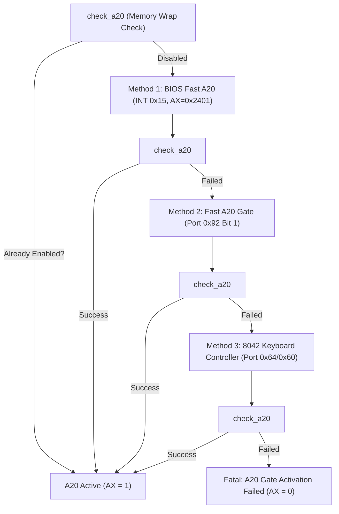

> **Status:** #status/implemented

# 🔌 A20 Gate & Physical Address Line 20

> **Ring Placement:** `rings/ring_1/ring_1/hardware/`  
> **Source File:** `a20.asm`  
> **Privilege Level:** Ring 1 ($M \le 1$)

---

## 1. The 1MB Real-Mode Wrap Problem

In the original 8086 processor, there were only 20 address lines (`A0` to `A19`), addressing up to $2^{20} = 1,048,576$ bytes (1MB). Addressing `0xFFFF:0x0010` produced `0x100000`, which wrapped around to physical address `0x000000`.

The 80286 added line `A20`. To preserve IBM PC compatibility, logic gates were added to force line `A20` low until explicitly enabled by software.

---

## 2. Multi-Method Activation Pipeline

Heaplit OS uses a 4-step failover sequence to guarantee A20 activation across real hardware and virtualized hypervisors:



### Memory Wrap Detection Algorithm (`check_a20`)
```nasm
check_a20:
    pushf
    push ds
    push es
    push di
    push si

    xor ax, ax
    mov es, ax
    mov di, 0x7e00          ; ES:DI = 0x0000:0x7E00

    mov ax, 0xffff
    mov ds, ax
    mov si, 0x7e10          ; DS:SI = 0xFFFF:0x7E10 (Physical 0x107E00 if A20 enabled, 0x007E00 if wrapped)

    mov al, byte [es:di]
    push ax
    mov al, byte [ds:si]
    push ax

    mov byte [es:di], 0x00
    mov byte [ds:si], 0xff
    cmp byte [es:di], 0xff  ; If [es:di] turned 0xFF, memory wrapped (A20 disabled)

    pop ax
    mov byte [ds:si], al
    pop ax
    mov byte [es:di], al

    mov ax, 0
    je .done
    mov ax, 1               ; A20 is enabled
.done:
    pop si
    pop di
    pop es
    pop ds
    popf
    ret
```
