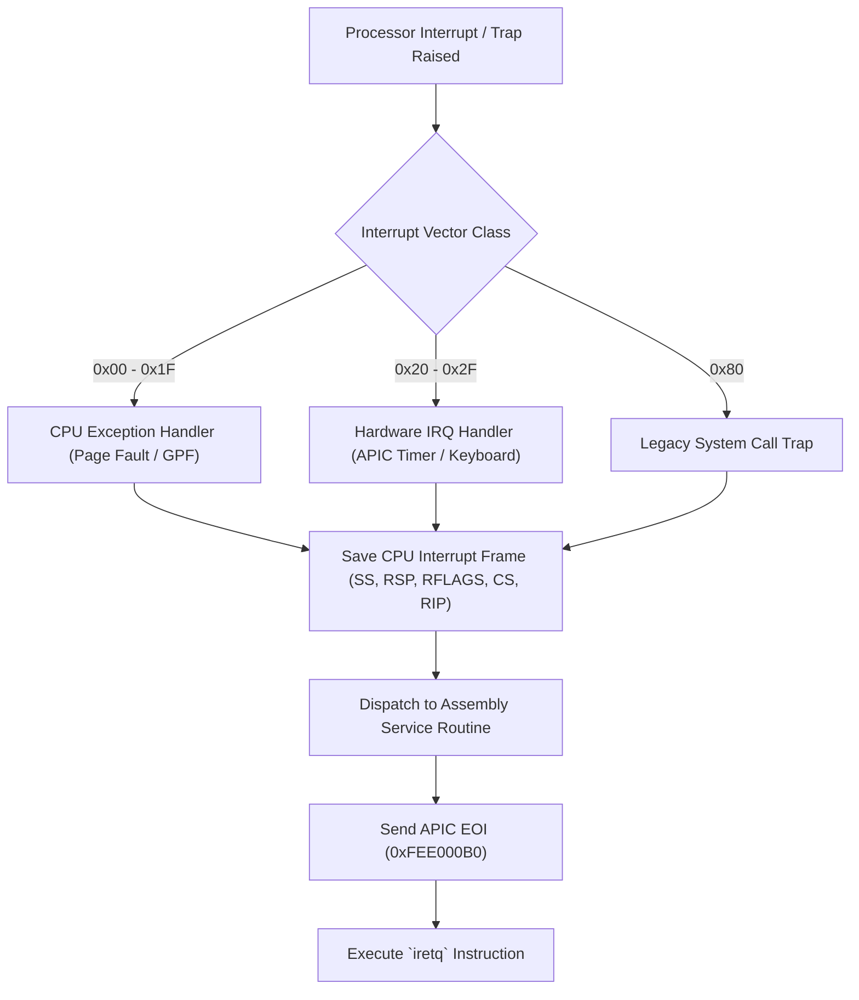

> **Status:** #status/implemented

# 📑 GDT, IDT & Processor Descriptor Tables

> **Ring Placement:** `rings/ring_0/ring_0/cpu/`  
> **Source Files:** `gdt.asm`, `idt.asm`  
> **Privilege Level:** Ring 0 ($M = 0$)

---

## 1. Global Descriptor Table (GDT) Layout

The GDT configures segment boundaries and privilege rings for Protected Mode and Long Mode.

```
+-----------------------------------+ 0x00: Null Descriptor
| 0x0000000000000000                |
+-----------------------------------+ 0x08: Ring 0 64-bit Kernel Code (DPL=0)
| Limit=0xFFFF, Base=0, Acc=0x9A... |
+-----------------------------------+ 0x10: Ring 0 64-bit Kernel Data (DPL=0)
| Limit=0xFFFF, Base=0, Acc=0x92... |
+-----------------------------------+ 0x18: Ring 3 64-bit User Data (DPL=3)
| Limit=0xFFFF, Base=0, Acc=0xF2... |
+-----------------------------------+ 0x20: Ring 3 64-bit User Code (DPL=3)
| Limit=0xFFFF, Base=0, Acc=0xFA... |
+-----------------------------------+ 0x28: Task State Segment (TSS, 16 Bytes)
| 64-bit TSS Descriptor             |
+-----------------------------------+
```

### Segment Descriptors Structure
```nasm
gdt_start:
    dq 0x0000000000000000              ; 0x00: Null descriptor
    ; 0x08: Kernel Code 64-bit (Exec/Read, DPL=0, L=1, D=0)
    dw 0xffff, 0x0000, 0x9a00, 0x00af
    ; 0x10: Kernel Data 64-bit (Read/Write, DPL=0)
    dw 0xffff, 0x0000, 0x9200, 0x00cf
    ; 0x18: User Data 64-bit (Read/Write, DPL=3)
    dw 0xffff, 0x0000, 0xf200, 0x00cf
    ; 0x20: User Code 64-bit (Exec/Read, DPL=3, L=1)
    dw 0xffff, 0x0000, 0xfa00, 0x00af
gdt_end:

gdt_descriptor:
    dw gdt_end - gdt_start - 1
    dd gdt_start
```

---

## 2. Interrupt Descriptor Table (IDT) Architecture

In 64-bit Long Mode, each IDT entry is **16 bytes wide** (128 bits):

```
+-------------------+-------------------+-------------------+-------------------+
| 63             48 | 47             32 | 31             16 | 15              0 |
+-------------------+-------------------+-------------------+-------------------+
| Offset (63..32)   | Reserved (0)      | Offset (31..16)   | Attributes/IST    |
+-------------------+-------------------+-------------------+-------------------+
| Segment Selector (0x08)               | Offset (15..0)                        |
+---------------------------------------+---------------------------------------+
```

### ISR Vectors Handled
- `0x00`: Divide-by-zero Error (`#DE`)
- `0x06`: Invalid Opcode (`#UD`)
- `0x08`: Double Fault (`#DF`)
- `0x0D`: General Protection Fault (`#GP`)
- `0x0E`: Page Fault (`#PF`) — Reads `CR2` for faulting virtual address.
- `0x20 - 0x2F`: PIC Hardware IRQs (Timer IRQ0, Keyboard IRQ1).
- `0x80`: Legacy syscall interrupt hook.

## 🔄 Interrupt & Exception Handling Flowchart


