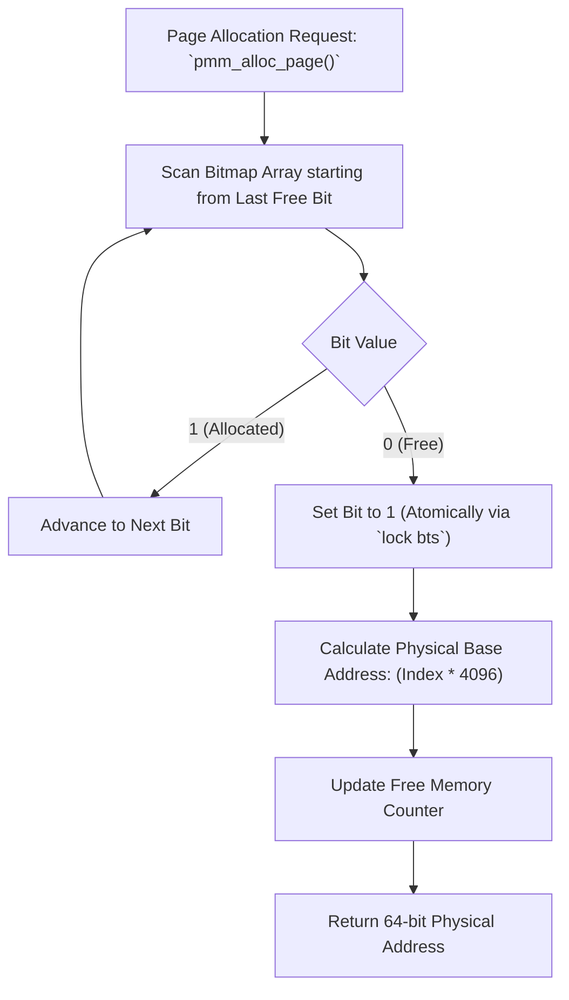

> **Status:** #status/implemented

# 🧠 Physical Memory Allocator (PMM)

> **Ring Placement:** `rings/ring_0/ring_0/memory/`  
> **Source File:** `pmm.asm`  
> **Privilege Level:** Ring 0 ($M = 0$)

---

## 1. Physical Memory Management Architecture

Heaplit OS uses a 64-bit Bitmap Physical Memory Manager (PMM) to track physical RAM frames.

- **Page Frame Size:** 4,096 bytes (4KB).
- **Tracking Mechanism:** 1 bit per page frame (`0` = Free, `1` = Allocated).
- **Capacity:** A 1MB bitmap tracks 8,388,608 page frames (32GB of physical RAM).
- **Bitmap Base Address:** Placed at physical address `0x00100000` (1MB mark) above BIOS reserved area.

---

## 2. BIOS E820 Map Parsing (`pmm_init`)

During bootstrap, BIOS function `INT 0x15, AX=0xE820` populates the physical memory map array:

```nasm
struc e820_entry
    .base_addr:  resq 1    ; +0:  Base physical address
    .length:     resq 1    ; +8:  Region length in bytes
    .type:       resd 1    ; +16: Type (1 = Free Usable RAM, 2 = Reserved)
    .acpi_attrs: resd 1    ; +20: ACPI 3.0 Extended Attributes
endstruc
```

`pmm_init` iterates through entry buffers, marks reserved physical regions (`Type != 1`) as allocated in the bitmap, and marks usable RAM as free.

---

## 3. Allocation & Deallocation Routines

### `pmm_alloc_page() -> RAX`
1. Scans bitmap dword-by-dword (`0xFFFFFFFF` check skips 32 allocated pages in a single instruction).
2. Finds first 0 bit using bit scan instruction `bsf`.
3. Sets bit to 1 (`bts`).
4. Calculates physical memory address: $\text{Physical Address} = \text{Bit Index} \times 4096$.
5. Returns physical base address in `RAX` (or `0` if out of memory).

### `pmm_free_page(RDI = phys_addr)`
1. Calculates bit index: $\text{Bit Index} = \text{RDI} / 4096$.
2. Clears bit in bitmap (`btr`).

## 🔄 PMM Page Allocation Flowchart


