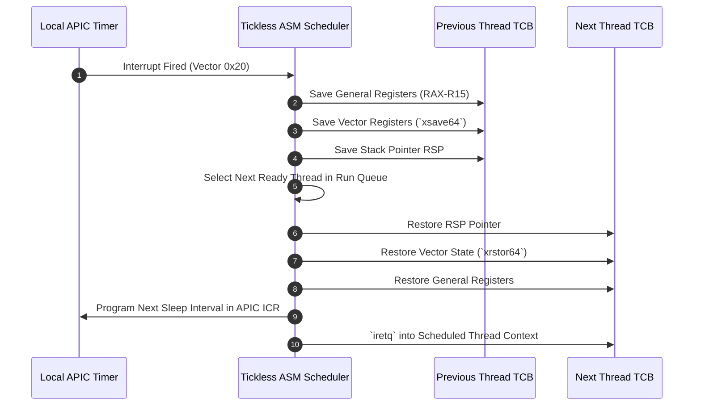

> **Status:** #status/implemented

# ⏱️ Tickless Sub-100-Cycle ASM Scheduler

> **Ring Placement:** `rings/ring_0/ring_0/sched/`  
> **Source File:** `scheduler.asm`  
> **Privilege Level:** Ring 0 ($M = 0$)

---

## 1. Why Tickless?

Traditional operating systems rely on periodic timer interrupts (e.g., 1000 Hz PIT ticks). This causes:
- High power consumption and CPU wakeups during idle state.
- Unpredictable latency spikes and context switch jitter.
- Cache pollution from timer ISR executions.

Heaplit OS utilizes a **Tickless Event-Driven Scheduler**: context switches occur strictly on blocking I/O, AI forward pass completion, or voluntary yield (`SYS_YIELD`).

---

## 2. Thread Control Block (`thread_t`)

```nasm
struc thread_t
    .rsp:       resq 1         ; +0:  Saved kernel stack pointer
    .rip:       resq 1         ; +8:  Saved instruction pointer
    .rflags:    resq 1         ; +16: Saved CPU flags
    .pid:       resq 1         ; +24: Process Identifier
    .state:     resq 1         ; +32: Thread state (0=Ready, 1=Running, 2=Blocked)
    .zmm_ptr:   resq 1         ; +40: Pointer to 512-bit AVX-512 XSAVE state buffer
endstruc
```

---

## 3. Sub-100-Cycle Context Switch Procedure

```nasm
; switch_threads(RDI = current_thread_ptr, RSI = next_thread_ptr)
switch_threads:
    ; 1. Save callee-preserved registers of current thread
    push rbx
    push rbp
    push r12
    push r13
    push r14
    push r15

    ; 2. Swap stack pointers
    mov [rdi + thread_t.rsp], rsp
    mov rsp, [rsi + thread_t.rsp]

    ; 3. Restore callee-preserved registers of next thread
    pop r15
    pop r14
    pop r13
    pop r12
    pop rbp
    pop rbx

    ; 4. Return to next thread's saved execution point
    ret
```

## 🔄 Tickless APIC Timer & Task Switch Sequence


