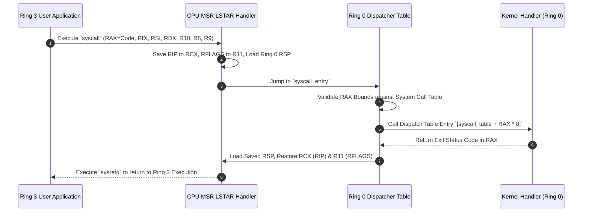

> **Status:** #status/implemented

# 📡 Fast Syscall Dispatcher & System V ABI

> **Ring Placement:** `rings/ring_0/ring_0/syscalls/`  
> **Source File:** `syscall.asm`, `syscall_ai.asm`  
> **Privilege Level:** Ring 0 ($M = 0$)

---

## 1. Fast MSR Syscall Hardware Setup

Heaplit OS uses hardware fast syscall instructions (`syscall` and `sysretq`) rather than slow legacy software interrupts (`int 0x80`).

| MSR Register | Address | Value / Configuration | Purpose |
| :--- | :--- | :--- | :--- |
| **`IA32_STAR`** | `0xC0000081` | `(0x18 << 48) | (0x08 << 32)` | Configures Kernel CS (`0x08`) & User CS (`0x20` / User SS `0x18`). |
| **`IA32_LSTAR`** | `0xC0000082` | `syscall_entry` address | 64-bit target RIP executed when userland issues `syscall`. |
| **`IA32_FMASK`** | `0xC0000084` | `0x00000200` | Flags automatically cleared upon entry (IF disabled). |

---

## 2. Syscall Calling Convention (System V ABI)

- **Syscall Number:** Passed in `RAX`.
- **Arguments (up to 6):** `RDI`, `RSI`, `RDX`, `R10` (kernel replaces RCX), `R8`, `R9`.
- **Return Value:** Returned in `RAX`. Negative return values represent error codes (`-errno`).
- **Caller Saved (Clobbered):** `RCX` (holds user RIP), `R11` (holds user RFLAGS).

---

## 3. Syscall Dispatch Table

| Syscall Number | Syscall Name | Target Handler | Description |
| :--- | :--- | :--- | :--- |
| `0x001` | `SYS_EXIT` | `sys_exit` | Terminates calling thread / process. |
| `0x003` | `SYS_READ` | `sys_read` | Reads bytes from VFS node file descriptor. |
| `0x004` | `SYS_WRITE` | `sys_write` | Writes bytes to VFS node file descriptor. |
| `0x018` | `SYS_YIELD` | `sys_yield` | Yields remaining time quantum to next ready thread. |
| `0x030` | `SYS_FS_WATCH`| `sys_fs_watch` | Registers filesystem watch notify queue for Antigravity daemon. |
| `0x600` | `SYS_AI_LOAD_MODEL` | `sys_ai_load` | Memory-maps GGUF model weights into physical cache. |
| `0x601` | `SYS_AI_INFER` | `sys_ai_infer` | Invokes Ring 1 SIMD transformer forward pass. |
| `0x602` | `SYS_AI_UNLOAD` | `sys_ai_unload`| Unmaps neural network weights from RAM. |

## 🔄 Fast Syscall Dispatcher Sequence Flowchart

