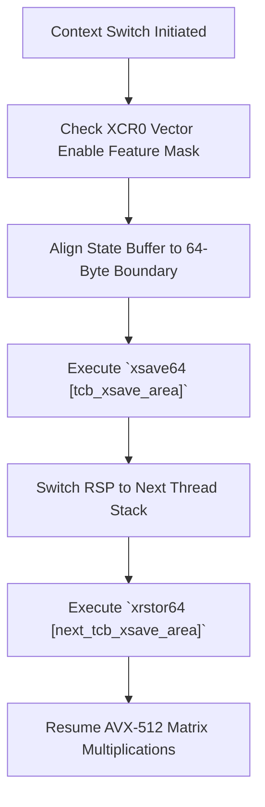

> **Status:** #status/implemented

# ⚡ AVX-512 & XSAVE Vector State Preservation

> **Ring Placement:** `rings/ring_0/ring_0/syscalls/`  
> **Source File:** `syscall_ai.asm`  
> **Privilege Level:** Ring 0 ($M = 0$)

---

## 1. Vector Context Preservation Requirement

Ring 1 local AI neural network operations heavily utilize 512-bit vector registers (`ZMM0` - `ZMM31`, `K0` - `K7` mask registers). To prevent kernel context switches or syscall transitions from corrupting caller SIMD state:

1. Ring 0 allocates a 512-byte aligned XSAVE area at physical offset `0x00005000`.
2. Hardware register `CR4.OSXSAVE` (bit 18) is enabled.
3. Extended Feature Enable Register `XCR0` is configured with `0x07` (x87, SSE, AVX state) and `0xE0` (AVX-512 `opmask`, `ZMM_Hi256`, `Hi16_ZMM`).

---

## 2. Fast Vector Save & Restore Routines

```nasm
; Save full 512-bit vector state prior to AI matrix math
save_vector_state:
    mov rdi, 0x5000
    mov eax, 0xffffffff        ; Enable all feature state masks in EDX:EAX
    mov edx, 0xffffffff
    xsave64 [rdi]
    ret

; Restore 512-bit vector state after AI matrix math
restore_vector_state:
    mov rdi, 0x5000
    mov eax, 0xffffffff
    mov edx, 0xffffffff
    xrstor64 [rdi]
    ret
```

---

## 3. CPU Core Turbo Boost Activation

During heavy `SYS_AI_INFER` (`0x601`) syscalls, Ring 0 writes to Model Specific Register `IA32_PERF_CTL` (`0x199`) to temporarily lock CPU cores to maximum Turbo Boost multiplier, reducing token inference latency.

## 🔄 XSAVE AVX-512 Vector State Lifecycle


