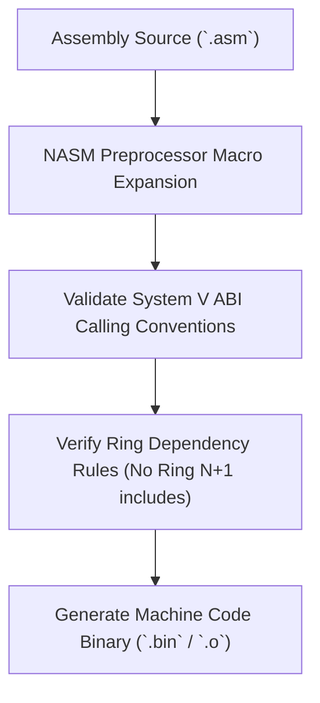

> **Status:** #status/implemented

# 📐 Assembly Coding Standards & NASM Macro Library

> **Ring Placement:** `include/`  
> **Source File:** `macros.inc`  
> **Privilege Level:** Ring 0-3

---

## 1. Coding Rules & Directives

1. **Naming Conventions:**
   - Procedures and labels use `snake_case` (e.g., `switch_threads`, `.loop_check`).
   - Equates and Macro names use `UPPER_CASE` (e.g., `ALIGN_16`, `SYS_AI_INFER`).
2. **Explicit Memory Operand Sizing:**
   - Always annotate memory operands with `byte`, `word`, `dword`, or `qword` (e.g., `mov dword [rdi], 0`).
3. **Bitness Annotations:**
   - Explicitly specify `[bits 16]`, `[bits 32]`, or `[bits 64]` at the start of code blocks.

---

## 2. Macro Library (`include/macros.inc`)

```nasm
; Align next directive to 16-byte boundary
%macro ALIGN_16 0
    align 16
%endmacro

; Align next directive to 4KB page boundary
%macro ALIGN_4K 0
    align 4096
%endmacro

; Save all 16 64-bit general-purpose registers to stack
%macro PUSH_ALL_64 0
    push rax
    push rcx
    push rdx
    push rbx
    push rsp
    push rbp
    push rsi
    push rdi
    push r8
    push r9
    push r10
    push r11
    push r12
    push r13
    push r14
    push r15
%endmacro

; Restore all 16 64-bit general-purpose registers from stack
%macro POP_ALL_64 0
    pop r15
    pop r14
    pop r13
    pop r12
    pop r11
    pop r10
    pop r9
    pop r8
    pop rdi
    pop rsi
    pop rbp
    pop rsp
    pop rbx
    pop rdx
    pop rcx
    pop rax
%endmacro

; Bare-metal debug breakpoint (disable interrupts & halt)
%macro DEBUG_HALT 0
    cli
    hlt
    jmp $-3
%endmacro
```

## 🔄 Assembly Macro & Standard Evaluation Pipeline


