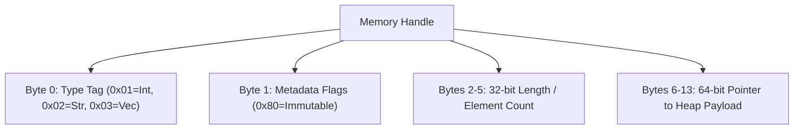

> **Status:** #status/implemented

# 🧱 Dynamic Variable Engine & Types

> **Ring Placement:** `rings/ring_0/ring_0/types/`  
> **Source File:** `variable.asm`, `math.asm`, `string.asm`  
> **Privilege Level:** Ring 0 ($M = 0$)

---

## 1. 6-Byte Typed Variable Structure

```nasm
struc variable
    .type:       resb 1        ; +0:  Variable type (type_int=1, type_string=2, type_float=3)
    .flags:      resb 1        ; +1:  Flags (Bit 0: Const, Bit 1: Dynamic, Bit 2: Signed)
    .payload:    resd 1        ; +2:  32-bit integer / float / 16-bit string pointer payload
endstruc
sizeof_variable: equ 6
```

---

## 2. Core Dynamic Type Operations

### `create_variable(DI = struct_ptr, AL = type, DX = int / SI = str_ptr)`
Initializes the structure fields based on the type specified in `AL`.

### `add_variables(DI = target_var, SI = source_var)`
Verifies both variables are `type_int`, performs addition `[DI].payload += [SI].payload`, and handles integer overflow.

### `sub_variables(DI = target_var, SI = source_var)`
Performs type-checked subtraction `[DI].payload -= [SI].payload`.

### `print_variable(DI = struct_var)`
Inspects `[DI].type`:
- If `type_int`: Loads `[DI].payload` into `AX`, formats to string using `int_to_string`, and outputs.
- If `type_string`: Loads pointer from `[DI].payload` into `SI` and outputs string via `print_string_16`.

## 🔄 Dynamic Variable Struct & Method Flowchart


