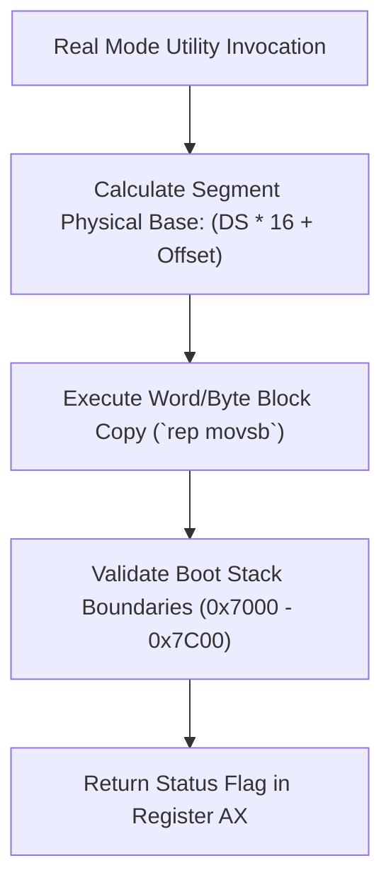

> **Status:** #status/implemented

# 🧼 Real-Mode Memory & Block Utilities

> **Ring Placement:** `rings/ring_0/ring_0/memory/`, `rings/ring_0/ring_0/types/`  
> **Source Files:** `memory.asm`, `string.asm`, `math.asm`  
> **Privilege Level:** Ring 0 ($M = 0$)

---

## 1. Block Memory Operations (`memory.asm`)

- **`mem_set(DI=dest, AL=val, CX=count)`**: Fills memory region. Combines byte values into 16-bit words for `rep stosw` word transfers when `CX >= 2`.
- **`mem_copy(DI=dest, SI=src, CX=count)`**: Copies memory block using `rep movsw` for even byte counts.
- **`mem_zero(DI=dest, CX=count)`**: Clears memory region to zero.

---

## 2. String Manipulation Utilities (`string.asm`)

- **`strlen16(SI=str_ptr) -> CX`**: Calculates null-terminated string length in bytes.
- **`strcmp16(SI=str1, DI=str2) -> AX`**: Lexicographically compares strings. Returns `0` if equal, `<0` if `str1 < str2`, `>0` if `str1 > str2`.
- **`strcpy16(DI=dest, SI=src)`**: Copies string including trailing null byte.
- **`strcat16(DI=dest, SI=src)`**: Appends source string onto end of destination string.

---

## 3. Math & Number Formatting (`math.asm`)

- **`int_to_string(AX=val, DI=buffer)`**: Converts 16-bit signed integer into ASCII decimal string. Uses iterative division by 10, pushes digit remainders to stack, and pops to reverse string.
- **`abs16(AX=val) -> AX`**: Computes absolute value.
- **`min16(AX=v1, BX=v2) -> AX`**: Clamps value to minimum.
- **`max16(AX=v1, BX=v2) -> AX`**: Clamps value to maximum.

## 🔄 Real Mode Memory Operations Sequence

