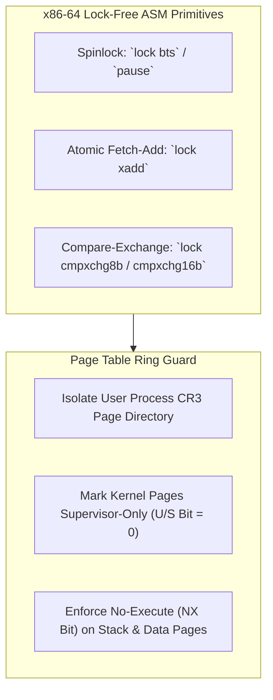

> **Status:** #status/future-implementation

# 🔒 Hardware-Assisted Sandbox Isolation & Concurrency Primitives – Technical Specification

> **Layer:** Ring 0 Metal Core (Assembly)  
> **Source Files:** `rings/ring_0/ring_0/cpu/sandbox.asm`, `locks.asm`

---

## 1. Overview & Architecture

To guarantee multi-core JIT safety and sandboxed execution, Heaplit OS implements hardware-assisted page table isolation and lock-free Assembly synchronization primitives.

---

## 2. Synchronization Implementation
- **Spinlocks**: Uses `pause` instruction in tight loops to minimize CPU power consumption and memory bus contention.
- **Atomic Counters**: Executes `lock xadd` for lock-free reference counting across dynamic variable headers.
- **CR3 Page Table Isolation**: Swaps page directory pointers during context switches to isolate process address spaces.
