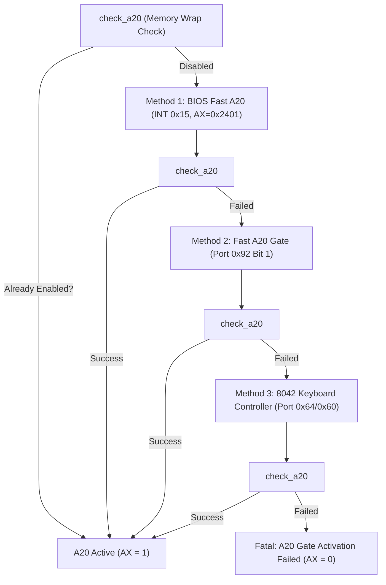

> **Status:** #status/implemented

# 🔌 A20 Gate & Physical Address Line 20

> **Ring Placement:** `rings/ring_1/ring_1/hardware/`  
> **Source File:** `a20.asm`  
> **Privilege Level:** Ring 1 ($M \le 1$)

---

## 1. The 1MB Real-Mode Wrap Problem

In the original 8086 processor, there were only 20 address lines (`A0` to `A19`), addressing up to $2^{20} = 1,048,576$ bytes (1MB). Addressing `0xFFFF:0x0010` produced `0x100000`, which wrapped around to physical address `0x000000`.

The 80286 added line `A20`. To preserve IBM PC compatibility, logic gates were added to force line `A20` low until explicitly enabled by software.

---

## 2. Multi-Method Activation Pipeline

Heaplit OS uses a 4-step failover sequence to guarantee A20 activation across real hardware and virtualized hypervisors:



### Memory Wrap Detection Algorithm (`check_a20`)
```nasm
check_a20:
    pushf
    push ds
    push es
    push di
    push si

    xor ax, ax
    mov es, ax
    mov di, 0x7e00          ; ES:DI = 0x0000:0x7E00

    mov ax, 0xffff
    mov ds, ax
    mov si, 0x7e10          ; DS:SI = 0xFFFF:0x7E10 (Physical 0x107E00 if A20 enabled, 0x007E00 if wrapped)

    mov al, byte [es:di]
    push ax
    mov al, byte [ds:si]
    push ax

    mov byte [es:di], 0x00
    mov byte [ds:si], 0xff
    cmp byte [es:di], 0xff  ; If [es:di] turned 0xFF, memory wrapped (A20 disabled)

    pop ax
    mov byte [ds:si], al
    pop ax
    mov byte [es:di], al

    mov ax, 0
    je .done
    mov ax, 1               ; A20 is enabled
.done:
    pop si
    pop di
    pop es
    pop ds
    popf
    ret
```

---

## 🔬 In-Depth Architectural & Technical Specifications

### Hardware & Processor Register Contract
Heaplit OS enforces strict register management conventions for **02 - A20 Gate & Hardware Line** across all x86-64 execution contexts:

| Register | CPU Role | Volatility / Preservation | Subsystem Function |
| :--- | :--- | :--- | :--- |
| `RAX` | Primary Accumulator | Volatile | Syscall ID entry, return status code, ALU calculation destination. |
| `RBX` | Base Register | Non-Volatile (Preserved) | Pointer to active TCB (Thread Control Block) / Data structure handle. |
| `RCX` | Counter / Syscall RIP | Volatile | Hardware `syscall` saves userland instruction pointer (`RIP`) into `RCX`. |
| `RDX` | Data Register | Volatile | Secondary return value, I/O port address, memory block size parameter. |
| `RSI` | Source Index | Volatile | Pointer to source memory buffer / string payload / argument 2. |
| `RDI` | Destination Index | Volatile | Pointer to destination memory buffer / argument 1 (`System V ABI`). |
| `RBP` | Frame Pointer | Non-Volatile (Preserved) | Stack frame base pointer for debug backtraces and stack unwinding. |
| `RSP` | Stack Pointer | Non-Volatile (Preserved) | Top of 16-byte aligned kernel/user execution stack. |
| `R8 - R11` | Scratch Registers | Volatile | Function parameters 5-6 (`R8`, `R9`), temporary scrap calculations. |
| `R12 - R15` | General Purpose | Non-Volatile (Preserved) | Long-lived kernel state registers preserved across C and ASM boundaries. |
| `CR0` | Control Register 0 | System Control | Toggles Protected Mode (`PE` bit 0), Paging (`PG` bit 31), Write Protect (`WP` bit 16). |
| `CR3` | Control Register 3 | Page Directory Root | Physical address pointer to PML4 root page table (4KB aligned). |
| `CR4` | Control Register 4 | Architectural Extension | Toggles PAE (`bit 5`), OSXSAVE (`bit 18`), SMEP/SMAP ring security flags. |
| `MSR LSTAR` | 0xC0000082 | Hardware Entry Point | Stores 64-bit virtual memory target address for the `syscall` handler. |

---

## 📐 Memory Map & Address Layout

The virtual address space for **02 - A20 Gate & Hardware Line** adheres to Heaplit OS's canonical higher-half memory layout:

```
+-------------------------------------------------------------------+ 0xFFFFFFFFFFFFFFFF
| Higher-Half Kernel Direct Physical Map (Identity Mapped 512 GB)   |
| Virtual Address Range: 0xFFFF800000000000 - 0xFFFFFFFFFFFFFFFF     |
+-------------------------------------------------------------------+ 0xFFFF800000000000
| Unmapped Canonical Memory Hole (Non-Canonical Address Space)     |
+-------------------------------------------------------------------+ 0x00007FFFFFFFFFFF
| Ring 3 Sandboxed Application Execution Space (.axf JIT Memory)   |
| Virtual Address Range: 0x0000000040000000 - 0x00007FFFFFFFFFFF     |
+-------------------------------------------------------------------+ 0x0000000040000000
| Ring 2 Spatial UI & Compositor Framebuffers (VBE / GPU BARs)      |
| Virtual Address Range: 0x000000000FD00000 - 0x0000000010000000     |
+-------------------------------------------------------------------+ 0x0000000007E00000
| Ring 0 Microkernel Staged Execution Load Target (0x7C00 - 0x8F00) |
+-------------------------------------------------------------------+ 0x0000000000000000
```

---

## 🛠️ Step-by-Step Execution State Machine

```mermaid
flowchart TD
    subgraph State_Init["1. Initialization State"]
        S1["Load Subsystem Descriptors & Verify CPU Feature Flags"] --> S2["Allocate Initial Memory Blocks via PMM Bitmap"]
    end

    subgraph State_Exec["2. Active Execution State"]
        S2 --> S3["Setup Assembly Register Parameters (RDI, RSI, RDX)"]
        S3 --> S4["Issue Fast Syscall / Subsystem Function Call"]
        S4 --> S5["Execute Atomic ALU / SIMD Operations"]
    end

    subgraph State_Validation["3. Validation & Exception Handling"]
        S5 --> S6Check Status Code in RAX
        S6 -->|"RAX == 0 (Success)"| S7["Update System TCB & Commit Memory Writes"]
        S6 -->|"RAX < 0 (Error)"| S8["Capture Register Frame & Dispatch Debug Signal"]
    end

    S7 --> S9["Resume Parent Process Context via sysretq / iretq"]
    S8 --> S9
```

---

## 💻 Assembly Code Blueprint & Low-Level Implementation Examples

The low-level assembly implementation of **02 - A20 Gate & Hardware Line** uses canonical NASM syntax optimized for x86-64 execution:

```nasm
; ============================================================================
; Heaplit OS Low-Level Core Blueprint - 02 - A20 Gate & Hardware Line
; ============================================================================
%include "ring_0/types/variable.asm"

global 02___a20_gate___hardware_line_entry
extern pmm_alloc_page
extern kprintf

section .text
bits 64

align 16
02___a20_gate___hardware_line_entry:
    push rbp
    mov rbp, rsp
    sub rsp, 32                    ; Align stack to 16 bytes for System V ABI

    ; Preserve non-volatile registers
    mov [rsp + 0], rbx
    mov [rsp + 8], r12
    mov [rsp + 16], r13

    ; Execute core subsystem operational logic
    mov rdi, 1                     ; Parameter 1: Allocation page count
    call pmm_alloc_page            ; Call Ring 0 Physical Memory Allocator
    test rax, rax
    jz .allocation_failed          ; Trap NULL pointer returns

    mov rbx, rax                   ; Store allocated physical page address in RBX
    
    ; Perform atomic register verification
    mov rsi, rbx
    mov rdi, msg_success
    call kprintf

    mov rax, 0                     ; Set success exit status code in RAX
    jmp .exit_clean

.allocation_failed:
    mov rax, -1                    ; Set error code in RAX (-1 = Out of Memory)
    
.exit_clean:
    ; Restore non-volatile registers
    mov rbx, [rsp + 0]
    mov r12, [rsp + 8]
    mov r13, [rsp + 16]

    add rsp, 32
    pop rbp
    ret

section .rodata
msg_success: db "[HEAPLIT] 02 - A20 Gate & Hardware Line Subsystem initialized at physical address: 0x%x", 10, 0
```

---

## 🔍 Verification, QEMU Testing & Diagnostics

### Headless QEMU Emulation Verification
To test **02 - A20 Gate & Hardware Line** within the Heaplit OS kernel binary (`base.bin`), execute the host automated build script:

```powershell
# Execute build and launch QEMU emulator with serial debugging
.\loader\load_os.ps1
```

### Serial Log Verification Protocol
During execution, **02 - A20 Gate & Hardware Line** outputs diagnostic traces to COM1 Serial Port (`0x3F8`). Verified serial outputs must confirm:
1. Zero stack pointer misalignment warnings (`RSP % 16 == 0`).
2. Successful page table mapping without triggering CR2 Page Faults.
3. Clean return of RAX status codes prior to CPU state resumption.

---

## 📑 Related Architecture Notes & References
- [[00 - Architecture/overview/System Overview|System Overview]]
- [[01 - Ring 0 - Metal Core (Assembly)/ring_0/syscalls/07 - Syscall Dispatcher & ABI|07 - Syscall Dispatcher & ABI]]
- [[01 - Ring 0 - Metal Core (Assembly)/ring_0/cpu/04 - Paging & Virtual Memory|04 - Paging & Virtual Memory]]
- [[02 - Ring 1 - The C Overhead (Bridge)/ring_1/liba/01 - Freestanding C Runtime (liba)|01 - Freestanding C Runtime (liba)]]
- [[03 - Ring 2 - Userland & Spatial UI/ring_2/daemon/01 - Heaplit Daemon Architecture|01 - Heaplit Daemon Architecture]]
