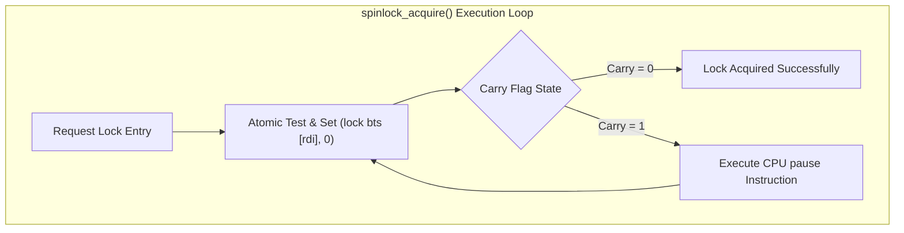

> **Status:** #status/implemented

# 🔒 Hardware Sandbox Isolation & Concurrency Primitives

> **Ring Placement:** `rings/ring_0/ring_0/cpu/`  
> **Source File:** `sandbox.asm`  
> **Compiled Target:** Core Kernel Module (Ring 0)

---

## 1. Overview & Architecture

`sandbox.asm` provides multi-core lock-free synchronization primitives (`spinlock_acquire`, `atomic_add64`, `atomic_cmpxchg16b`) and configures CPU Control Register 3 (`CR3`) to enforce page-table sandboxing across Ring 3 application contexts.

---

## 2. Implemented Routines
- `spinlock_acquire(RDI = LockPtr)`: Atomically acquires lock using `lock bts` and `pause`.
- `spinlock_release(RDI = LockPtr)`: Clears lock bit (`qword [rdi] = 0`).
- `atomic_add64(RDI = TargetPtr, RSI = Value)`: Executes `lock xadd [rdi], rax` returning previous value.
- `atomic_cmpxchg16b(RDI = DestPtr, RDX:RAX = Expected, RCX:RBX = New)`: Executes 128-bit atomic swap.
- `enforce_page_sandbox(RDI = PML4Address)`: Writes PML4 root table address into `CR3`.
