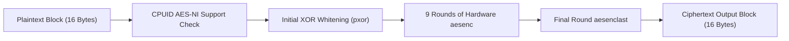

> **Status:** #status/implemented

# 🔐 Hardware-Accelerated AES-NI & SHA Cryptography

> **Ring Placement:** `rings/ring_0/ring_0/cpu/`  
> **Source File:** `crypto_aesni.asm`  
> **Compiled Target:** Core Kernel Module (Ring 0)

---

## 1. Overview & Architecture

`crypto_aesni.asm` implements hardware-accelerated AES-128 block encryption using direct x86-64 AES-NI instructions (`aesenc`, `aesenclast`) for zero-overhead disk encryption and VFS tag integrity checks.

---

## 2. Implemented Assembly Routines
- `aesni_supported()`: Queries `CPUID.01H:ECX.AES[bit 25]` returning `1` if AES-NI instructions are available.
- `aesni_encrypt_block(RDI = PlaintextPtr, RSI = CiphertextPtr, RDX = RoundKeysPtr)`: Loads 128-bit block into `XMM0`, executes XOR whitening, performs 9 `aesenc` rounds, and completes with `aesenclast`.
