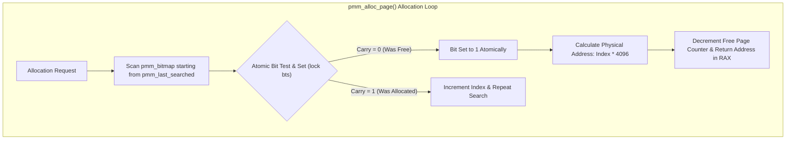

> **Status:** #status/implemented

# 💾 Physical Memory Allocator (PMM 4KB Bitmap Allocator)

> **Ring Placement:** `rings/ring_0/ring_0/memory/`  
> **Source File:** `pmm.asm`  
> **Compiled Target:** Core Kernel Module (Ring 0)  
> **Hardware Alignment:** 4KB Page Frame Boundary (`0x1000`)

---

## 1. Overview & Architectural Role

The **Physical Memory Allocator (PMM)** is Ring 0's foundational memory manager. Responsible for managing up to 512 GB of physical RAM, the PMM uses a 16MB bitmap array (`pmm_bitmap`) where each bit represents a single 4KB physical page frame. It employs x86-64 Bit Scan Forward (`bsf`) and atomic Bit Test and Set (`lock bts`) instructions to guarantee multi-core thread safety without kernel deadlocks.

---

## 2. Low-Level API & Assembly Routines

### `pmm_init(RDI = TotalPhysicalMemoryBytes)`
- Calculates total 4KB pages (`TotalBytes >> 12`).
- Clears the `pmm_bitmap` memory region (`16,384 KB`).
- Sets `pmm_free_pages` counter and zeroes `pmm_last_searched`.

### `pmm_alloc_page()`
- Scans `pmm_bitmap` using `lock bts [pmm_bitmap], rbx`.
- On finding a zero bit, atomically sets it to 1 and returns physical base address `(rbx << 12)`.
- If memory is exhausted, wraps around to index 0; returns NULL (`RAX = 0`) on failure.

### `pmm_free_page(RDI = PhysicalAddress)`
- Computes page index (`PhysicalAddress >> 12`).
- Executes `lock btr [pmm_bitmap], rdi` (Bit Test and Reset) to return the page frame to the free pool.

---

## 3. Register & Memory Specifications

| Register / Variable | Data Type | Function |
| :--- | :--- | :--- |
| `pmm_bitmap` | `resb 16384 * 1024` | 16MB bitmap array managing 134,217,728 physical page frames. |
| `pmm_total_pages` | `resq 1` | Total system page frame count. |
| `pmm_free_pages` | `resq 1` | Counter tracking currently available 4KB pages. |
| `pmm_last_searched` | `resq 1` | Index hint for next allocation pass to reduce bitmap search overhead. |
