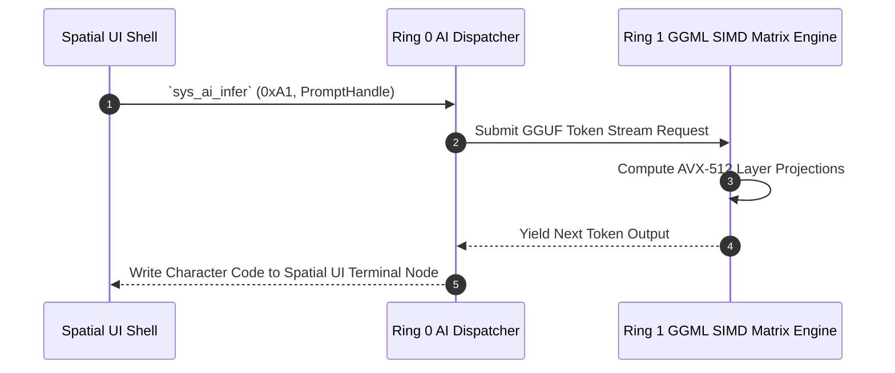

> **Status:** #status/future-implementation

# ⚡ AI Syscall Specification (0x600 – 0x6FF)

> **Caller Ring:** Ring 2 / Ring 3 (Userland Process / Heaplit Daemon)  
> **Handler Ring:** Ring 0 (Kernel Supervisor) $\rightarrow$ Trampoline to Ring 1 (Freestanding C Inference)  
> **Instruction:** `syscall` (x86_64 Long Mode)

---

## 1. Syscall Register ABI

| Register | Direction | Purpose |
| :--- | :--- | :--- |
| `RAX` | In / Out | **In:** Syscall Number (`0x600`–`0x6FF`) **Out:** Return Value / Status Code (`-1` on error) |
| `RDI` | In | Argument 1 |
| `RSI` | In | Argument 2 |
| `RDX` | In | Argument 3 |
| `RCX` | In / Clb | Argument 4 (Clobbered by `syscall` with return `RIP`) |
| `R8` | In | Argument 5 |
| `R9` | In | Argument 6 |
| `R11` | Clb | Clobbered by `syscall` with return `RFLAGS` |

---

## 2. Syscall Definitions

### `0x600`: `SYS_AI_LOAD_MODEL`
Maps model file weights into huge-page memory and initializes inference context.

- **Parameters:**
  - `RDI`: Pointer to null-terminated ASCII model path string (e.g. `"/system/models/mistral-7b-q4.gguf"`)
  - `RSI`: Size hint / flags
- **Return (`RAX`):**
  - $\ge 0$: Model Handle index
  - `-1`: File not found or memory allocation failed

---

### `0x601`: `SYS_AI_INFER`
Executes token generation against a loaded model context.

- **Parameters:**
  - `RDI`: Model Handle (obtained via `SYS_AI_LOAD_MODEL`)
  - `RSI`: Pointer to prompt string buffer
  - `RDX`: Prompt character count / length
  - `RCX`: Destination output string buffer
- **Return (`RAX`):**
  - $\ge 0$: Number of generated tokens written to output buffer
  - `-1`: Inference failure or invalid handle
- **Ring 0 Actions:**
  1. Saves `ZMM0`–`ZMM31` vector registers to XSAVE area at `0xFFFFFFFF80000000 + 0x5000`.
  2. Sets `IA32_PERF_CTL` MSR for maximum CPU performance.
  3. Calls Ring 1 `ai_infer_c`.
  4. Restores vector registers via `xrstor`.

---

### `0x602`: `SYS_AI_SCHEDULE_TASK`
Submits an autonomous background task to the kernel workqueue.

- **Parameters:**
  - `RDI`: Pointer to Task JSON / Struct definition
- **Return (`RAX`):**
  - Task ID

---

## 3. Related Notes
- [[00 - Architecture/Ring 0 - Metal & Scheduler|Ring 0 ASM Dispatcher]]
- [[00 - Architecture/Ring 1 - The C Inference Engine|Ring 1 Inference Engine]]
- [[01 - Planning/HeaplitPlan - AI Syscall Subsystem|AI Syscall Plan]]

## 🔄 AI Syscall Interface Flowchart

