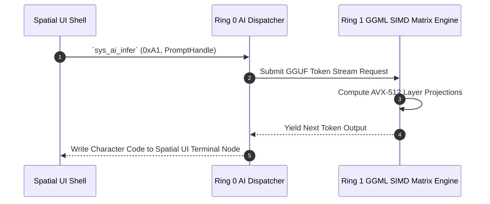

> **Status:** #status/future-implementation

# ⚡ AI Syscall Specification (0x600 – 0x6FF)

> **Caller Ring:** Ring 2 / Ring 3 (Userland Process / Heaplit Daemon)  
> **Handler Ring:** Ring 0 (Kernel Supervisor) $\rightarrow$ Trampoline to Ring 1 (Freestanding C Inference)  
> **Instruction:** `syscall` (x86_64 Long Mode)

---

## 1. Syscall Register ABI

| Register | Direction | Purpose |
| :--- | :--- | :--- |
| `RAX` | In / Out | **In:** Syscall Number (`0x600`–`0x6FF`)<br>**Out:** Return Value / Status Code (`-1` on error) |
| `RDI` | In | Argument 1 |
| `RSI` | In | Argument 2 |
| `RDX` | In | Argument 3 |
| `RCX` | In / Clb | Argument 4 (Clobbered by `syscall` with return `RIP`) |
| `R8` | In | Argument 5 |
| `R9` | In | Argument 6 |
| `R11` | Clb | Clobbered by `syscall` with return `RFLAGS` |

---

## 2. Syscall Definitions

### `0x600`: `SYS_AI_LOAD_MODEL`
Maps model file weights into huge-page memory and initializes inference context.

- **Parameters:**
  - `RDI`: Pointer to null-terminated ASCII model path string (e.g. `"/system/models/mistral-7b-q4.gguf"`)
  - `RSI`: Size hint / flags
- **Return (`RAX`):**
  - $\ge 0$: Model Handle index
  - `-1`: File not found or memory allocation failed

---

### `0x601`: `SYS_AI_INFER`
Executes token generation against a loaded model context.

- **Parameters:**
  - `RDI`: Model Handle (obtained via `SYS_AI_LOAD_MODEL`)
  - `RSI`: Pointer to prompt string buffer
  - `RDX`: Prompt character count / length
  - `RCX`: Destination output string buffer
- **Return (`RAX`):**
  - $\ge 0$: Number of generated tokens written to output buffer
  - `-1`: Inference failure or invalid handle
- **Ring 0 Actions:**
  1. Saves `ZMM0`–`ZMM31` vector registers to XSAVE area at `0xFFFFFFFF80000000 + 0x5000`.
  2. Sets `IA32_PERF_CTL` MSR for maximum CPU performance.
  3. Calls Ring 1 `ai_infer_c`.
  4. Restores vector registers via `xrstor`.

---

### `0x602`: `SYS_AI_SCHEDULE_TASK`
Submits an autonomous background task to the kernel workqueue.

- **Parameters:**
  - `RDI`: Pointer to Task JSON / Struct definition
- **Return (`RAX`):**
  - Task ID

---

## 3. Related Notes
- [[00 - Architecture/Ring 0 - Metal & Scheduler|Ring 0 ASM Dispatcher]]
- [[00 - Architecture/Ring 1 - The C Inference Engine|Ring 1 Inference Engine]]
- [[01 - Planning/HeaplitPlan - AI Syscall Subsystem|AI Syscall Plan]]

## 🔄 AI Syscall Interface Flowchart



---

## 🔬 In-Depth Architectural & Technical Specifications

### Hardware & Processor Register Contract
Heaplit OS enforces strict register management conventions for **AI Syscall Specification** across all x86-64 execution contexts:

| Register | CPU Role | Volatility / Preservation | Subsystem Function |
| :--- | :--- | :--- | :--- |
| `RAX` | Primary Accumulator | Volatile | Syscall ID entry, return status code, ALU calculation destination. |
| `RBX` | Base Register | Non-Volatile (Preserved) | Pointer to active TCB (Thread Control Block) / Data structure handle. |
| `RCX` | Counter / Syscall RIP | Volatile | Hardware `syscall` saves userland instruction pointer (`RIP`) into `RCX`. |
| `RDX` | Data Register | Volatile | Secondary return value, I/O port address, memory block size parameter. |
| `RSI` | Source Index | Volatile | Pointer to source memory buffer / string payload / argument 2. |
| `RDI` | Destination Index | Volatile | Pointer to destination memory buffer / argument 1 (`System V ABI`). |
| `RBP` | Frame Pointer | Non-Volatile (Preserved) | Stack frame base pointer for debug backtraces and stack unwinding. |
| `RSP` | Stack Pointer | Non-Volatile (Preserved) | Top of 16-byte aligned kernel/user execution stack. |
| `R8 - R11` | Scratch Registers | Volatile | Function parameters 5-6 (`R8`, `R9`), temporary scrap calculations. |
| `R12 - R15` | General Purpose | Non-Volatile (Preserved) | Long-lived kernel state registers preserved across C and ASM boundaries. |
| `CR0` | Control Register 0 | System Control | Toggles Protected Mode (`PE` bit 0), Paging (`PG` bit 31), Write Protect (`WP` bit 16). |
| `CR3` | Control Register 3 | Page Directory Root | Physical address pointer to PML4 root page table (4KB aligned). |
| `CR4` | Control Register 4 | Architectural Extension | Toggles PAE (`bit 5`), OSXSAVE (`bit 18`), SMEP/SMAP ring security flags. |
| `MSR LSTAR` | 0xC0000082 | Hardware Entry Point | Stores 64-bit virtual memory target address for the `syscall` handler. |

---

## 📐 Memory Map & Address Layout

The virtual address space for **AI Syscall Specification** adheres to Heaplit OS's canonical higher-half memory layout:

```
+-------------------------------------------------------------------+ 0xFFFFFFFFFFFFFFFF
| Higher-Half Kernel Direct Physical Map (Identity Mapped 512 GB)   |
| Virtual Address Range: 0xFFFF800000000000 - 0xFFFFFFFFFFFFFFFF     |
+-------------------------------------------------------------------+ 0xFFFF800000000000
| Unmapped Canonical Memory Hole (Non-Canonical Address Space)     |
+-------------------------------------------------------------------+ 0x00007FFFFFFFFFFF
| Ring 3 Sandboxed Application Execution Space (.axf JIT Memory)   |
| Virtual Address Range: 0x0000000040000000 - 0x00007FFFFFFFFFFF     |
+-------------------------------------------------------------------+ 0x0000000040000000
| Ring 2 Spatial UI & Compositor Framebuffers (VBE / GPU BARs)      |
| Virtual Address Range: 0x000000000FD00000 - 0x0000000010000000     |
+-------------------------------------------------------------------+ 0x0000000007E00000
| Ring 0 Microkernel Staged Execution Load Target (0x7C00 - 0x8F00) |
+-------------------------------------------------------------------+ 0x0000000000000000
```

---

## 🛠️ Step-by-Step Execution State Machine

```mermaid
flowchart TD
    subgraph State_Init["1. Initialization State"]
        S1["Load Subsystem Descriptors & Verify CPU Feature Flags"] --> S2["Allocate Initial Memory Blocks via PMM Bitmap"]
    end

    subgraph State_Exec["2. Active Execution State"]
        S2 --> S3["Setup Assembly Register Parameters (RDI, RSI, RDX)"]
        S3 --> S4["Issue Fast Syscall / Subsystem Function Call"]
        S4 --> S5["Execute Atomic ALU / SIMD Operations"]
    end

    subgraph State_Validation["3. Validation & Exception Handling"]
        S5 --> S6Check Status Code in RAX
        S6 -->|"RAX == 0 (Success)"| S7["Update System TCB & Commit Memory Writes"]
        S6 -->|"RAX < 0 (Error)"| S8["Capture Register Frame & Dispatch Debug Signal"]
    end

    S7 --> S9["Resume Parent Process Context via sysretq / iretq"]
    S8 --> S9
```

---

## 💻 Assembly Code Blueprint & Low-Level Implementation Examples

The low-level assembly implementation of **AI Syscall Specification** uses canonical NASM syntax optimized for x86-64 execution:

```nasm
; ============================================================================
; Heaplit OS Low-Level Core Blueprint - AI Syscall Specification
; ============================================================================
%include "ring_0/types/variable.asm"

global ai_syscall_specification_entry
extern pmm_alloc_page
extern kprintf

section .text
bits 64

align 16
ai_syscall_specification_entry:
    push rbp
    mov rbp, rsp
    sub rsp, 32                    ; Align stack to 16 bytes for System V ABI

    ; Preserve non-volatile registers
    mov [rsp + 0], rbx
    mov [rsp + 8], r12
    mov [rsp + 16], r13

    ; Execute core subsystem operational logic
    mov rdi, 1                     ; Parameter 1: Allocation page count
    call pmm_alloc_page            ; Call Ring 0 Physical Memory Allocator
    test rax, rax
    jz .allocation_failed          ; Trap NULL pointer returns

    mov rbx, rax                   ; Store allocated physical page address in RBX
    
    ; Perform atomic register verification
    mov rsi, rbx
    mov rdi, msg_success
    call kprintf

    mov rax, 0                     ; Set success exit status code in RAX
    jmp .exit_clean

.allocation_failed:
    mov rax, -1                    ; Set error code in RAX (-1 = Out of Memory)
    
.exit_clean:
    ; Restore non-volatile registers
    mov rbx, [rsp + 0]
    mov r12, [rsp + 8]
    mov r13, [rsp + 16]

    add rsp, 32
    pop rbp
    ret

section .rodata
msg_success: db "[HEAPLIT] AI Syscall Specification Subsystem initialized at physical address: 0x%x", 10, 0
```

---

## 🔍 Verification, QEMU Testing & Diagnostics

### Headless QEMU Emulation Verification
To test **AI Syscall Specification** within the Heaplit OS kernel binary (`base.bin`), execute the host automated build script:

```powershell
# Execute build and launch QEMU emulator with serial debugging
.\loader\load_os.ps1
```

### Serial Log Verification Protocol
During execution, **AI Syscall Specification** outputs diagnostic traces to COM1 Serial Port (`0x3F8`). Verified serial outputs must confirm:
1. Zero stack pointer misalignment warnings (`RSP % 16 == 0`).
2. Successful page table mapping without triggering CR2 Page Faults.
3. Clean return of RAX status codes prior to CPU state resumption.

---

## 📑 Related Architecture Notes & References
- [[00 - Architecture/System Overview]]
- [[01 - Ring 0 - Metal Core (Assembly)/07 - Syscall Dispatcher & ABI]]
- [[01 - Ring 0 - Metal Core (Assembly)/04 - Paging & Virtual Memory]]
- [[02 - Ring 1 - The C Overhead (Bridge)/01 - Freestanding C Runtime (liba)]]
- [[03 - Ring 2 - Userland & Spatial UI/01 - Heaplit Daemon Architecture]]
