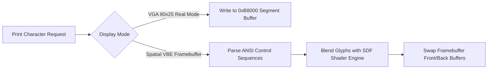

> **Status:** #status/implemented

# 📺 Console & Display API Reference

> **Ring Placement:** `rings/ring_2/ring_2/console/`  
> **Source File:** `console.asm`

---

## Procedural API Specification

| Procedure | Parameters | Return Values | Description |
| :--- | :--- | :--- | :--- |
| `set_video_mode` | None | None | Configures 80x25 16-color VGA text mode. |
| `clear_screen` | None | None | Clears display buffer and resets cursor to `(0,0)`. |
| `set_cursor_position` | `DH` = Row (0-24), `DL` = Col (0-79) | None | Repositions teletype hardware cursor. |
| `print_string_16` | `SI` = Null-terminated string ptr | None | Outputs string to display via BIOS teletype. |
| `print_hex16` | `DX` = 16-bit word value | None | Formats and prints word in `0xXXXX` hexadecimal format. |
| `print_newline` | None | None | Emits Carriage Return (`0x0D`) and Line Feed (`0x0A`). |

## 🔄 Console Rendering & Display Pipeline Flowchart

