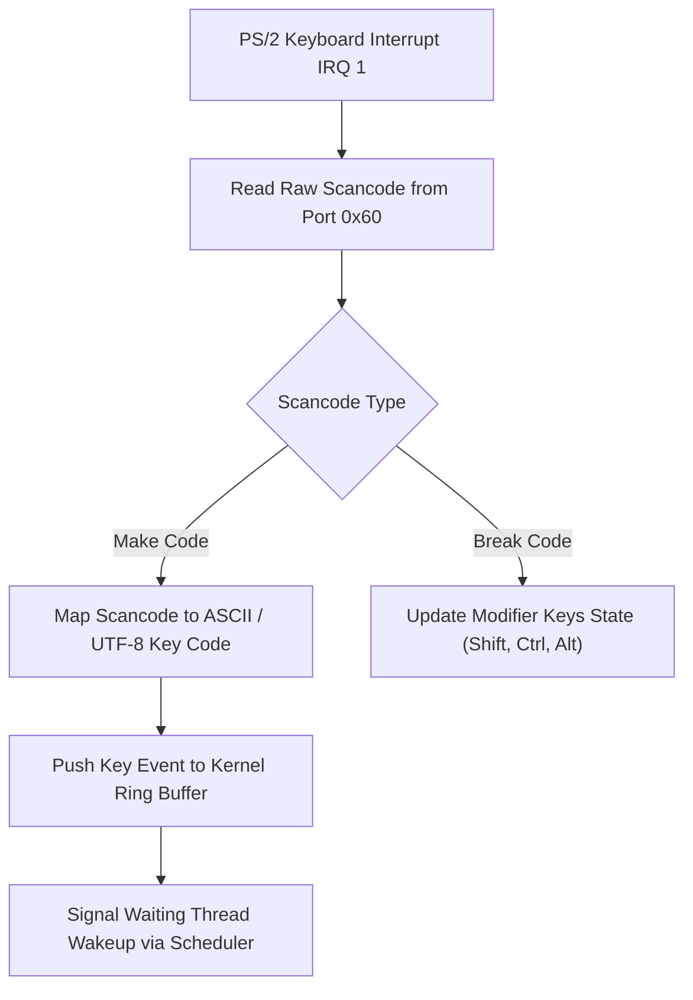

> **Status:** #status/future-implementation

# ⌨️ Keyboard & Input Service Reference

> **Services:** BIOS `INT 0x16` (16-bit Real Mode) & Port `0x60` / `0x64` (Hardware Controller)

---

## 1. BIOS Keyboard Interrupt (`INT 0x16`)

### Function 0x00: Blocking Character Read (`wait_for_key`)
Suspends CPU execution until a keystroke is received into the keyboard buffer.

- **Call:** `AH = 0x00`, `INT 0x16`
- **Returns:**
  - `AL`: ASCII character code (e.g. `'A'`, `'1'`, `0x0D` for Enter)
  - `AH`: Hardware BIOS Scan Code

---

### Function 0x01: Non-Blocking Buffer Check (`check_key_available`)
Inspects the BIOS keyboard buffer without blocking or removing the key.

- **Call:** `AH = 0x01`, `INT 0x16`
- **Returns:**
  - `ZF = 1` (Zero Flag Set): Buffer is empty (no key pressed)
  - `ZF = 0` (Zero Flag Clear): Key is available (`AH` = scan code, `AL` = ASCII)

---

## 2. Common Keyboard Scan Codes

| Key | Scan Code (`AH`) | ASCII (`AL`) |
| :--- | :--- | :--- |
| **Enter / Return** | `0x1C` | `0x0D` |
| **Backspace** | `0x0E` | `0x08` |
| **Escape** | `0x01` | `0x1B` |
| **Space** | `0x39` | `0x20` |
| **Tab** | `0x0F` | `0x09` |
| **Up Arrow** | `0x48` | `0x00` / `0xE0` |
| **Down Arrow** | `0x50` | `0x00` / `0xE0` |
| **Left Arrow** | `0x4B` | `0x00` / `0xE0` |
| **Right Arrow** | `0x4D` | `0x00` / `0xE0` |

---

## 3. Related Notes
- [[02 - Reference/Console & Display API|Console & Display API]]
- [[01 - Planning/HeaplitPlan - Bootloader & Real Mode|Bootloader Action Plan]]
- [[00 - Architecture/Ring 0 - Metal & Scheduler|Ring 0 Architecture]]

## 🔄 Keyboard Input Processing Pipeline

