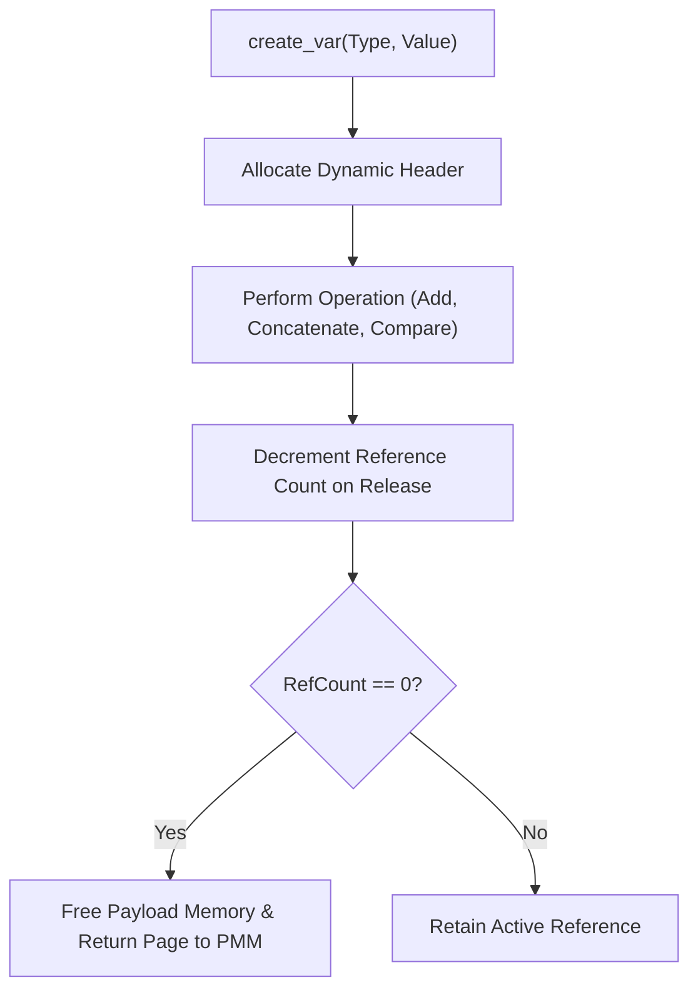

> **Status:** #status/implemented

# 🧱 Variable System API Reference

> **Ring Placement:** `rings/ring_0/ring_0/types/`  
> **Source File:** `variable.asm`

---

## 1. Dynamic Variable Structure Definition

```nasm
struc variable
    .type:       resb 1    ; +0: Type Identifier (1=Int, 2=String, 3=Float)
    .flags:      resb 1    ; +1: Flags
    .payload:    resd 1    ; +2: 32-bit payload / pointer
endstruc
sizeof_variable: equ 6
```

---

## 2. Procedural API Specification

### `create_variable`
- **Inputs:** `DI` = Destination `struc variable` pointer, `AL` = Type Enum, `DX` = Integer value / `SI` = String pointer.
- **Outputs:** None.
- **Clobbers:** None (Preserves `AX`, `DI`).

### `add_variables`
- **Inputs:** `DI` = Target variable pointer, `SI` = Source variable pointer.
- **Behavior:** Verifies both variables have `[type] == 1` (`type_int`). Adds `[SI].payload` to `[DI].payload`.
- **Clobbers:** Flags.

### `print_variable`
- **Inputs:** `DI` = Variable pointer.
- **Behavior:** Checks `[DI].type`. If `type_int`, formats decimal payload and outputs to console. If `type_string`, prints string at payload pointer.

## 🔄 Variable API Operation Lifecycle


