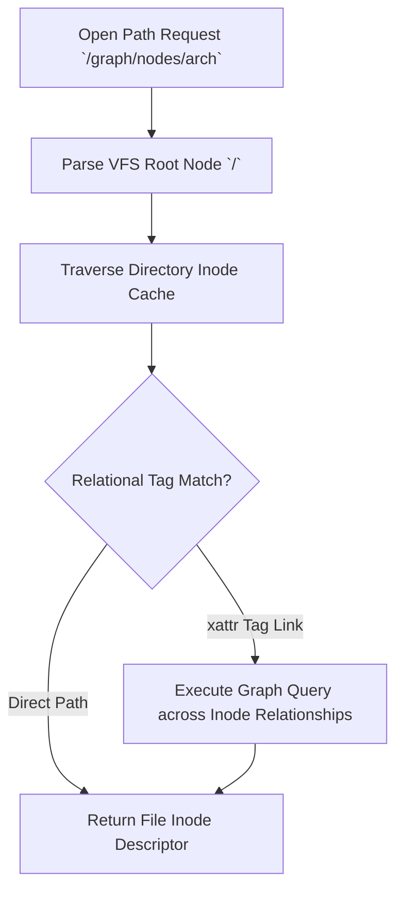

> **Status:** #status/implemented

# 📁 Virtual File System (VFS) with xattr Graph Hooks

> **Ring Placement:** `rings/ring_1/ring_1/drivers/`  
> **Source File:** `vfs.c`, `include/heaplit/vfs.h`  
> **Privilege Level:** Ring 1 ($M \le 1$)

---

## 1. Unified Inode Abstraction

```c
typedef struct vfs_node {
    char name[256];
    uint32_t flags;
    uint64_t inode_id;
    uint64_t size;
    struct vfs_ops* ops;
    void* private_data;
} vfs_node_t;

typedef struct vfs_ops {
    int (*open)(vfs_node_t* node, uint32_t flags);
    int (*read)(vfs_node_t* node, uint64_t offset, size_t size, uint8_t* buffer);
    int (*write)(vfs_node_t* node, uint64_t offset, size_t size, const uint8_t* buffer);
    int (*close)(vfs_node_t* node);
    int (*setxattr)(vfs_node_t* node, const char* name, const void* value, size_t size);
    int (*getxattr)(vfs_node_t* node, const char* name, void* value, size_t size);
} vfs_ops_t;
```

---

## 2. Extended Attributes (`xattr`) for The Lens File Explorer

Traditional filesystems use hierarchical paths (`/foo/bar/baz.txt`). Heaplit OS extends files with key-value graph metadata links via `setxattr`:

- `user.heaplit.rel.parent`: Pointer inode of semantic parent.
- `user.heaplit.rel.tags`: Comma-separated relational tags (`"os, kernel, asm"`).
- `user.heaplit.ai.summary`: Local AI generated summary string.

These hooks allow **The Lens** file explorer in Ring 2 to render the filesystem as an interactive force-directed graph.

## 🔄 VFS Node Lookup & Relational Graph Navigation


