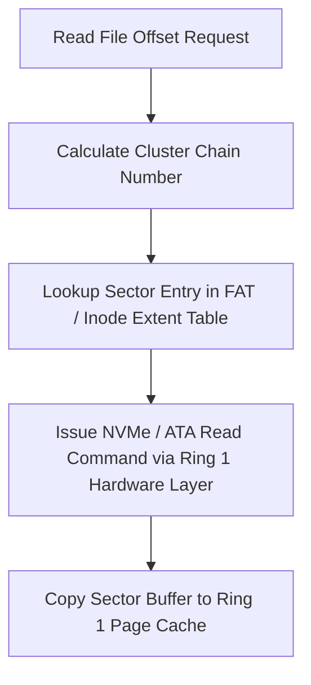

> **Status:** #status/future-implementation

# 💾 FAT32 & EXT4 Filesystem Drivers

> **Location:** `src/kernel/fs/`  
> **Role:** Provides block storage decoding for boot partitions (FAT32 EFI) and system storage (EXT4 / ZFS).

---

## 1. FAT32 Driver Architecture
FAT32 is used for the primary boot partition and UEFI compatibility:
1. **BIOS Parameter Block (BPB):** Parsed at Sector 0 of the partition.
2. **File Allocation Table (FAT):** Tracks linked lists of clusters on disk.
3. **Cluster Chains:** Read via the NVMe / AHCI block storage driver.

```c
// fat32.h
typedef struct __attribute__((packed)) {
    uint8_t  jmp_boot[3];
    uint8_t  oem_name[8];
    uint16_t bytes_per_sector;
    uint8_t  sectors_per_cluster;
    uint16_t reserved_sector_count;
    uint8_t  num_fats;
    uint16_t root_entry_count;
    uint16_t total_sectors_16;
    uint8_t  media_type;
    uint16_t table_size_16;
    uint16_t sectors_per_track;
    uint16_t head_side_count;
    uint32_t hidden_sector_count;
    uint32_t total_sectors_32;
    // Extended FAT32 Fields
    uint32_t table_size_32;
    uint16_t extended_flags;
    uint16_t fat_version;
    uint32_t root_cluster;
} fat32_bpb_t;
```

---

## 2. Related Links
- [[02 - Ring 1 - The C Overhead (Bridge)/03 - Virtual File System (VFS)|VFS Specification]]
- [[02 - Ring 1 - The C Overhead (Bridge)/05 - Device Drivers (PCIe, NVMe, USB)|Device Drivers]]

## 🔄 Disk Sector & Filesystem Reading Pipeline


