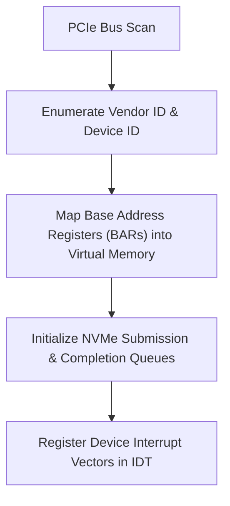

> **Status:** #status/implemented

# 🏎️ Device Drivers (PCIe, NVMe, USB)

> **Ring Placement:** `rings/ring_1/ring_1/drivers/`  
> **Source File:** `pci.c`  
> **Privilege Level:** Ring 1 ($M \le 1$)

---

## 1. PCIe Configuration Space Scanner (`pci.c`)

PCI devices are enumerated via x86 I/O ports:
- **`0xCF8`**: Config Address Port (`CONFIG_ADDRESS`).
- **`0xCFC`**: Config Data Port (`CONFIG_DATA`).

```c
#include <heaplit/types.h>

uint32_t pci_read_config(uint8_t bus, uint8_t device, uint8_t func, uint8_t offset) {
    uint32_t address = (uint32_t)((bus << 16) | (device << 11) | (func << 8) | (offset & 0xFC) | ((uint32_t)0x80000000));
    outl(0xCF8, address);
    return inl(0xCFC);
}
```

---

## 2. Target Device Enumeration Table

| Vendor ID | Device ID | Device Description | Driver Target |
| :--- | :--- | :--- | :--- |
| `0x8086` | `0x100E` | Intel e1000 Gigabit NIC | Network Driver |
| `0x1B36` | `0x0010` | QEMU PCIe Root Complex | PCIe Scanner |
| `0x1B36` | `0x000D` | QEMU xHCI USB Controller | USB Driver |
| `0x8086` | `0x0953` | NVMe Express Controller | Storage DMA Queue Driver |

## 🔄 Hardware Driver Initialization & Queue Management


