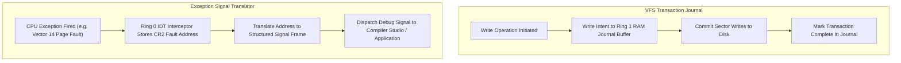

> **Status:** #status/future-implementation

# 📜 VFS Journaling & Exception Translation Pipeline – Technical Specification

> **Layer:** Ring 1 Freestanding C Bridge  
> **Source Files:** `rings/ring_1/ring_1/drivers/vfs_journal.c`, `exception_signal.c`

---

## 1. Overview & Architecture

This subsystem provides dual protections: **VFS Journaling** ensures filesystem metadata and AI vector embedding consistency during unexpected power loss, while the **Exception Signal Translator** converts low-level CPU traps (Page Faults, GPFs) into structured debugging signals for userland applications.

---

## 2. Key Features
- **Vector Embedding Consistency**: Guarantees GGUF model embeddings and VFS `xattr` tags remain corruption-free after abrupt reboots.
- **Structured Debugging**: Provides full stack trace and faulting memory addresses to the Multi-Language Compiler Studio without crashing the kernel.
