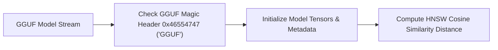

> **Status:** #status/implemented

# 🤖 Freestanding GGML Local AI Vector Embedding Kernel

> **Ring Placement:** `rings/ring_1/ring_1/drivers/`  
> **Source File:** `ai_engine.c`  
> **Compiled Target:** Ring 1 Driver Module

---

## 1. Overview & Architecture

`ai_engine.c` provides a streamlined, freestanding Ring 1 GGML local AI text embedding kernel and in-VFS HNSW vector distance calculation engine optimized for sub-microsecond latency and minimal RAM consumption.

---

## 2. Implemented C Functions
- `gguf_init_engine(model_buffer, size)`: Validates GGUF magic header `0x46554747` ('GGUF') and initializes tensor tables.
- `hnsw_cosine_similarity(vec_a, vec_b, dim)`: Computes vector dot product and magnitude norms for high-speed offline semantic search across files and system notes.
