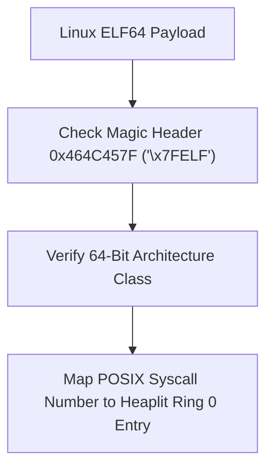

> **Status:** #status/implemented

# 🐧 Linux ELF POSIX Compatibility Translation Wrapper (posixcall)

> **Ring Placement:** `rings/ring_1/ring_1/drivers/`  
> **Source File:** `posixcall.c`  
> **Compiled Target:** Ring 1 Driver Module

---

## 1. Overview & Architecture

`posixcall.c` parses 64-bit Linux ELF headers (`ELF`) and translates standard POSIX syscall numbers (`sys_read`, `sys_write`, `sys_open`, `sys_close`, `sys_mmap`, `sys_exit`) directly to native Heaplit OS kernel system calls.

---

## 2. Implemented C Functions
- `posixcall_validate_elf(buffer, size)`: Validates ELF magic bytes `ELF` and 64-bit class (`e_class == 2`).
- `posixcall_translate_syscall(linux_syscall_nr)`: Translates Linux POSIX numbers (`0` -> `sys_read`, `1` -> `sys_write`, `2` -> `sys_open`, `9` -> `sys_mmap`, `60` -> `sys_exit`).
