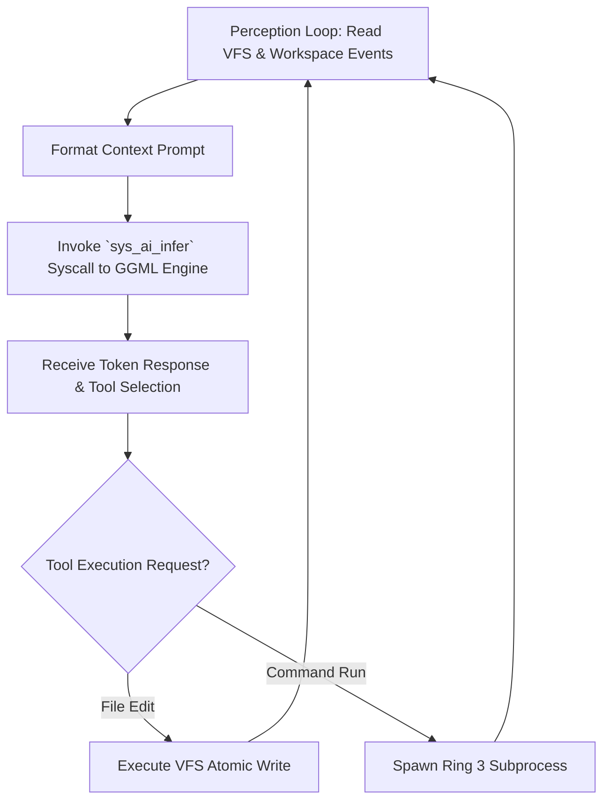

> **Status:** #status/future-implementation

# 🤖 Heaplit Userland Daemon Architecture

> **Ring Placement:** `/system/bin/heaplit`  
> **Privilege Level:** Ring 2 / Ring 3 ($M \le 3$)

---

## 1. Daemon Responsibilities

The **Heaplit Daemon** is the background autonomous intelligence orchestrator operating within userland:

1. **Obsidian Vault Watcher:** Monitors Markdown files in the Obsidian vault via `SYS_FS_WATCH` (`0x30`) for changes to `#HeaplitPlan` directives.
2. **AI Inference Syscall Dispatch:** Crafts prompts and triggers local LLM inference via `SYS_AI_INFER` (`0x601`).
3. **Automated NASM Compiler Hook:** Receives generated assembly source, invokes compiler toolchain, generates `.bin` / `.axf` binaries, and executes QEMU tests.
4. **2-Way Markdown Sync:** Writes back build logs, register dumps, and execution results into the user's Obsidian vault.

---

## 2. Unix Domain Socket Interface (`/tmp/heaplit.sock`)

Applications and UI components communicate with the daemon via local sockets:

```c
typedef struct {
    uint32_t msg_type;     // 1=STATUS, 2=COMPILE, 3=INFER_PROMPT, 4=BUILD_LOG
    uint32_t payload_len;  // Length of raw payload bytes
    uint8_t payload[];     // Message payload
} heaplit_ipc_header_t;
```

## 🔄 Heaplit Agent Execution Loop Flowchart


