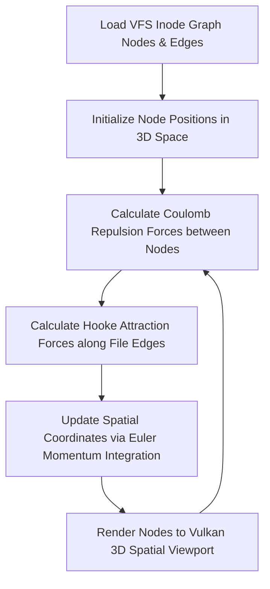

> **Status:** #status/future-implementation

# 🌌 The Lens: Relational Graph Filesystem Explorer

> **Ring Placement:** Ring 2 Spatial UI  
> **Graphics API:** Vulkan Compute & Graphics Pipeline

---

## 1. Relational Graph Filesystem Model

Unlike legacy operating systems that force files into rigid tree hierarchies (`/usr/local/bin`), **The Lens** treats the entire filesystem as a 3D force-directed graph.

- **Nodes:** Files, directories, applications, dynamic variables, and memory objects.
- **Edges:** Relational links stored in Extended Attributes (`xattr`):
  - Inode parent/child relationships.
  - Tag links (e.g., `#kernel`, `#asm`, `#vulkan`).
  - Local AI semantic similarity links generated during indexing.

---

## 2. Vulkan Compute Shader Physics Engine

Node positioning is calculated in real-time on the GPU using a spring-embedder force-directed graph compute shader:

$$\vec{F}_{repulsion} = k_r \frac{\vec{r}_{ij}}{|\vec{r}_{ij}|^3}, \quad \vec{F}_{attraction} = k_a (|\vec{r}_{ij}| - d_0) \hat{r}_{ij}$$

## 🔄 Spatial Lens Graph Physics Engine Flowchart

