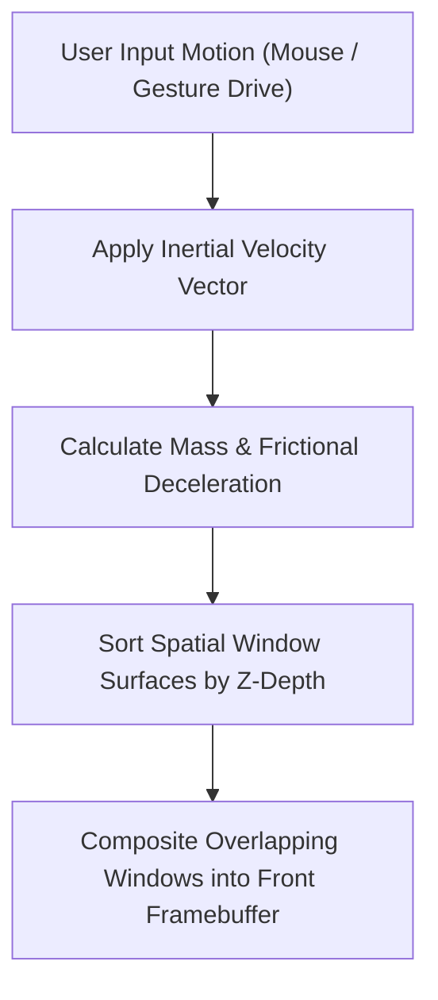

> **Status:** #status/future-implementation

# 🪟 Spatial Window Compositor

> **Ring Placement:** Ring 2 Spatial Desktop  
> **Graphics Engine:** Vulkan Swapchain & Physics Compositor

---

## 1. Inertia Physics Window Engine

Windows in Heaplit OS possess physical properties (mass, velocity, friction, bounce elasticity). Dragging and throwing windows uses an integrated spring-damper physics simulation:

$$\vec{a} = \frac{\vec{F}_{user} - \mu v \hat{v} - k (x - x_0)}{m}$$

- **Mass ($m$):** Proportional to window buffer resolution.
- **Friction ($\mu$):** Smooth deceleration upon release.
- **Depth ($z$):** Dynamic 3D depth positioning based on window focus.

## 🔄 Spatial Compositor Inertia & Layering Pipeline

