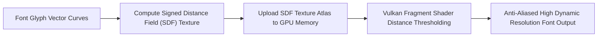

> **Status:** #status/future-implementation

# 🔤 GPU Rendering & Signed Distance Field (SDF) Fonts

> **Approach:** Infinite-resolution vector font rasterization directly on the GPU without CPU glyph baking.

---

## 1. Multi-Channel Signed Distance Fields (MSDF)
Instead of storing raster bitmaps of glyphs at specific point sizes, fonts in Heaplit OS are converted into Multi-Channel Signed Distance Field textures:
- **Sharp Corners:** Preserved at any zoom level or DPI scaling.
- **Memory Efficiency:** A single $512 \times 512$ atlas texture contains an entire Unicode font face.
- **Live Drop-in:** Dropping a `.ttf` file into `~/.fonts/` triggers immediate GPU atlas compilation.

---

## 2. Related Links
- [[03 - Ring 2 - Userland & Spatial UI/03 - Spatial Window Compositor|Spatial Compositor]]
- [[03 - Ring 2 - Userland & Spatial UI/06 - Live Theming & TOML Engine|Live Theming]]

## 🔄 Vector Glyph SDF Rendering Pipeline

